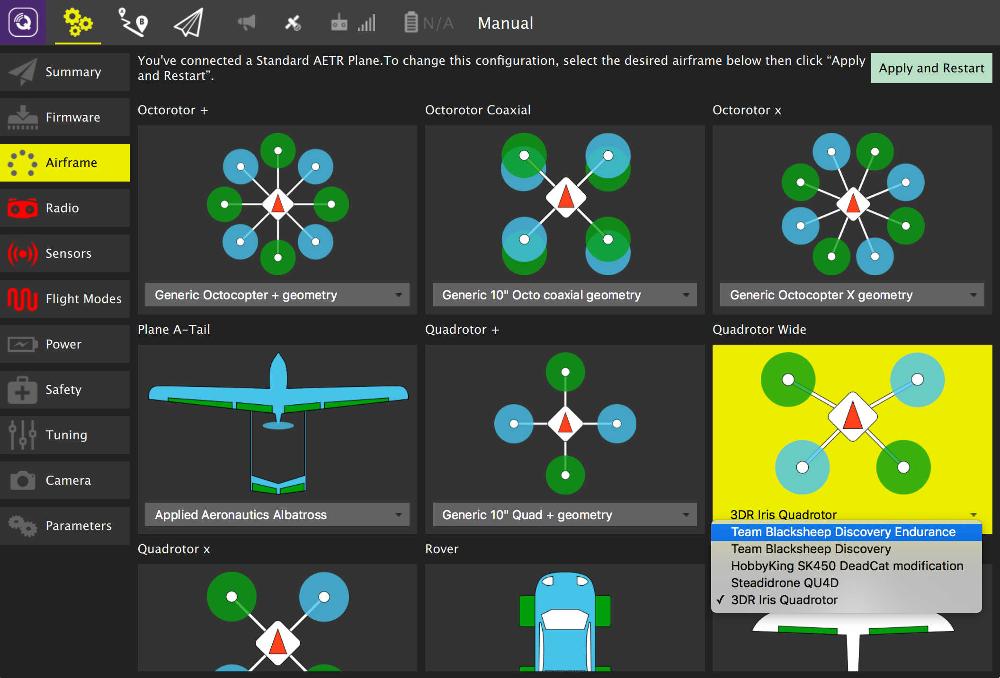

# Airframe Setup

This screen allows you to configure the main airframe selection associated with your vehicle. The details of the screen differ if you are using PX4 Pro firmware or ArduPilot firmware.

### PX4 Pro Airfame Setup

Select the specific airframe from the dropdown within the group which best matches your vehicle. Example image above shows 3DR Iris Quadrotor selected from the Quadrotor wide group.

After you have selected your airfame, click Apply and Restart. This will prompt you to save the settings and restart to vehicle.

### ArduCopter Airfame Setup

The airframe setup option is only available when using the ArduCopter firmware from ArduPilot.
