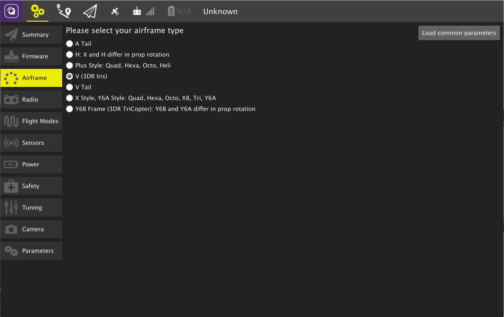
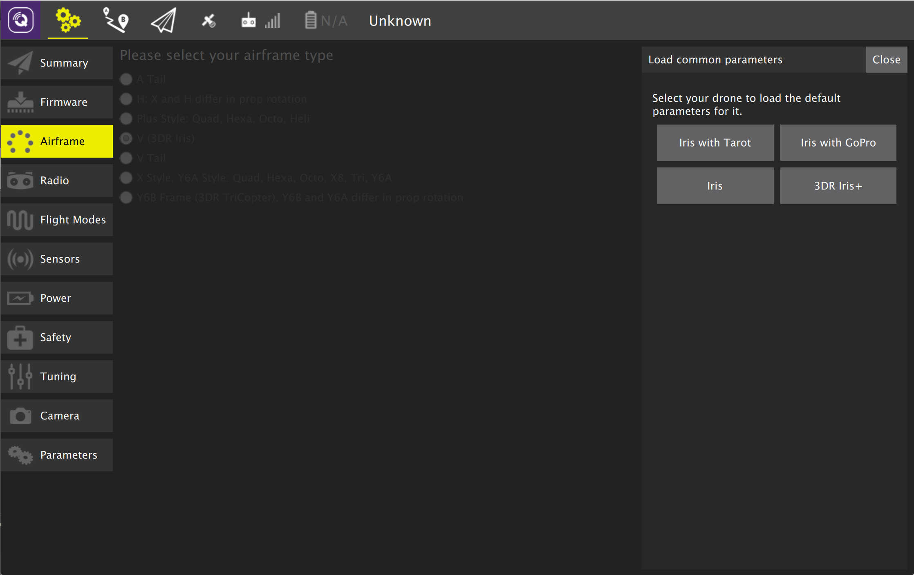

# Airframe Setup

This page allows you to configure the main airframe selection associated with your vehicle. The details of the page differ if you are using PX4 Pro firmware or ArduPilot firmware.

## ArduCopter Airfame Setup

Select the frame type that matches your vehicle. You can also click "Load common parameters" to load a parameter set for known vehicle types:

Note: Airframe Setup is only available on ArduCopter vehicles. For other ArduPilot vehicles Airframe Setup will not be shown.

## PX4 Pro Airfame Setup

Select the specific airframe from the dropdown within the group which best matches your vehicle. Example image above shows 3DR Iris Quadrotor selected from the Quadrotor wide group.

After you have selected your airfame, click Apply and Restart. This will prompt you to save the settings and restart to vehicle.

