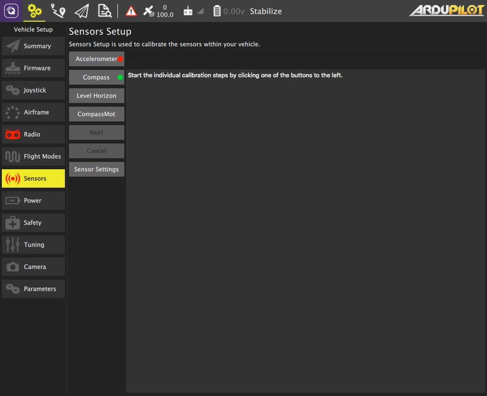
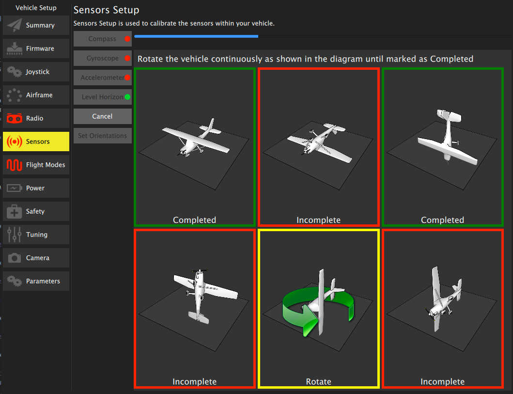

# Sensors
Sensor setup allows you to configure and calibrate the sensors on your vehicle.

*Note: The image shown is from a vehicle running ArduPilot firmware. PX4 Firmware options will be slightly different.*

To start the individual calibration steps click on a sensor's button. Sensors marked with red require calibration prior to flight. Sensors marked with green indicate a good calibration.

## Accelerometer
To calibrate the accelerometers on your vehicle you will be asked to place you vehicle in an orientation and hold it there until asked to move to the next step.

For ArduPilot follow text textual instructions in the center display, clicking the Next button to capture each position.

For PX4 you will be guided with a visual display of positions.

## Compass

### ArduPilot (newer firmwares)
For newer ArduPilot firmwares compass calibration will be done using the Onboard calibration support which provides for more accurate calibration. You need to rotate the vehicle randomly around all axes until the progress bar fills all the way to the right and the calibration completes. When the calibration completes you will get the following results:

This shows you the quality of the calibration for each compass. Using these values you can determine whether you may want to turn off usage of poorly performing compasses.

### ArduPilot (older firmwares) and PX4

For PX4 and older ArduPilot you will be guided through positioning the vehicle in a number of set orientations and rotating the vehicle through the request axis. To calibrate place the Vehicle in one of the incomplete orientations and hold it still, when asked to Rotate rotate the vehicle around the specific axis.

## Level Horizon
If after completing Accelerometer calibration you see that the horizon as shown in the HUD is not level you can calibrate the level horizon for your vehicle. You will be asked to place the vehicle in a level orientation while it captures the information.

## CompassMot (ArduPilot only)
CompassMot calibration is only recommended for vehicles that have only an internal compass and on vehicles where there is significant interference on the compass from the motors, power wires, etc. CompassMot only works well if you have a battery current monitor because the magnetic interference is linear with current drawn.

To perform CompassMot calibration click the button and follow the onscreen prompts.

## Sensor Settings
Configure the orienation and usage of your sensors.

