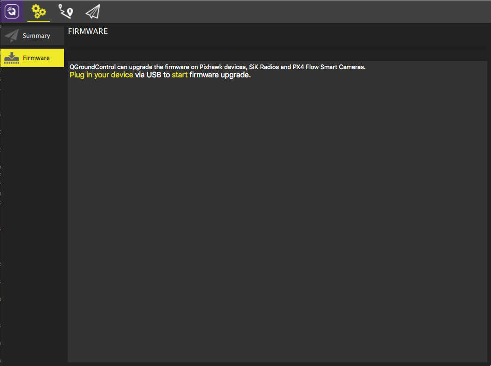
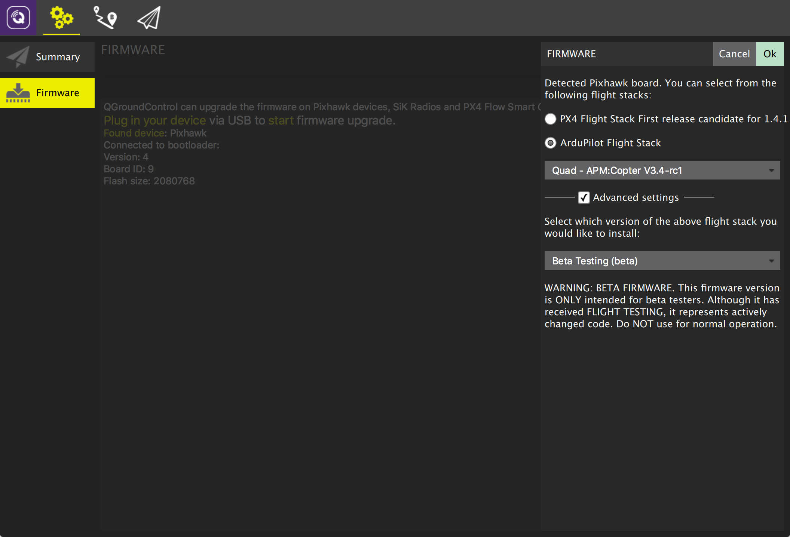

# Loading firmware

Firmware is what makes your vehicle run and have all of its great capabilities. Using QGroundControl you can install the latest versions of the firmware of your choice.

QGroundControl is capable of loading firmware onto Pixhawk family autopilot boards, SiK Radios and PX4 Flow devices.

### Before you install Firmware [Important]

Before you can install firmware onto your vehicle all USB connections to you vehicle, either direct or through a telemetry radio must be disconnected. Also the vehicle must not be powered by battery. 

### Connect the device via USB

Now connect your device (Pixhawk, SiK Radio, PX4 Flow) directly to your computer with a USB. Do not connect through a USB hub. Only connect directly to a powered USB port on your machine.

### Select the firmware to load

Once the device is connected you can now choose which firmware to load. The image above is for uploading firmware to a Pixhawk family board. Choose whether you would like to install [PX4 Pro](http://px4.io/) or [ArduPilot](http://ardupilot.com) firmware.

Checking the “Advanced mode” check box allows you to choose from developer releases of the firmware as well as install firmware from your local file system.

### Firmware load complete

Once the specified firmware has completed loading the device/vehicle will reboot and reconnect.

*Note: Support for loading Firmware is currently not available on tablet or phone versions of QGroundControl.*
