# Fly View

The Fly View is used to command and monitor the vehicle when flying.

You can use it to:
- Run an automated [pre-flight checklist](#preflight_checklist).
- Control missions: [start](#start_mission), [continue](#continue_mission), [pause](#pause), [stop](#stop_mission) and [resume](#resume_mission).
- Guide the vehicle to [arm](#arm)/[disarm](#disarm)/[emergency stop](#emergency_stop), [takeoff](#takeoff)/[land](#land), [change altitude](#change_altitude), [go to](#goto) or [orbit](#orbit) a particular location, and [return/RTL](#rtl).
- Switch between a map view and a video view (if available)
- Display video, mission, telemetry, and other information for the current vehicle, and also switch between connected vehicles.

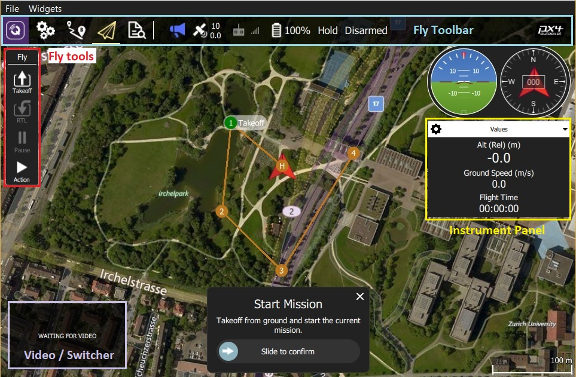

## UI Overview

The screenshot above shows the main elements of the fly view:

- **Map:** Displays the positions of all connected vehicles and the mission for the current vehicle.
  - You can drag the map to move it around (the map automatically re-centres after a certain amount of time).
  - Once flying, you can click on the map to set a [Go to](#goto) or [Orbit at](#orbit) location.
- **Fly Toolbar:** Key status information for sensors (GPS, battery, RC control), and vehicle state (Flight mode, Armed/Disarmed status).
  - Select the sensor indicators to view more detail.
  - Click the *Flight mode* text (e.g. "Hold") to select a new mode. Not every mode may be available.
  - Click the *Armed/Disarmed* text to toggle the armed state. If flying you can click this to Emergency Stop.
- **Fly tools:** You can use these to:
  - Toggle between takeoff/land.
  - Pause/restart the current operation (e.g. landing, or the mission).
  - Safety return (also known as RTL or Return).
  - The *Action* button offers other appropriate options for the current state (these overlay the *Confirmation Slider*). 
    Actions include changing the altitude or continuing a mission.
  - Enable the [preflight checklist](#preflight_checklist) (tool option disabled by default).
- **[Instrument Panel](#instrument_panel):** A multi-page widget that displays vehicle information including: telemetry, camera, video, system health, and vibration.
- **[Video/Switcher](#video_switcher):** Toggle between video or map in a window.
  - Click the element to switch *Video* and *Map* to foreground.
  - *QGroundControl* supports RTP and RTSP video streaming over your vehicles UDP connection. 
    It also support directly connected UVC device support.
    QGC video support is further discussed in the [Video README](https://github.com/mavlink/qgroundcontrol/blob/master/src/VideoStreaming/README.md).
- **Confirmation Slider:** Context sensitive slider to confirm requested actions. 
  Slide to start operation. Press **X** to cancel.

There are a number of other elements that are not displayed by default/are only displayed in certain conditions. 
For example, the multi-vehicle selector is only displayed if you have multiple vehicles, and the preflight checklist tool button is only displayed if the appropriate setting is enabled.

## Instrument Panel {#instrument_panel}

The instrument panel is a multi-page widget that displays information about the current vehicle, including: telemetry, camera, video, system health, and vibration information.

The default page displays vehicle telemetry - use the drop down menu on the to right to select the other options.

### Values (Telemetry)

The values page shows telemetry information; by default the altitude (relative to the home location) and the ground speed.

You can configure what information is display by clicking the small gear icon on the top left of the panel.
Each value can be displayed in normal or "large" size (large size shows just one value per row in the page, while normal shows 2).

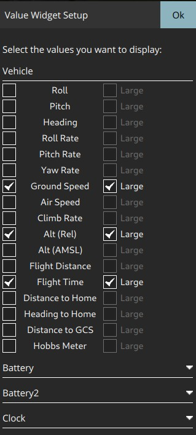

### Camera {#camera_instrument_page}

The camera page is used to configure and control the camera.
For a camera connected directly to the Flight Controller the only available option is camera triggering:

When connected to camera that supports the [MAVLink Camera Protocol](https://mavlink.io/en/services/camera.html) you can additionally configure and use other camera services that it makes available.
For example, if your camera supports video mode you will be able to  switch between still image capture and video mode, and start/stop recording.

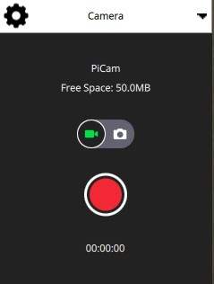

Advanced settings can be changed by clicking the gear icon at the top left of the page.
The settings that are displayed will depend on/are a property of the camera.

### Video Stream {#video_instrument_page}

The video page is used to enable/disable video streaming.
When enabled, you can start/stop the video stream, enable a grid overlay, change how the image fits the screen, and record the video locally with QGC.

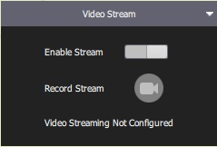

### Health

The health page shows you the health of the systems within your vehicle.
*QGroundControl* will switch to this page automatically if any systems change to unhealthy.

### Vibration

The vibration page shows current vibration levels and clip counts.

## Actions/Tasks

The following sections describe how to perform common operations/tasks in the Fly View.

> **Note** Many of the available options depend on both the vehicle type and its current state.

### Pre Flight Checklist {#preflight_checklist}

An automated preflight checklist can be used to run through standard checks that the vehicle is configured correctly and it is safe to fly.

To you the checklist, first enable the tool by navigating to [Application Settings > General > Fly View](../SettingsView/General.md) and selecting the **Use preflight checklist** checkbox.
The tool will then be added to the *Flight Tools*. 
Click it to open the checklist:

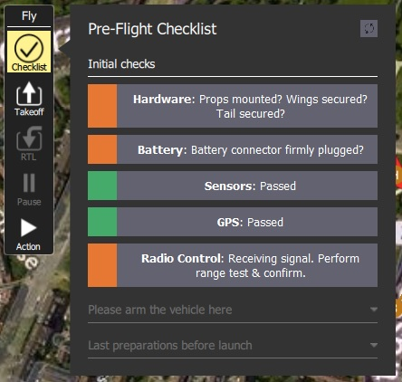

Once you have performed each test, click on it in the UI to mark it as complete.

### Arm {#arm}

> **Tip** Generally *QGroundControl* does not require you to arm the vehicle explicitly; this is done for you if you start a mission or takeoff.

Arming a vehicle starts the motors in preparation for takeoff.

To arm the vehicle, select **Disarmed** in the *Fly Toolbar* and then use the confirmation sider.

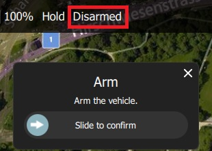

> **Note** Vehicles usually disarm automatically if you do not take off after a few seconds.

### Disarm {#disarm}

Disarming the vehicle stops the motors (making the vehicle safe).
To disarm the vehicle select **Armed** in the *Fly Toolbar* when the vehicle is **landed**.

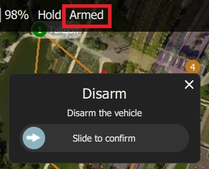

> **Note** Disarming the vehicle while it is flying is called an [Emergency Stop](#emergency_stop)

### Emergency Stop {#emergency_stop}

Emergency stop is effectively the same as disarming the vehicle while you are flying.
Your vehicle will crash!

To disarm the vehicle select **Armed** in the *Fly Toolbar* when the vehicle is flying.

### Takeoff {#takeoff}

> **Tip** If you are starting a mission for a multicopter *QGroundControl* will automatically perform the takeoff step.

To takeoff (when landed):
1. Click the **Takeoff** button in the *Fly Tools* (this will toggle to a **Land** button after taking off).
1. Optionally set the takeoff altitude in the right-side vertical slider.
1. Confirm takeoff using the slider.

### Land {#land}

You can land at the current position at any time while flying:
1. Click the **Land** button in the *Fly Tools* (this will toggle to a **Land** button when landed).
1. Confirm landing using the slider.

### RTL/Return

Return to the home position at any time while flying:
1. Click the **RTL** button in the *Fly Tools*.
1. Confirm RTL using the slider.

> **Note** The vehicle may also land at the home position, depending on its type and configuration.

### Change Altitude {#change_altitude}

You can change altitude while flying, except when in a mission:
1. Click the **Action** button on the *Fly Tools*
1. Select the *Change Altitude* action from the dialog.

   

1. Move the vertical slider to the desired altitude, then drag the confirmation slider to start the action.

   

### Goto Location {#goto}

After taking off you can specify that you want to fly to a particular location.

1. Click the map where you want the vehicle to move and select **Go to location** on the popup.

  
  
1. The location will be displayed on the map, along with a confirmation slider.

   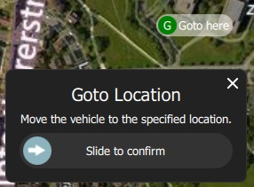
   
1. When you're ready, drag the slider to start the operation (or click the cross to cancel it).

### Orbit Location {#orbit}

After taking off you can specify that you want to orbit a particular location.

1. Click the map (near the centre of your desired orbit) and select **Orbit at location** on the popup.

  
  
1. The proposed orbit will be displayed on the map, along with a confirmation sider.

   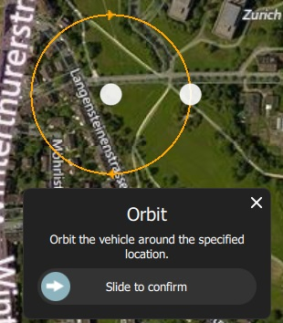
   
   - Select and drag the central marker to move the orbit location.
   - Select and drag the dot on the outer circle to change the orbit radius
1. When you're ready, drag the slider to start the operation (or click the cross to cancel it).

### Pause

You can pause most operations, including taking off, landing, RTL, missions, Orbit at location. 
The vehicle behaviour when paused depends on the vehicle type; typically a multicopter will hover, and a fixed wing vehicle will circle.

> **Note** You cannot pause a *Goto location* operation.

To pause:
1. Click the **Pause** button in the *Fly Tools*.
1. Optionally set a new altitude using the right-side vertical slider.
1. Confirm Pause using the slider.

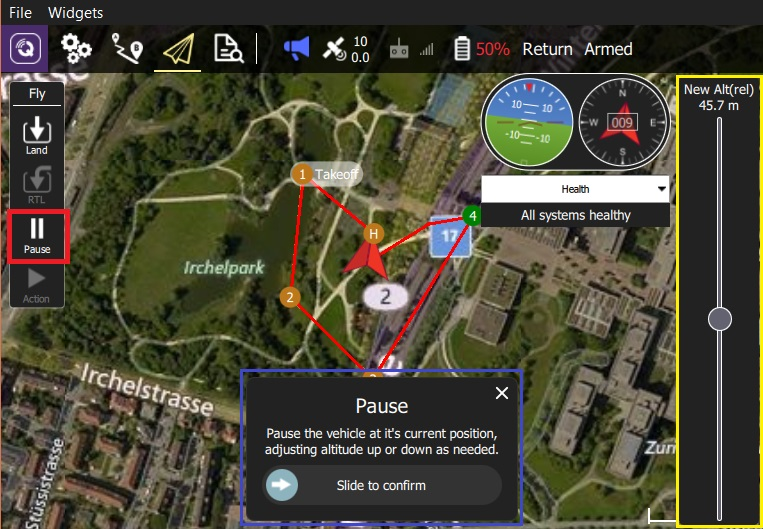

### Missions

#### Start Mission {#start_mission}

You can start a mission when the vehicle is landed (the start mission confirmation slider is often displayed by default).

To start a mission from landed:
1. Click the **Action** button on the *Fly Tools*
1. Select the *Start Mission* action from the dialog.

   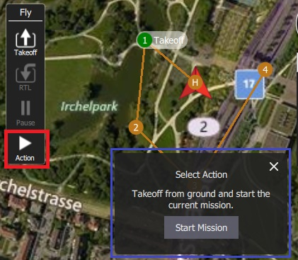
   
    (to display the confirmation slider)
1. When the confirmation slider appears, drag it to start the mission.

   

#### Continue Mission {#continue_mission}

You can *continue* mission from the *next* waypoint when you're flying (the *Continue Mission* confirmation slider is often displayed by default after you takeoff).

> **Note** Continue and [Resume mission](#resume_mission) are different!
  Continue is used to restart a mission that has been paused, or where you have taken off, so you've already missed a takeoff mission command.
  Resume mission is used when you've used a RTL or landed midway through a mission (e.g. for a battery change) and then wish to continue the next mission item (i.e. it takes you to where you were up to in the mission, rather than continuing from you place in the mission).

You can continue the current mission while (unless already in a mission!):
1. Click the **Action** button on the *Fly Tools*
1. Select the *Continue Mission* action from the dialog.

   

1. Drag the confirmation slider to continue the mission.

   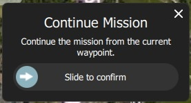

#### Resume Mission {#resume_mission}

*Resume Mission* is used to resume a mission after performing an [RTL/Return](#rtl) or [Land](#land) from within a mission (in order, for example, to perform a battery change).

> **Note** If you are performing a battery change, **do not** disconnect QGC from the vehicle after disconnecting the battery.
After you insert the new battery *QGroundControl* will detect the vehicle again and automatically restore the connection. 

After reconnecting you will be prompted with a *Resume Mission* confirmation slider.
If you want to resume the mission, confirm this and the mission will start from the last waypoint traveled through. 
Once the mission is rebuilt you will be presented with another Resume Mission slide which allows you to review the rebuilt mission before starting it again.
Confirm this *Resume Mission* slider to continue on with the mission.

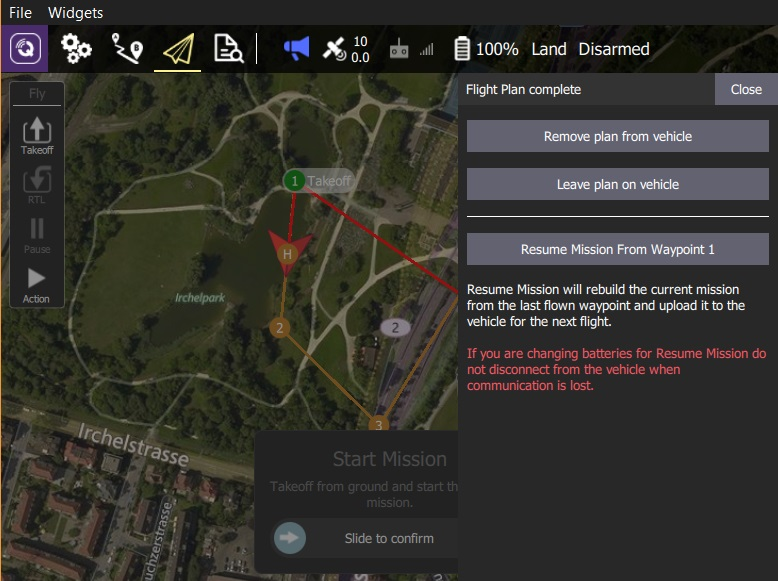

##### Note: How Resume Mission Rebuilding Works

A mission cannot simply resume from the last mission item the vehicle executed because there may be multiple items at the last waypoint that affect the next stage of the mission (e.g. speed commands or camera control commands).
Skipping any mission items at the last waypoint may prevent the rest of the mission running correctly.

Therefore *QGroundControl* rebuilds the mission looking backwards from the last mission item flown, and automatically appends relevant commands to the front of the mission. 
By doing this the state of the mission prior to the resume point is restored.

The following mission commands are the ones scanned for:
* [MAV_CMD_DO_CONTROL_VIDEO](https://mavlink.io/en/messages/common.html#MAV_CMD_DO_CONTROL_VIDEO)
* [MAV_CMD_DO_SET_ROI](https://mavlink.io/en/messages/common.html#MAV_CMD_DO_SET_ROI)
* [MAV_CMD_DO_DIGICAM_CONFIGURE](https://mavlink.io/en/messages/common.html#MAV_CMD_DO_DIGICAM_CONFIGURE)
* [MAV_CMD_DO_DIGICAM_CONTROL](https://mavlink.io/en/messages/common.html#MAV_CMD_DO_DIGICAM_CONTROL)
* [MAV_CMD_DO_MOUNT_CONFIGURE](https://mavlink.io/en/messages/common.html#MAV_CMD_DO_MOUNT_CONFIGURE)
* [MAV_CMD_DO_MOUNT_CONTROL](https://mavlink.io/en/messages/common.html#MAV_CMD_DO_MOUNT_CONTROL)
* [MAV_CMD_DO_SET_CAM_TRIGG_DIST](https://mavlink.io/en/messages/common.html#MAV_CMD_DO_SET_CAM_TRIGG_DIST)
* [MAV_CMD_DO_FENCE_ENABLE](https://mavlink.io/en/messages/common.html#MAV_CMD_DO_FENCE_ENABLE)
* [MAV_CMD_IMAGE_START_CAPTURE](https://mavlink.io/en/messages/common.html#MAV_CMD_IMAGE_START_CAPTURE)
* [MAV_CMD_IMAGE_STOP_CAPTURE](https://mavlink.io/en/messages/common.html#MAV_CMD_IMAGE_STOP_CAPTURE)
* [MAV_CMD_VIDEO_START_CAPTURE](https://mavlink.io/en/messages/common.html#MAV_CMD_VIDEO_START_CAPTURE)
* [MAV_CMD_VIDEO_STOP_CAPTURE](https://mavlink.io/en/messages/common.html#MAV_CMD_VIDEO_STOP_CAPTURE)
* [MAV_CMD_DO_CHANGE_SPEED](https://mavlink.io/en/messages/common.html#MAV_CMD_DO_CHANGE_SPEED)
* [MAV_CMD_NAV_TAKEOFF](https://mavlink.io/en/messages/common.html#MAV_CMD_NAV_TAKEOFF)

#### Remove Mission Prompt After Landing {#resume_mission_prompt}

You will be prompted to remove the mission from the vehicle after the mission completes and the vehicle lands and disarms. 
This is meant to prevent issues where stale missions are unknowingly left on a vehicle, potentially resulting in unexpected behavior.

### Display Video {#video_switcher}

*QGroundControl* supports RTP and RTSP video streaming over your vehicle's UDP connection.
When video streaming is enabled the stream is displayed in the video switcher window at the bottom left of the map.
Click the switcher to toggle *Video* and *Map* to foreground.

> **Note** The video stream is configured/enabled in [Application Settings > General tab > Video](../SettingsView/General.md#video).

It is possible to resize the video switcher.
First click on its top-left corner.
Resize the window by dragging the icon in the top right corner, and hide it with the icon in the lower left.

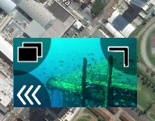

### Record Video

If supported by the camera, *QGroundControl* can start and stop video recording on the camera itself, or it can record and save the video stream locally.

> **Tip** Video stored on the camera may be of much higher quality, but it is likely that your ground station will have a much larger recording capacity.

#### Record Video Stream (on GCS)

Record the video stream on the [video stream instrument page](#video_instrument_page).
Click the red circle to start recording a new video (a new video file is created each time the circle is clicked); the circle will change into a red square while recording is in progress.

Video stream recording is configured in the [Application Settings > General tab](../SettingsView/General.md):
- [Video Recording](../SettingsView/General.md#video-recording) - specifies the recording file format and storage limits. 
  > **Note** Videos are saved in Matroska format (.mkv) by default.
    This format is relatively robust against corruption in case of errors.
- [Miscellaneous](../SettingsView/General.md#miscellaneous) - Streamed video is saved under the **Application Load/Save Path**. 

> **Tip** The stored video includes just the video stream itself.
  To record video with QGroundControl application elements displayed, you should use separate screen recording software. 

#### Record Video on Camera

Start/stop video recording *on the camera itself* using the [camera instrument page](#camera_instrument_page).
First toggle to video mode, then select the red button to start recording.

