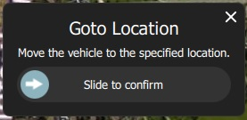

# Fly View

The Fly View is used to command and monitor the vehicle when flying.
You can use it to: start, pause, stop and resume missions.
You can also use it to directly control the vehicle to arm/disarm/emergency stop, takeoff/land, move to or orbit a particular location, and return/RTL.

From this view you can also switch between a map view and a video view (if available), and also switch between connected vehicles to view their mission and telemetry.

## UI Overview

The screenshot above shows the main elements of the fly view:

- **Map:** Displays the positions of all connected vehicles and the mission for the current vehicle.
  - You can drag the map to move it around (the map automatically re-centres after a certain amount of time).
  - Once flying, you can click on the map to set a [Go to](#goto) or [Orbit at](#orbit) location.
- **Fly Toolbar:** Key status information for sensors (GPS, battery, RC control), and vehicle state (Flight mode, Armed/Disarmed status).
  - Select the sensor indicators to view more detail.
  - Click the *Flight mode* text (e.g. "Hold") to select a new mode. Not every mode may be available.
  - Click the *Armed/Disarmed* text to toggle the armed state. If flying you can click this to Emergency Stop.
- **Fly tools:** You can use these to:
  - Toggle between takeoff/land.
  - Pause/restart the current operation (e.g. landing, or the mission).
  - Safety return (also known as RTL or Return).
  - The *Action* button offers other appropriate options for the current state (these overlay the *Confirmation Slider*). 
    Actions include changing the altitude or continuing a mission.
  - Enable the [preflight checklist](#preflight_checklist) (tool option disabled by default).
- **[Instrument Panel](#instrument_pane):** A multi-page widget that displays vehicle information including: telemetry, camera, video, system health, and vibration.
- **Video/Switcher:** Displays video in a window (if available).
  - Click the element to switch *Video* and *Map* to foreground.
  - *QGroundControl* supports RTP and RTSP video streaming over your vehicles UDP connection. 
    It also support directly connected UVC device support.
    QGC video support is further discussed in the [Video README](https://github.com/mavlink/qgroundcontrol/blob/master/src/VideoStreaming/README.md).
- **Confirmation Slider:** Context sensitive slider to confirm requested actions. 
  Slide to start operation. Press **X** to cancel.

There are a number of other elements that are not displayed by default/are only displayed in certain conditions. 
For example, the multi-vehicle selector is only displayed if you have multiple vehicles, and the preflight checklist tool button is only displayed if the appropriate setting is enabled.

## Instrument Panel {#instrument_pane}

The instrument panel is a multi-page widget that displays information about the current vehicle, including: telemetry, camera, video, system health, and vibration information.

The default page displays vehicle telemetry - use the drop down menu on the to right to select the other options.

### Values (Telemetry)

The values page shows telemetry information; by default the altitude (relative to the home location) and the ground speed.

You can configure what information is display by clicking the small gear icon on the top left of the panel.

### Camera

The camera page can be used to manually trigger the camera.

### Video Stream

The video page is used to enable and record video streaming.

### Health

The health page shows you the health of the systems within your vehicle.
*QGroundControl* will switch to this page automatically if any systems change to unhealthy.

### Vibration

The vibration page shows current vibration levels and clip counts.

## Common Operations

The following sections describe how to access/perform common operations in the Fly View.
Most operations must be confirmed using the *Confirmation slider* at the bottom of the screen.

> **Note** The available options vary by vehicle and current vehicle state.

### Pre Flight Checklist {#preflight_checklist}

An automated preflight checklist can be used to run through standard checks that the vehicle is configured correctly and it is safe to fly.

To you the checklist, first enable the tool by navigating to [Application Settings > General > Fly View](../SettingsView/General.md) and selecting the **Use preflight checklist** checkbox.
The tool will then be added to the *Flight Tools*. 
Click it to open the checklist:

Once you have performed each test, click on it in the UI to mark it as complete.

### Arm/Disarm/Emergency Stop {#arm}

> **Tip** Generally *QGroundControl* does not require you to arm the vehicle explicitly; this is done for you if you start a mission or takeoff.

Arming a vehicle starts the motors in preparation for takeoff.

To arm the vehicle, select **Disarmed** in the *Fly Toolbar* and then use the confirmation sider.

> **Note** Vehicles usually disarm automatically if you do not take off after a few seconds.

### Disarm/Emergency Stop {#arm}

Disarming the vehicle stops the motors (making the vehicle safe).
To disarm the vehicle select **Armed** in the *Fly Toolbar* when the vehicle is landed.

If you disarm the vehicle while it is flying your vehicle may crash - this is called an *Emergency Stop*!

### Takeoff {#takeoff}

> **Tip** If you are starting a mission for a multicopter *QGroundControl* will automatically perform the takeoff step.

To takeoff (when landed):
1. Click the **Takeoff** button in the *Fly Tools* (this will toggle to a **Land** button after taking off).
1. Optionally set the takeoff altitude in the right-side vertical slider.
1. Confirm takeoff using the slider.

### Land {#land}

You can land at the current position at any time while flying
1. Click the **Land** button in the *Fly Tools* (this will toggle to a **Land** button when landed).
1. Confirm landing using the slider.

### RTL/Return

Return to the home position at any time while flying:
1. Click the **RTL** button in the *Fly Tools*.
1. Confirm RTL using the slider.

> **Note** The vehicle may also land at the home position, depending on its type and configuration.

### Change Altitude

### Goto Location {#goto}

After taking off you can specify that you want to fly to a particular location.

1. Click the map where you want the vehicle to move and select **Go to location** on the popup.

  
  
1. The location will be displayed on the map, along with a confirmation slider.

   
   
1. When you're ready, drag the slider to start the operation (or click the cross to cancel it).

### Orbit Location {#orbit}

After taking off you can specify that you want to orbit a particular location.

1. Click the map (near the centre of your desired orbit) and select **Orbit at location** on the popup.

  
  
1. The proposed orbit will be displayed on the map, along with a confirmation sider.

   
   
   - Select and drag the central marker to move the orbit location.
   - Select and drag the dot on the outer circle to change the orbit radius
1. When you're ready, drag the slider to start the operation (or click the cross to cancel it).

### Pause

You can pause most operations, including taking off, landing, RTL, missions, Orbit at location. 
The vehicle behaviour when paused depends on the vehicle type; typically a multicopter will hover, and a fixed wing vehicle will circle.

> **Note** You cannot pause a *Goto location* operation.

To pause:
1. Click the **Pause** button in the *Fly Tools*.
1. Optionally set a new altitude using the right-side vertical slider.
1. Confirm Pause using the slider.

### Missions

#### Start Mission

You can start a mission when the vehicle is landed (the start mission confirmation slider is often displayed by default).

To start a mission from landed:
1. Click the **Action** button on the *Fly Tools*
1. Select the *Start Mission* action from the dialog.

   
   
    (to display the confirmation slider)
1. When the confirmation slider appears, drag it to start the mission.

   

### Continue Mission

### Resume Mission

<!-- populate from https://docs.qgroundcontrol.com/en/releases/stable_v3.2_long.html#resume-mission -->

