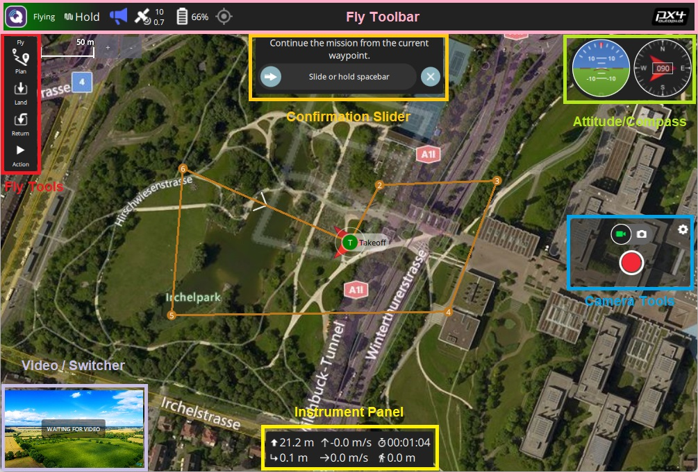

# Fly View

The Fly View is the main view you will use while flying your vehicle. 
You can switch between a map view and a video view (if available).

## Map

The map shows the positions of all connected vehicles and the mission for the current vehicle.

You can drag the map to move it around (the map automatically re-centres after a certain amount of time).

Once flying, you can click on the map to set a [Go to](#goto) or [Orbit at](#orbit) location.

## Fly Tools {#fly_tools}

On the left edge of the screen you will see the *Fly Tools*.
You can use these to takeoff, return, pause, or continue/start an action (e.g. a mission).

The default order of tools from top to bottom is:
* Takeoff/Land
* Return To Launch
* Pause
* Action

Additionally a [preflight checklist](#preflight_checklist) may be enabled, which will add a Checklist tool option.

### Pre Flight Checklist {#preflight_checklist}

A preflight checklist tool can be enabled by navigating to [Application Settings > General > Fly View](../SettingsView/General.md) and selecting the **Use preflight checklist** checkbox.

Use the checklist to run though standard tests to ensure that the vehicle is configured correctly and it is safe to fly.
Once you have performed each test, click on it in the UI to mark it as complete.  

## Video

At the lower left of the display you will see video output.
*QGroundControl* supports RTP and RTSP video streaming over your vehicles UDP connection. 
It also support directly connected UVC device support. 
More details on QGC Video support can be found on the [Video README](https://github.com/mavlink/qgroundcontrol/blob/master/src/VideoStreaming/README.md).

By clicking on the video you can make it be the main display for the *Fly View*.

## Instrument Panel

To the right is an instrument panel showing you current information on your vehicle. 
By default this displays vehicle telemetry, but you can switch the content using the drop down menu.

The different content is listed below.

### Values (Telemetry)

The values page shows telemetry information.
The displayed information can be configured by clicking on the small gear icon.

### Camera

The camera page can be used to manually trigger the camera.

### Video Stream

This page is used to enable and record video streaming.

### Health

This page shows you the health of the systems within your vehicle.
*QGroundControl* will switch to this page automatically if any systems change to unhealthy.

### Vibration

This page shows current vibration levels and clip counts.

## Guided Operations

The vehicle state and movement can controlled from a number of UI elements in the *Fly View*.
Once an operation is requested, *QGroundControl* displays the *Guided bar* at the bottom of the screen.
This can be used confirm (start) or cancel the operation (X).

The available options vary by vehicle and current vehicle state.
Some of the operations are listed below.

### Arm/Disarm/Emergency Stop

### Change Altitude

### Takeoff/Land

### Goto Location {#goto}

After taking off you can specify that you want to fly to a particular location.

1. Click the map where you want the vehicle to move and select **Go to location** on the popup.

  
  
1. The location will be displayed on the map, along with a confirmation slider.

   
   
1. When you're ready, drag the slider to start the operation (or click the cross to cancel it).

### Orbit Location {#orbit}

After taking off you can specify that you want to orbit a particular location.

1. Click the map (near the centre of your desired orbit) and select **Orbit at location** on the popup.

  
  
1. The proposed orbit will be displayed on the map, along with a confirmation sider.

   
   
   - Select and drag the central marker to move the orbit location.
   - Select and drag the dot on the outer circle to change the orbit radius
1. When you're ready, drag the slider to start the operation (or click the cross to cancel it).

### RTL/Return

### Pause

### Resume Mission

<!-- populate from https://docs.qgroundcontrol.com/en/releases/stable_v3.2_long.html#resume-mission -->

