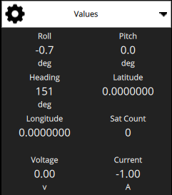
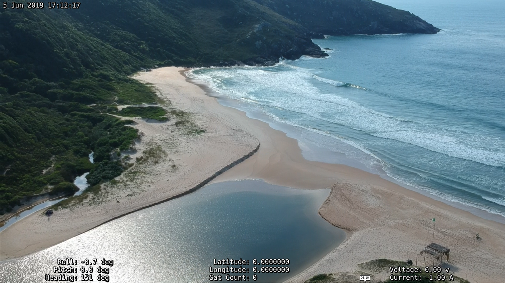

# Video Overlay

> **Note** This is a daily build feature (not present in QGC v3.5)

When QGroundControl is recording a video stream to file, it will also export a subtitle file with telemetry data that can be used to overlay the telemetry on the video during playback. Whichever telemetry values are selected for display in the telemetry [values widget](FlyView.md#values-telemetry) will also be exported to the overlay. The overlay values are updated at 1Hz.

The selected values are laid out in three columns to optimize the screen utilization.

## Playing

The overlay can be used with any player that [supports the SubStation Alpha](https://en.wikipedia.org/wiki/SubStation_Alpha#Players_and_renderers) subtitle format.
Most players will open both files together when you try to play the video. They need to be in the same folder and with the same name, which is how they are created by QGC.
