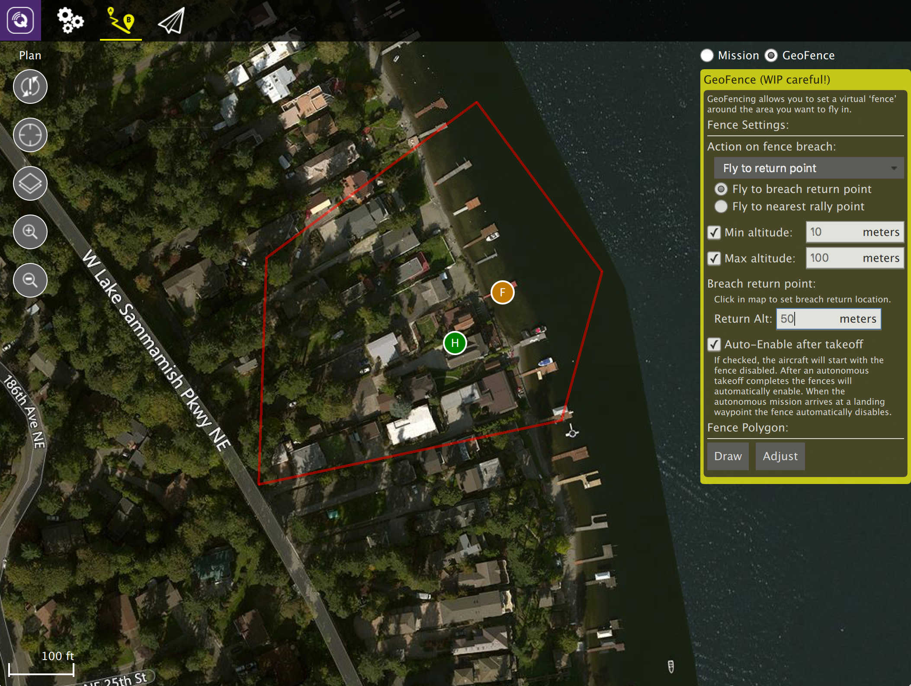

# Plan View - GeoFence
A GeoFence allows you to create a virtual fence around the area you want to fly in. If you then fly outside that area you can configure a specific action to be taken. 

Not all vehicle firmwares support GeoFence and if supported the GeoFence capabilities vary.

## Example Visuals
ArduCopter visual:

ArduPlane visual:

PX4 Pro visual:

## GeoFence Setup
The steps to creating a GeoFence are:

1. Change to Plan View
2. Select the GeoFence radio button (top right of view)
3. Specify fence settings in the editor panel
4. Add a fence polygon (if supported)
5. Send the GeoFence to the Vehicle (or save to file)

### Drawing a GeoFence Polygon
If your vehicle supports polygon fences, at the bottom of the editor panel you will see the "Fence Polygon" section. Click the Draw button to draw a polygon on the map by clicking to add points to the polygon.

Once you have created a fence polygon you can adjust it by clicking the Adjust button which will allow you to move the polygon corners. You can also click Draw again to redraw a completely new fence polygon.

### GeoFence Tools
On the left edge of the screen you will see the Plan Tools. The order of tools from top to bottom is:

* Sync
* Center map
* Map Type
* Zoom In/Out

#### Sync
The Sync tools allows you to move GeoFences back and forth to your Vehicle or a file. *Before you fly you must be sure to send your GeoFence to your vehicle.* The tool will change to have an "!" within it to indicate that you have changes to your GeoFence which you have not sent to your vehicle. 

The Sync tool provides the following functionality:

* Send to Vehicle
* Load from Vehicle
* Save to File
* Load from File
* Remove All

When you save a GeoFence to a file all settings will be saved, not just the fence polygon. 

#### Remaining tools
The rest of the tools work exactly as they do while editing a Mission.
