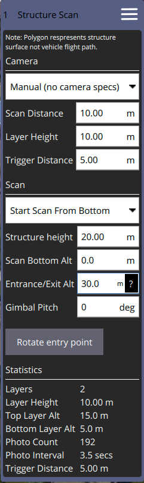
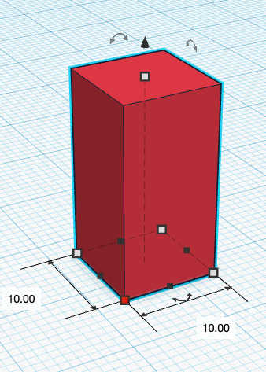
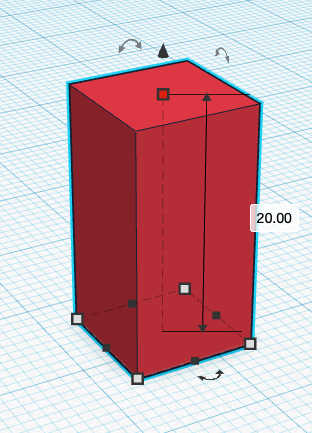
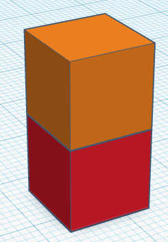

# Structure Scan (Plan Pattern) - Daily Builds

A *Structure Scan* allows you to create a grid flight pattern that captures images over vertical surfaces. 
These are typically used for the visual inspection or creation of 3d models of structures.

Structure Scan is available to insert into a mission from the *Pattern* tool.

> **Note** The new version of Structure Scan is not able to read older Structure Scan plans. They will need to be recreated.

> **Warning** This feature is not yet supported by ArduPilot firmware. 
  It is supported in PX4.

In the diagram green is used to show the polygon that represents the structure. 
In white you can see the flight path for the vehicle. 
You can also fly circular structure scans by changing the polygon to a circle using the *center tool*.

## Manual scan

A manual scan allows you to specify the detailed distances and heights associated with a structure scan yourself. You select **Manual** from the list for a manual scan.

To explain how the Structure Scan settings works we will will be use a theoretical structure which is 10 meters square and 20 meters high.

### Define vertical surface

To scan this entire structure from top to bottom we define the vertical surfaces of the structure faces with the following values.

10m Square Structure            |  Structure Height 20m | Settings
:-------------------------:|:-------------------------: | :-------------------------:
  |   | **Structure Height** = 20m **Scan Bottom Alt** = 0m

### Split into layers
Next step is we subdivide the structure into layers with each layer 10 meters high. Since the structure is 20 meters high this will create two layers each 10 meters high.

Two Layers           |  Settings
:-------------------------:|:-------------------------:
  |  **Layer Height** = 10m 

### Layer flight Path

The last step is to set the Scan Distance which is how far away from the structure the vehicle will fly. Here you can see the vehicle will fly two passes centered within each layer flying 10 meters away from the structure.

Flight Path          |  Settings
:-------------------------:|:-------------------------:
  |  **Scan Distance** = 10m 

asde

### Layer flight obstacles

An important thing to take into account is the height of the bottommost layer being flown. This height is shown in Stats as Bottom Layer Alt. If there are obstacles in the flight path at this height then you will not be able to scan to base of the structure. You can adjust the **Scan Bottom Alt** value to adjust the bottom of the structure to be above the ground. This will in turn raise up the bottommost layer flight altitude to be above obstacles.

### Flying to the structure

You also have to be aware of obstactles when flying to the structure from your home takeoff position. In order to handle this you can set the **Entrance/Exit Alt** value to be the height you want to fly to directly above the entrance point. Once it reaches this point it will fly directly up/down to the first layer. Once all layers are completed it will also fly back up/down to this height before proceeding with the next waypoint.

### Taking images

* **Trigger Distance** - The distance between each camera trigger. The camera is only triggered while flying the layer path. It does not trigger images while transitioning from one layer to the next.
* **Gimbal Pitch** - Gimbal pitch you want to use for the scan. Only available for Manual scan.

## Camera based scan

The settings for the scan can be based on the specifications of the camera on the vehicle. You do this by selecting a camera from the list or selecting **Custom Camera** to provide you own camera specs.

You can then either manually specify the **Scan Distance** or you can specify the resolution of the images you want with **Ground Res** which which will automatically calculate the **Scan Distance** needed.

When performing a camera based scan the values for **Layer Height** and **Trigger Distance** are automatically set based on the camera settings.

For camera based scans the camera is always pointed directly at the right angles to the surface which it is capturing images for.