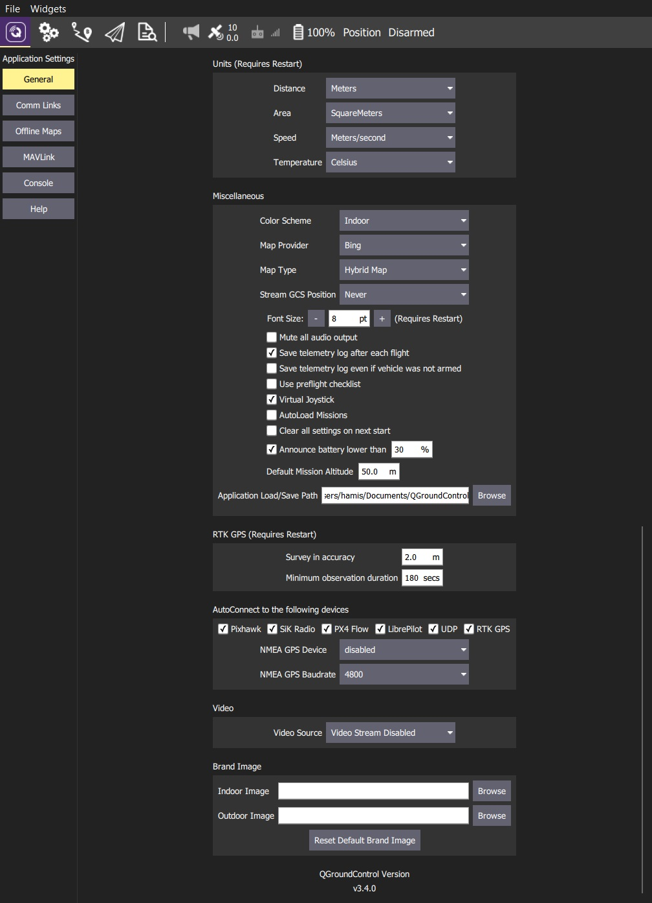
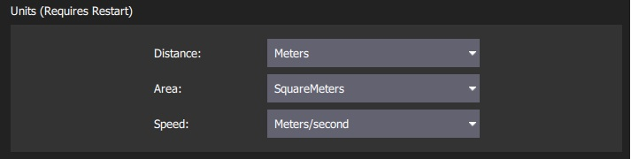
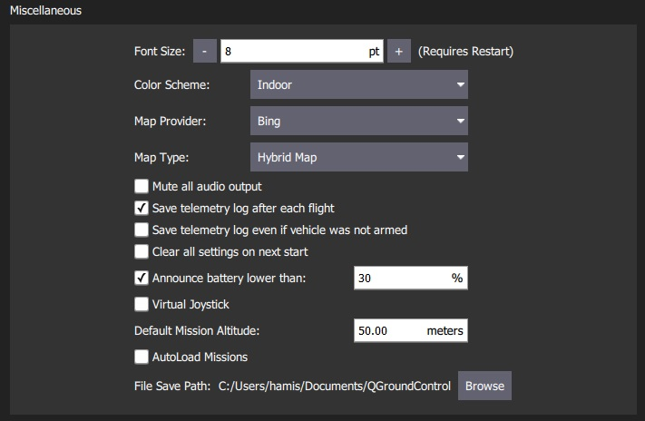
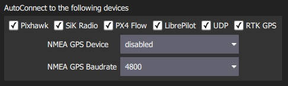
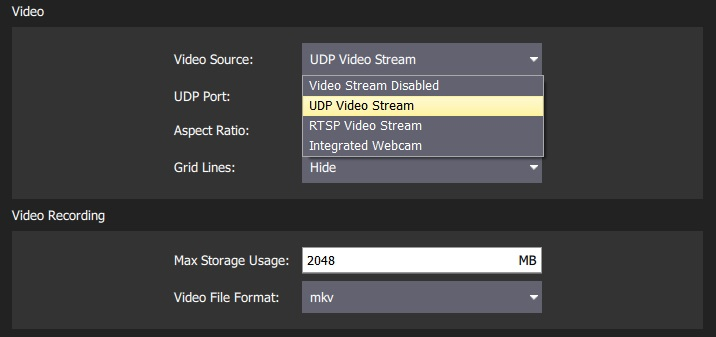

# General Settings (Settings View)

The general settings (**SettingsView > General Settings**) are the main place for application-level configuration. Settable values include: display units, autoconnection devices, video display and storage, RTK GPS, and other miscellaneous settings.

> **Note** Values are settable even if no vehicle is connected. Settings that require a vehicle restart are indicated in the UI.

## Units

This section defines the display units used for: distance, area and speed.

## Miscellaneous

This section defines a number of miscellaneous settings, related to (non exhaustively): font sizes, colour schemes, map providers, map types, telemetry logging, audio output, low battery announcement levels, default mission altitude, [virtual joysticks](../SettingsView/VirtualJoystick.md), mission autoloading, default file save path etc.

## RTK GPS

This section specifies the RTK GPS "Survey-in" settings:

- **Survey-in accuracy:** The minimum position accuracy for the RTK Survey-in process to complete.
- **Minimum observation duration:** The minimum time that will be taken for the RTK Survey-in process. 

> **Note** The *Survey-In* process is a startup procedure required by RTK GPS systems to get an accurate estimate of the base station position. The process takes measurements over time, leading to increasing position accuracy. Both of the setting conditions must met for the Survey-in process to complete. For more information see [RTK GPS](https://docs.px4.io/en/advanced_features/rtk-gps.html) (PX4 docs).

## Autoconnect to the following devices

This section defines the set of devices that *QGroundControl* will auto-connect to: Pixhawk, SiK Radio, PX4 Flow, Libre Pilot, UDP, RTK GPS.

## Video / Video Recording

The *Video* section is used to define the source and connection settings for video that will be displayed in *Fly View*. The *Video Recording* section is used to specify the file format and maximum allocated file storage for storing video.

> **Note** The values displayed in this setting depend on the video source. If no video source is specified then no other video or video recording settings will be displayed (below we see the settings when UDP source is selected).

