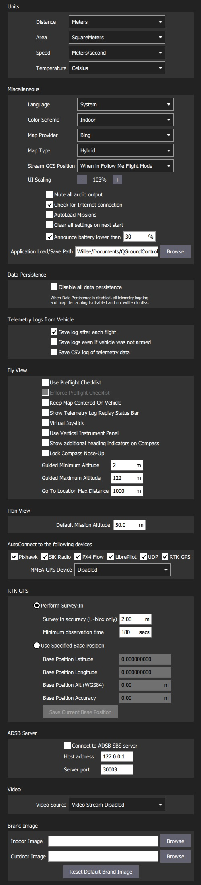
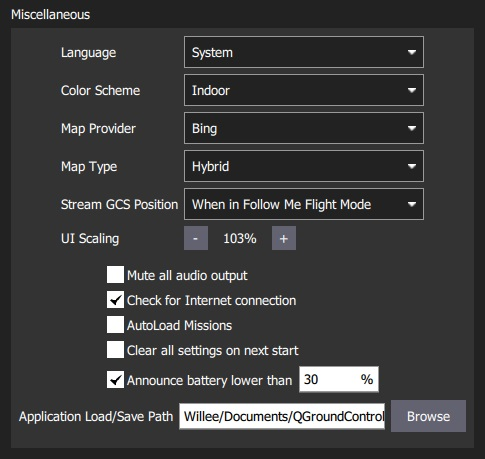
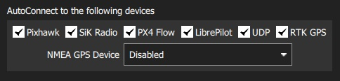

# General Settings (Settings View)

The general settings (**SettingsView > General Settings**) are the main place for application-level configuration. 
Settable values include: display units, autoconnection devices, video display and storage, RTK GPS, brand image, and other miscellaneous settings.

> **Note** Values are settable even if no vehicle is connected. Settings that require a vehicle restart are indicated in the UI.

## Units

This section defines the display units used in the application.

The settings are:
- **Distance**: Meters | Feet
- **Area**: SquareMetres | SquareFeet | SquareKilometers | Hectares | Acres |SquareMiles
- **Speed**: Metres/second | Feet/second | Miles/hour | Kilometres/hour | Knots
- **Temperature**: Celsius | Fahrenheit

## Miscellaneous

This section defines a number of miscellaneous settings, related to (non exhaustively): font sizes, colour schemes, map providers, map types, telemetry logging, audio output, low battery announcement levels, default mission altitude, [virtual joysticks](../SettingsView/VirtualJoystick.md), mission autoloading, default application file load/save path etc.

The settings are:
- **Color Scheme**: Indoor (Dark) | Outdoor (Light)
- **Map Provider**: Bing | Google | Statkart | Eniro
- **Map Type**: Hybrid | Street | Satellite
- **Stream GCS Position**: Never | Always | When in Follow Me flight mode.
- **Font Size**: Font size across app (Requires restart)
- **Mute all audio output**: Turns off all audio output. 
- **Save telemetry log after each flight**: Logs automatically saved to the *Application Load/Save Path* ([below](#load_save_path)) after flight. 
- **Save telemetry log even if vehicle was not armed**: Logs when a vehicle connects to *QGroundControl*. 
  Stops logging when the last vehicle disconnects.
- **Use preflight checklist**: Enable pre-flight checklist.
- **Virtual Joystick**: Enable [virtual joysticks](../SettingsView/VirtualJoystick.md) (PX4 only)
-  **Autoload Missions**: If enabled, automatically upload a plan to the vehicle on connection. 
  - The plan file must be named **AutoLoad#.plan**, where the `#` is replaced with the vehicle id. 
  - The plan file must be located in the [Application Load/Save Path](#load_save_path).
- **Clear all settings on next start**: Resets all settings to the default (including this one) when *QGroundControl* restarts.
- **Announce battery lower than**: Specify battery level at which *QGroundControl* will start low battery announcements.
- **Default Mission Altitude**: The default altitude used for the first waypoint (subsequent new waypoints are seeded with the altitude value of the preceding waypoint).
- **Application Load/Save Path**: Default location for loading/saving application files, including: parameters, telemetry logs, and mission plans.

## RTK GPS {#rtk_gps}

This section allows you to specify the RTK GPS "Survey-in" settings, to save and reuse the result of a Survey-In operation, or to directly enter any other known position for the base station.

> **Note** The *Survey-In* process is a startup procedure required by RTK GPS systems to get an accurate estimate of the base station position.
  The process takes measurements over time, leading to increasing position accuracy.
  Both of the setting conditions must met for the Survey-in process to complete.
  For more information see [RTK GPS](https://docs.px4.io/en/advanced_features/rtk-gps.html) (PX4 docs) and [GPS- How it works](http://ardupilot.org/copter/docs/common-gps-how-it-works.html#rtk-corrections) (ArduPilot docs).

> **Tip** In order to save and reuse a base position (because Survey-In is time consuming!) perform Survey-In once, select *Use Specified Base Position* and press **Save Current Base Position** to copy in the values for the last survey.
  The values will then persist across QGC reboots until they are changed.

The settings are:
- Perform Survey-In
  - **Survey-in accuracy (U-blox only):** The minimum position accuracy for the RTK Survey-In process to complete.
  - **Minimum observation duration:** The minimum time that will be taken for the RTK Survey-in process.
- Use Specified Base Position
  - **Base Position Latitude:** Latitude of fixed RTK base station.
  - **Base Position Longitude:** Longitude of fixed RTK base station.
  - **Base Position Alt (WGS94):** Altitude of fixed RTK base station.
  - **Base Position Accuracy:** Accuracy of base station position information.
  - **Save Current Base Position** (button): Press to copy settings from the last Survey-In operation to the *Use Specified Base Position* fields above.

## AutoConnect to the following devices {#auto_connect}

This section defines the set of devices to which *QGroundControl* will auto-connect. 

Settings include:
- **Pixhawk:** Autoconnect to Pixhawk-series device
- **SiK Radio:** Autoconnect to SiK (Telemetry) radio
- **PX4 Flow:** Autoconnect to PX4Flow device
- **Libre Pilot:** Autoconnect to Libre Pilot autopilot
- **UDP:** Autoconnect to UDP
- **RTK GPS:** Autoconnect to RTK GPS device
- **NMEA GPS Device:** Autoconnect to an external GPS device to get ground station position ([see below](#nmea_gps))

### Ground Station Location (NMEA GPS Device) {#nmea_gps}

*QGroundControl* will automatically use an internal GPS to display its own location on the map with a purple `Q` icon (if the GPS provides a heading, this will be also indicated by the icon). 
It may also use the GPS as a location source for *Follow Me Mode* - currently supported on [PX4 Multicopters only](https://docs.px4.io/en/flight_modes/follow_me.html).

You can also configure QGC to connect to an external GPS device via a serial or UDP port.
The GPS device must support the ASCII NMEA format - this is normally the case.

> **Tip** A higher quality external GPS system may be useful even if the ground station has internal GPS support.

Use the *NMEA GPS Device* drop-down selector to manually select the GPS device and other options:

- USB connection:

  

  - **NMEA GPS Device:** *Serial*
  - **NMEA GPS Baudrate**: The baudrate for the serial port

  > **Tip** To troubleshoot serial GPS problems: Disable RTK GPS [auto connection](#auto_connect), close *QGroundControl*, reconnect your GPS, and open QGC.

- Network connection:

  

  - **NMEA GPS Device:** *UDP Port*.
  - **NMEA Stream UDP Port**: The UDP port on which QGC will listen for NMEA data (QGC binds the port as a server)

## Video {#video}

The *Video* section is used to define the source and connection settings for video that will be displayed in *Fly View*.

> **Note** The values displayed in this setting depend on the video source. 
  If no video source is specified then no other video or *video recording* settings will be displayed (above we see the settings when UDP source is selected).

## Video Recording

The *Video Recording* section is used to specify the file format and maximum allocated file storage for storing video. 
Videos are saved to a sub-directory ("Video") of the [Application Load/Save Path](#load_save_path).

The settings are:
- **Auto-delete Files**: If checked, files are auto deleted when the specified amount of storage is used.
- **Max Storage Usage**: Maximum video file storage before video files are auto deleted.
- **Video file format**: File format for the saved video recording.

## Brand Image

This setting specifies the *brand image* used for indoor/outdoor colour schemes.

The brand image is displayed in place of the icon for the connected autopilot in the top right corner of the toolbar.
It is provided so that users can easily create screen/video captures that include a company logo/branding.

The settings are:
- **Indoor Image**: Brand image used in [indoor color scheme](#colour_scheme)
- **Outdoor Image**: Brand image used in [outdoor color scheme](#colour_scheme)
- **Reset Default Brand Image**: Reset the brand image back to default.
