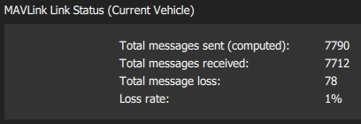
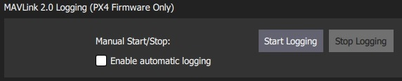
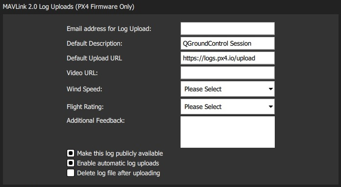
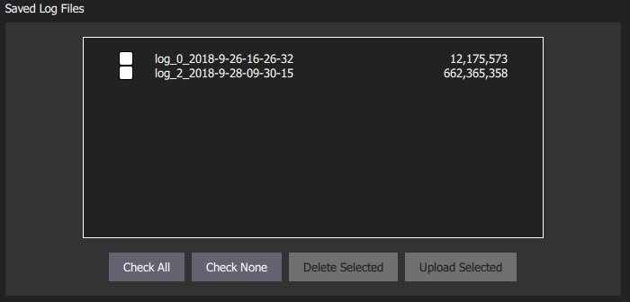

# MAVLink Settings

The MAVLink settings (**SettingsView > MAVLink**) allow you to configure options and view information specific to MAVLink communications.
This includes setting the MAVLink system ID for *QGroundControl*, viewing link quality, and managing log uploads (e.g. to [Flight Review](https://logs.px4.io)).

## Ground Station {#ground_station}

This section sets the MAVLink properties and behaviour of *QGroundControl*.

- **MAVLink System ID:** System ID of *QGroundControl* on the MAVLink network (Default: 255).
  Vehicles are typically allocated IDs from 1. 
  You may have to specify another ID if there are multiple ground stations or MAVLink applications on the network. 
- **Emit heartbeat:** Disable emission of regular MAVLink HEARTBEAT message (Default: True).
  MAVLink systems are required to emit heartbeats by the protocol, but this is not strictly speaking *needed* on single-vehicle/GCS networks.
- **Request start of MAVLink telemetry streams (ArduPilot only):** TBD (Default: True).
- **Only accept MAVs with the same protocol version:** TBD (Default: True).

## Link Status {#link_status}

This shows the status of MAVLink message transfer over the communications link. 
A high **Loss rate** may lead to protocol errors for things like parameter download or mission upload/download.

## MAVLink 2 Logging (PX4 only) {#logging}

On PX4 you can enable manual or automatic logging and upload to [Flight Review](https://logs.px4.io) (or another logging service).

The *MAVLink 2 Logging* section allows you to manually start and stop logging, and to enable automatic capture of logs. 

The *MAVLink 2 Log Uploads* section allows you configure uploading of MAVLink logs to [Flight Review](https://logs.px4.io).
You can specify all the fields that you would otherwise have to directly enter in the site, and also choose whether logs are automatically or manually uploaded.

The fields are:
- **Email address for Log Uploads:** *Flight Review* will email you a link to the upload at this address.
  This is important as otherwise you will have no way to access a non-public log after upload.
- **Default Description:** Description/name of flight used for log.
- **Default Upload URL:** URL for upload of the log/log metadata. 
  This is set by default to the *Flight Review* URL.
- **Video URL:** (Optional) URL for video of flight associated with log.
  This may be included on the Flight Review page to ease analysis.
- **Wind Speed:** Used to aid debugging and filtering (from multiple flights). Allowed values: *Calm* | *Breeze* | *Gale* | *Storm*. 
- **Flight Rating:** Used to aid debugging and filtering (from multiple flights). Allowed values: *Crashed (Pilot Error)* | *Crashed (Software or Hardware Issue)* | *Unsatisfactory* | *Good* | *Great*.
- **Additional Feedback:** (Optional). Enter a more detailed description of the flight or behaviour.
- **Make this log publically available:** If set, the log will be visible and searchable on *Flight Review*. 
  If not set, it will only be available via the link emailed on upload.
- **Enable automatic log uploads:** If set, the log will automatically be uploaded on completion.
- **Delete log file after uploading:** If set, the log will automatically deleted after upload.

The *Saved Log Files* section is used to manually manage log uploads.
Use the checkboxes and buttons to select logs, and either delete or upload them.

> **Tip** You can change the parameters in *MAVLink 2 Log Uploads* above to specify separate descriptions for uploaded logs.

