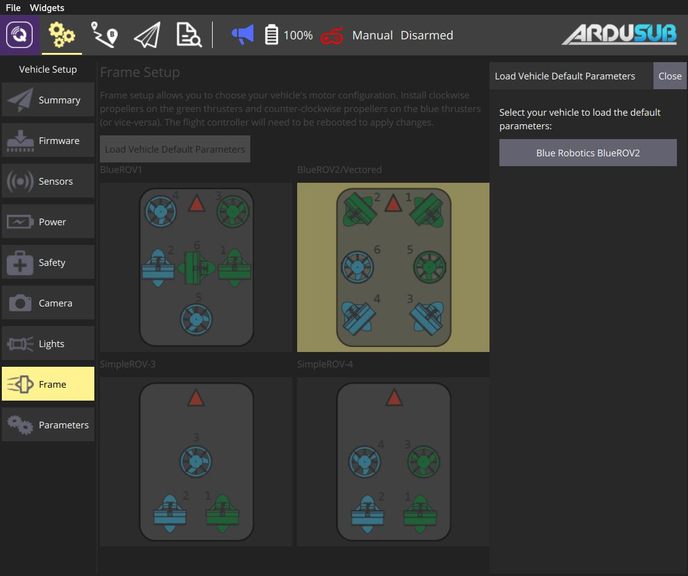

# ArduPilot Airframe Setup

This page allows you to configure the main airframe selection associated with your Ardupilot vehicle. 

> **Note** Airframe Setup is only available on *ArduCopter* and *ArduSub* vehicles (it is not shown for *ArduPilot* Rover or Plane vehicles).

## ArduCopter Airframe Setup

1. First select the **Gear** icon (Vehicle Setup) in the top toolbar and then **Airframe** in the sidebar.

1. Select the broad frame type that matches your vehicle (selecting a radio button applies the selection)

   
   

   * You can also click **Load common parameters** to load a parameter set for known vehicle types.

     
     
     > **Tip** Any selection is automatically applied when you close the prompt.

## ArduSub Frame Setup {#ardusub}

1. First select the **Gear** icon (Vehicle Setup) in the top toolbar and then **Frame** in the sidebar.

1. Select the frame type that matches your vehicle (selecting a frame applies the selection).

1. Make sure that all **green** thrusters have **clockwise** propellers and all **blue** thrusters have **counter-clockwise** propellers (or vice-versa).

   

   * You can also click **Load Vehicle Default Parameters** to load default parameter set for ArduSub.

     