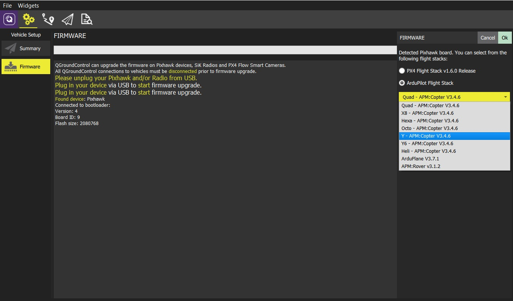

# Loading Firmware

*QGroundControl* **desktop** versions can install [PX4 Pro](http://px4.io/) or [ArduPilot](http://ardupilot.com) firmware onto Pixhawk-family flight-controller boards. By default QGC will install the current stable version of the selected autopilot, but you can also choose to install beta builds, daily builds, or custom firmware files. 

*QGroundControl* can also install the firmware for SiK Radios and PX4 Flow devices.

> **Caution** Support for loading Firmware is currently not available on tablet or phone versions of *QGroundControl*.

## Connect the device for firmware update

> **Caution** **Before you start installing Firmware** all USB connections to you vehicle must be *disconnected* (both direct or through a telemetry radio). The vehicle must *not be* powered by a battery.

1. First select the **Gear** icon (*Vehicle Setup*) in the top toolbar and then **Firmware** in the sidebar. 

  

1. Connect your device (Pixhawk, SiK Radio, PX4 Flow) directly to your computer via USB. 

   > **Note** Connect directly to a powered USB port on your machine (do not connect through a USB hub).

## Select the firmware to load

Once the device is connected you can choose which firmware to load (*QGroundControl* presents sensible options based on the connected hardware). 

1. For a Pixhawk-compatible board choose either *PX4 Pro* or *ArduPilot* firmware to download the current stable release. If you select *ArduPilot* you will further have to select the specific firmware for each type of vehicle (as shown below).
   
   

1. Check **Advanced settings** to select specific developer releases or install firmware from your local file system.

   
   

## Update the firmware

1. Click the **OK** button to start the update.

   The firmware will then proceed through a number of upgrade steps (downloading new firmware, erasing old firmware etc.). Each step is printed to the screen and overall progress is displayed on a progress bar.
   
   
   
Once the firmware has completed loading the device/vehicle will reboot and reconnect. Next you will need to configure the airframe (and then sensors, radio, etc.)

