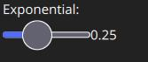

# Joystick Setup (PX4 only)

*QGroundControl* allows you to control a vehicle using a joystick or gamepad instead of an RC Transmitter.

> **Note** Flying with a Joystick (or [virtual thumb-sticks](../SettingsView/VirtualJoystick.md)) is not as responsive as RC Control because joystick information is sent over MAVLink.

> **Note** Joystick and Gamepad support is enabled using the cross-platform [SDL2](http://www.libsdl.org/index.php) library. Compatibility with a particular controller depends on SDL (all buttons that are exposed by that API are displayed through the *QGroundControl* UI). A [number of common joysticks and gamepads](#supported-joysticks) are known to work.

## Enabling PX4 Joystick Support

To enable Joystick support in PX4 you need to set the parameter `COM_RC_IN_MODE` to 1 - *Joystick/No RC Checks*. If this parameter is not set then *Joystick* will not be offered as a setup option.

This is enabled by default for PX4 SITL builds (see the [Parameters](../SetupView/Parameters.md) topic for information on how to find and set a particular parameter). 

<!-- what is "Virtual RC by Joystick"? -->

## Configuring the Joystick

To configure a joystick:

1. Shut down *QGroundControl*
1. Connect the Joystick or Gamepad to a USB port
1. Start *QGroundControl* and connect to a vehicle
1. Select the **Gear** icon (Vehicle Setup) in the top toolbar and then **Joystick** in the sidebar. The screen below will appear.
   
   
1. Press the **Calibrate** button and then follow the on-screen instructions to calibrate/move the sticks.
1. Check the **Enable joystick input** checkbox 
1. Make sure your joystick is selected in the **Active joystick** dropdown.
1. Select the flight modes/vehicle functions activated by each joystick button. A maximum of 16 joystick *button actions* can be set. <!-- MANUAL_CONTROL used to send button values only has 16 bits -->
1. Test the buttons and sticks work as intended by pressing them, and viewing the result in the Axis/Button monitor.

## Throttle Options
   

- **Center stick is zero throttle**: Centered or lowered stick sends 0 in [MANUAL_CONTROL **z**](https://mavlink.io/en/messages/common.html#MANUAL_CONTROL), raised stick sends 1000.
    - **Spring loaded throttle smoothing**: In this mode you control not the throttle itself, but the rate at which it increases/decreases. This is useful for setups where the throttle stick is spring loaded, as the user can hold the desired throttle while releasing the stick.
- **Full down stick is zero throttle**: In this mode, lowered stick sends 0 in [MANUAL_CONTROL **z**](https://mavlink.io/en/messages/common.html#MANUAL_CONTROL), centered stick 500, and raised 1000.
- **Allow negative thrust**: When in **Center stick is zero throttle** mode, this allows the user to send negative values by lowering the stick. So that lowered stick sends -1000 in [MANUAL_CONTROL **z**](https://mavlink.io/en/messages/common.html#MANUAL_CONTROL), centered sends zero, and raised stick sends 1000. This mode is only enabled for vehicles that support negative thrust, such as [Rover](http://ardupilot.org/rover/index.html).

## Expo
   

The expo slider allows you to make the sticks less sensitive in the center, allowing finer control in this zone. The slider adjusts the curvature of the exponential curve.

   

The higher the Expo value, the flatter the curve is at the center, and steeper it is at the edges.

## Supported Joysticks

The following joysticks/controllers have been shown to work with relatively recent *QGroundControl* builds.

### Sony Playstation 3/4 Controllers

These are both highly recommended. They work well "out of the box" and have many buttons that you can map to flight modes. 

### FrSky Taranis XD9 plus

The *FrSky Taranis XD9 plus* remote control can also be connected as a joystick. You will need to connect it via the USB port on the back. 

The Taranis does not allow you to use button options (to be precise, you can set the options, but toggling the buttons on your transmitter does not cause them to be pressed).

> **Note** The Taranis is an open system that is openly being worked on. It is possible that at time of writing there is a firmware or configuration that allows it to work effectively as a joystick. 

### Logitech Gamepad F310

The Logitech Gamepad F310 has been tested via USB on MacOSX "Sierra".

### Logitech Extreme 3D Pro

The [Logitech Extreme 3D Pro](http://gaming.logitech.com/en-ch/product/extreme-3d-pro-joystick) Joystick has been tested on all platforms (Linux, Windows, Mac OSX). This is a single stick controller that can also be twisted. The main stick axes are used for pitch and roll, while the twist action is used for yaw. The throttle is mapped onto a separate wheel.

### Logitech F710 Gamepad

<!-- This is from http://qgroundcontrol.org/users/joystick -->

This gamepad is great for flying a multirotor manually via QGroundControl. It works on Windows, Linux and Mac OS.

#### Mac OS Leopard / Lion Setup

The F710 is detected under Leopard / Lion but is not automatically configured as an input device. In order to get a working configuration, the F710 has to be recognised as *Rumblepad2*. 

First check how it is recognised: **Apple > About this Mac > Additional Information > System Report > USB**. I it is detected as "Logitech Cordless RumblePad 2" then nothing further needs to be done.

If it is detected as a "Logitech Wireless 710", perform these steps:

1. Unplug the USB receiver of the gamepad
1. Prepare to quickly plug it into a USB port
1. Hit the Logitech button (its silver with the Logitech Logo on it in the center of the pad)
1. Quickly connect the USB receiver to your Mac
1. The pad should now be detected in the system report as "Logitech Cordless RumblePad 2". If not, retry the above steps.

