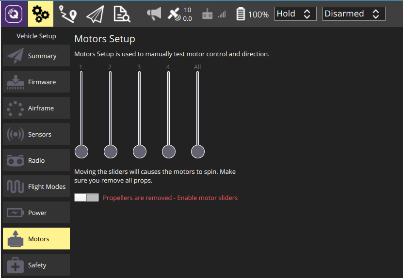

# Motors Setup

Motor Setup is used to test individual motors/servos (for example, to verify that motors spin in the correct direction).

> **Tip** These instructions apply to PX4 and to most vehicle types on ArduPilot.
  Vehicle-specific instructions are provided as sub-topics (e.g. [Motors Setup (ArduSub)](../SetupView/Motors_ardusub.md)).

## Test Steps

To test the motors:

1. Remove all propellers.
   > **Warning** You must remove props before activating the motors!
1. (*PX4-only*) Enable safety switch - if used.
1. Slide the switch to enable motor sliders (labeled: *Propellers are removed - Enable motor sliders*).
1. Adjust the individual sliders to spin the motors and confirm they spin in the correct direction.
   > **Note** The motors only spin after you release the slider and will automatically stop spinning after 3 seconds.

## PX4 Notes

The following notes apply PX4 only:
- A safety switch (if used) must be be pressed before motor testing is allowed.
- The kill-switch will immediately stop motors.
- The parameter [COM_MOT_TEST_EN](http://docs.px4.io/master/en/advanced_config/parameter_reference.html#COM_MOT_TEST_EN) disables motor testing.
- Pixhawk boards with an IO are only tested for motors/servos connected to MAIN pins.

Additional information on motor testing can be found in: [Basic Configuration > Motor Setup](http://docs.px4.io/master/en/config/motors.html) (PX4 User Guide).
