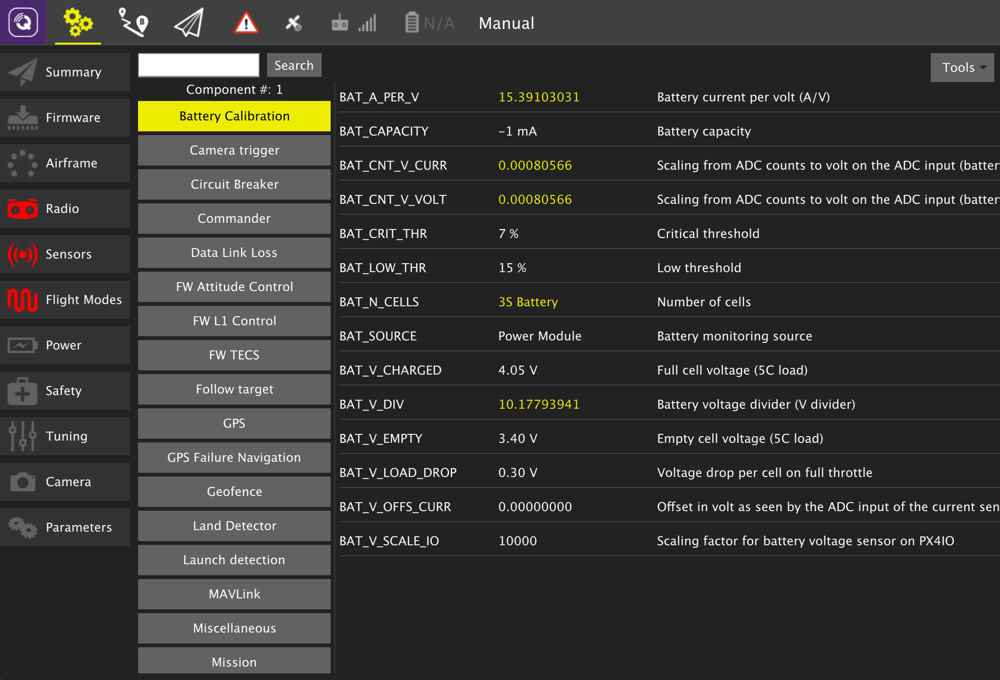

# Parameters

The *Parameters* screen allows you to modify any of the parameters associated with the vehicle.

*Note: This image is from a vehicle running PX4 Pro firmware. ArduPilot works similarly, just the parameter set will differ.*

## Finding a Parameter

The parameters are organized in groups. Select a group of parameters to view by clicking on one of the group buttons to the left (in the image above the *Battery Calibration* group is selected).

You can also *search* for a parameter by entering the string you are searching for in the text field to right of the Search button and then click **Search**. This will show you a list of parameters which match you search criteria. Search will not only match on parameter names, but it will also match on parameter descriptions.

## Changing a Value

To change the value of a parameter click on the parameter value in the list. This will open a side dialog which allows you to update the value and also provides additional detailed information on the parameter.

*Note: This image is out of date.*

## Tools

*Note: These images are out of date.*

You can select additional options from the **Tools** menu.

**Refresh**
 Refresh the parameter values by re-requesting all of them from the vehicle.

**Reset all to defaults**
 Reset all parameters to their original default values.

**Load from file / Save to file**
 Load parameters from an existing file or Save your current parameter settings to a file.
