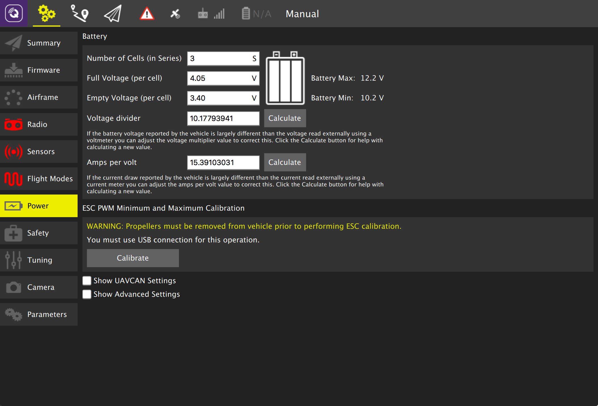

# Power Setup

Enter data for your battery from its data sheet: number of cells, full voltage per cell, empty voltage per cell. Approximate values will be automatically populated for the voltage divider and amps per volt values.

## Battery Voltage/Current Calibration

If the measured battery voltage and current differ significantly from the default values *QGroundControl* will help you calculate more appropriate voltage divider and amps-per-volt values:

1. Measure the voltage from the battery using a multimeter
1. Click **Calibrate** next to the *Voltage divider* field. On the prompt that appears:
  1. Enter the measured voltage.
  1. Click **Calculate** to generate a new voltage-divider value.
  1. Click **Close** to save the value into the main form. 
1. Measure the current from the battery.
1. Click **Calibrate** next to the *Amps per volt* field. On the prompt that appears:
  1. Enter the measured current.
  1. Click **Calculate** to generate a new *amps per volt* value.
  1. Click **Close** to save the value into the main form. 

## Advanced Power Settings

Click the **Show Advanced Settings** checkbox to specify advanced power settings.

### Voltage Drop on Full Load

Batteries show less voltage at high throttle. Enter the difference in Volts between idle throttle and full throttle, divided by the number of battery cells. The default value should be used if unsure!

> **Warning** If the value is too high the battery may be deep-discharged and damaged.

## ESC PWM Minimum and Maximum Calibration

To calibrate the ESC max/min PWM values:
1. Connect the vehicle to QGC via USB (only). 
1. Remove the propellers. 
1. Click the **Calibrate** button.
 
## Other Settings

Select the **Show UAVCAN Settings** checkbox to access additional settings for UAVCAN Bus Configuration and motor index and direction assignment.
