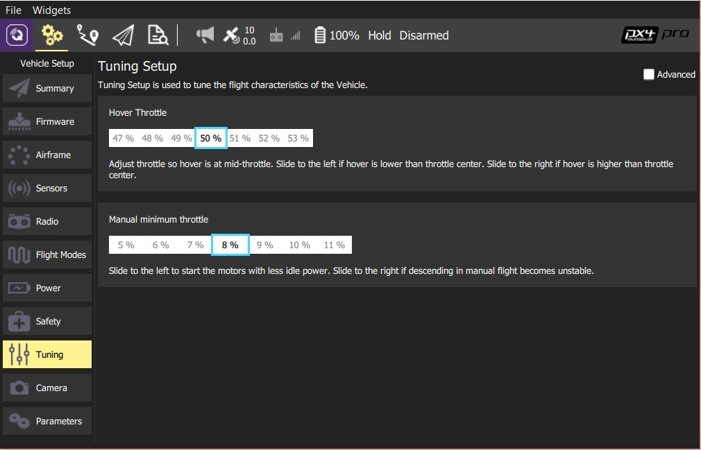

# Tuning Setup

This page allows you to configure settings on your vehicle which control basic flight characteristics. The details of the page differ slightly if you are using PX4 Pro firmware or ArduPilot firmware.

## ArduCopter Tuning

### Basic Tuning

Adjust the flight characteristics by moving the desired slider to the left or right.

### AutoTune

AutoTune is used to automatically tune the rate parameters in order to provide the highest response without significant overshoot.

Performing an AutoTune:

* Select which axes you would like to tune. 
  > **Tip** Tuning all axes at once can take a significant amount of time, which may cause you to run out of battery. 
    To prevent this choose to tune only one axis at a time. 
* Assign AutoTune to one of your transmitter switches.
  Ensure that switch is in low position before taking off.
* Take off and put the copter into AltHold.
* Turn on AutoTune with your transmitter switch.
* The copter will twitch around the specified axes for a few minutes.
* When AutoTune completes the copter will change back to the original settings.
* Move the AutoTune switch back to low position and then back to high to test the new settings.
* Move the AutoTune switch to low to test previous settings.
* To save new settings, land and disarm while AutoTune switch is in high position.

Note:

* Since AutoTune is done in AltHold your copter must already have a tuning which is minimally flyable in AltHold.
  You can cancel AutoTune at any time by moving the AutoTune switch back to low position.
* You can reposition the copter using your transmitter at any time during AutoTune.

### In Flight Tuning

This is an advanced option which allows you to tune a flight control parameter using one of your transmitter dial channels. 
Select the control option from the dropdown and specify the min/max for the values to assign to the dial.

## PX4 Copter Tuning

### Basic Tuning

Adjust the specified flight characteristic by moving the slider(s) to the left or right.

### Advanced Tuning

> **Note** Advanced tuning is currently only available on PX4 Multicopter frames. <!-- Still only multirotors? -->

To access advanced tuning, select the **Advanced** checkbox.

To use advanced tuning:
1. First select the *Tuning axis* to tune: **Rol**, **Pitch** or **Yaw** (each axis is tuned separately).
1. Fly the vehicle, observing the tracking on the chart.
   - Adjust the *Tuning Values* (parameters) to improve the tracking shown on the graph
   - Set the **Increment/Decrement %** to a larger/smaller value for course/fine tuning
   - Press the **Save Values** button if a change improves tracking. 
     > **Tip** At any point you can press **Reset To Saved Values** to restore the last saved good state.
   - You can also **Clear**/**Stop** the chart using the buttons provided.
1. Tune the other axes.
