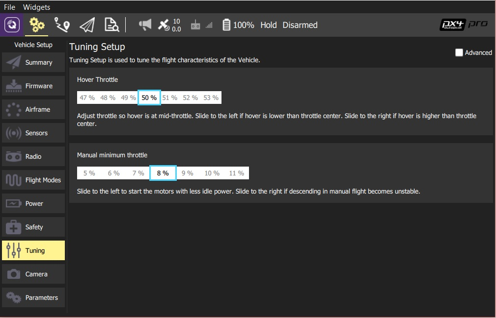
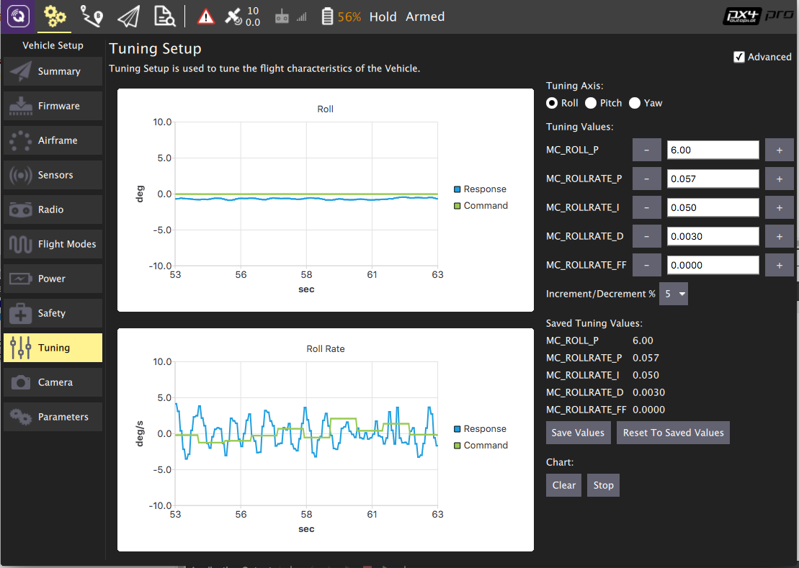

# Tuning (PX4)

## Basic Tuning (Multicoper, Fixed Wing, VTOL)

Adjust the specified flight characteristic by moving the slider(s) to the left or right.

## Advanced Tuning (MultiCopter)

To access advanced tuning, select the **Advanced** checkbox.

To use advanced tuning:
1. First select the *Tuning axis* to tune: **Rol**, **Pitch** or **Yaw** (each axis is tuned separately).
1. Fly the vehicle, observing the tracking on the chart.
   - Adjust the *Tuning Values* (parameters) to improve the tracking shown on the graph
   - Set the **Increment/Decrement %** to a larger/smaller value for coarse/fine tuning
   - Press the **Save Values** button if a change improves tracking. 
     > **Tip** At any point you can press **Reset To Saved Values** to restore the last saved good state.
   - You can also **Clear**/**Stop** the chart using the buttons provided.
1. Tune the other axes.
