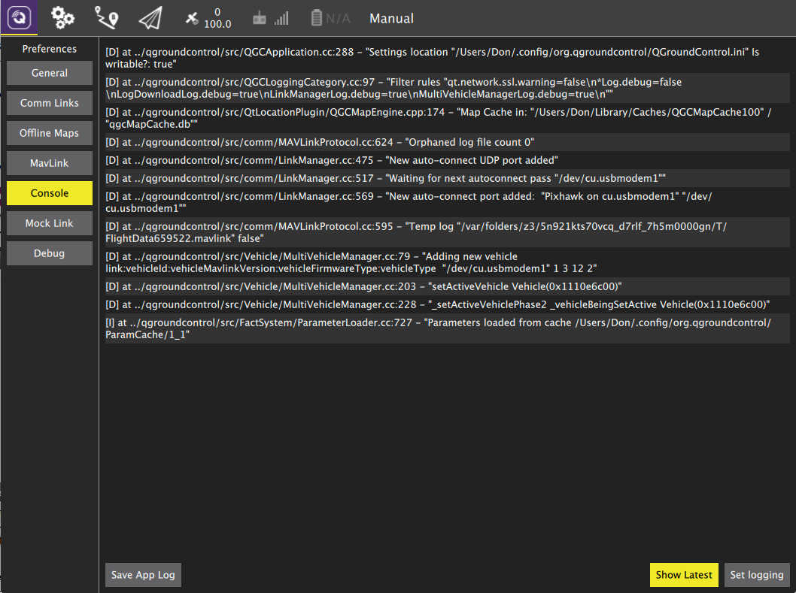

# Support

This user guide is meant to be the main provider of support for QGroundControl. If you find that it is missing helpful information and/or has incorrect information please file an [Issue](https://github.com/mavlink/qgc-user-guide/issues) against it.

For reporting problems or asking questions about QGroundControl please use the [QGroundControl Google Group](http://groups.google.com/group/qgroundcontrol).

### Console Logging

The Console can be helpful tool for diagnosing QGroundControl problems. It can be found in the Setttings view. It allows you turn turn on/off the logging options available in QGroundControl. Click the "Set Logging" button to select logging options.

##### Commonly used logging options

* LinkManagerLog, MultiVehicleManagerLog - Debug connection problems.
* LinkManagerVerboseLog - Very noisy connection problem debugging. Continuous output of available serial ports.
* FirmwareUpgradeLog - Debug firmware flash issues.
* ParameterLoaderLog - Debug parameter load problems.
* ParameterLoaderVerboseLog - Debug parameter load problems with full trace of parameters coming/going/in system.
* MissionManagerLog - Debug mission protocol issues.
* RadioComponentControllerLog - Debug Radio calibration issues.

##### Logging from the command line

An alternate mechanism for logging is using the --logging command line option. This is handy if you are trying to get logs from a situation where QGroundControl crashes.

How you do this and where the traces are output vary by OS:

  * Windows
    * You must open a command prompt, change directory to the qgroundcontrol.exe location, and run it from there:
    * <code>cd "\Program Files (x86)\qgroundcontrol"
qgroundcontrol --logging:full</code>
    * When QGC starts you should see a separate console window open which will have the log output
  * OSX
    * You must run QGC from Terminal. The Terminal app is located in Applications/Utilities. Once Terminal is open paste the following into it:
    * <code>cd /Applications/qgroundcontrol.app/Contents/MacOS/
./qgroundcontrol --logging:full</code>
    * Log traces will output to the Terminal window.
  * Linux
    * <code>./qgroundcontrol-start.sh --logging:full</code>
    * Log traces will output to the shell you are running from.

### Developer Chat

The QGroundControl developers as well as many QGGroundControl users can be found on the QGroundControl [Gitter](https://gitter.im/mavlink/qgroundcontrol) channel. If you are a heavy user of QGroundControl and want to keep up to date on the latest information or help with QGroundControl we suggest monitoring that channel.

##### Help out your fellow QGroundControl users

Just like QGroundControl itself, the user guide is an open source, user created and supported GitBook. We welcome [Pull Requests](https://github.com/mavlink/qgc-user-guide/pulls) against the guide for fixes and/or updates.
