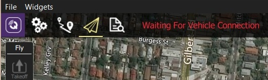

# Support

This user guide is meant to be the main provider of support for *QGroundControl*. 
If you find incorrect or missing information please report an [Issue](https://github.com/mavlink/qgc-user-guide/issues).

*Questions* about *QGroundControl* should be raised in the associated flight stack's discussion server at the links below:
* [PX4 Flight Stack](http://discuss.px4.io/c/qgroundcontrol/qgroundcontrol-usage) (discuss.px4.io).
* [ArduPilot Flight Stack](http://discuss.ardupilot.org/c/ground-control-software/qgroundcontrol) (discuss.ardupilot.org).

## Developer Chat {#developer_chat}

The *QGroundControl* developers as well as many *QGroundControl* users can be found on the [#QGroundControl channel on Slack](https://px4.slack.com/) or the [Gitter](https://gitter.im/mavlink/qgroundcontrol) channel. If you are a heavy user of *QGroundControl* and want to keep up to date on the latest information or help with *QGroundControl* we suggest monitoring that channel.


## GitHub Issues

Issues are used to track bugs against *QGroundControl* as well as feature requests for later versions. The current list of issues can be found on [GitHub here](https://github.com/mavlink/qgroundcontrol/issues).

> **Note** Please contact our developers using the [IM](#developer_chat) channels **before** creating GitHub issues! 


### Feature Requests

Feature Requests should first be discussed on a [developer IM](#developer_chat) channel. The developer team will direct you to create a feature request on Github if necessary (or refer you to the appropriate existing feature).

### Reporting Bugs

Bug reports should first be discussed on a [developer IM](#developer_chat) channel (there are many cases where something that seems like a bug is actually a vehicle setup problem). The developer team will direct you to create an issue if necessary.

If you are directed to create an issue, please provide all information needed to reproduce the problem (OS, *QGroundControl* version/build, Autopilot version/release etc). The sections below explain how to get additional information that can help with debugging issues.

#### Console Logging

*Console Logs* can be helpful when diagnosing *QGroundControl* problems. For more information see: [Console Logging](../SettingsView/console_logging.md).

#### Reporting Crashes from Windows Builds

1. Create a file called **qgccrash.reg** with the following contents:
  ```
  Windows Registry Editor Version 5.00

  [HKEY_LOCAL_MACHINE\SOFTWARE\Microsoft\Windows\Windows Error Reporting\LocalDumps\qgroundcontrol.exe]
  "DumpType"=dword:00000002
  "DumpFolder"="c:\\qgccrash"
  ```
2. Double-click it to install to your registry
3. Create a **c:\qgccrash** folder on you machine
4. Now when *QGroundControl* crashes it will place a dump file in the **c:\qgccrash** folder
5. After *QGroundControl* crashes, place the newest instance of the **.dmp** file in a public location
6. Add a link to the **.dmp** file and above details in the GitHub issue.

#### Reporting Hangs from Windows Builds

If Windows is telling you the *QGroundControl program is unresponsive* use the following steps to report the hang:

1. Open *Task Manager* (right-click TaskBar, select **Task Manager**)
2. Switch to the Processes tab and local **qgroundcontrol.exe**
3. Right-click on **groundcontrol.exe** and select **Create Dump File**
4. Place the dump file in a public location
5. Add a link to the **.dmp** file and above details in the GitHub issue.


## Troubleshooting

This section is for troubleshooting the QGC host computer/configuration. 
Problems when *using QGroundControl* to interact with a vehicle are covered in: [Common Problems](../Support/CommonProblems.md).

### 64-bit Windows: Audio in Unexpected Language

On Windows 64-bit machines *QGroundControl* may sometimes play audio/messages in a language that does not match the *Text-to-speech* setting in **Control Panel > Speech** (e.g. audio spoken in German on an English machine).

This can occur because 64-bit Windows only displays 64-bit voices, while *QGroundControl* is a 32-bit application (on Windows) and hence can only run 32-bit voices.

The solution is to set the desired *32-bit voice* for your system:
1. Run the control panel application: **C:\Windows\SysWOW64\Speech\SpeechUX\sapi.cpl**.
2. Make your desired *Voice selection* and then click **OK** at the bottom of the dialog.
   

> **Note** Additional information about the Windows speech APIs can be found [here](https://www.webbie.org.uk/blog/microsoft-speech/).


### Windows: UI Rendering/Video Driver Issues {#opengl_troubleshooting}

If you experience UI rendering issues or video driver crashes on Windows, this may be caused by "flaky" OpenGL drivers. *QGroundControl* provides 3 shortcuts that you can use to start *QGroundControl* in "safer" video modes (try these in order):

- **QGroundControl:** QGC uses OpenGL graphics drivers directly.
- **GPU Compatibility Mode:** QGC uses ANGLE drivers, which implement OpenGL on top of DirectX.
- **GPU Safe Mode:** QGC uses a software rasterizer for the UI (this is very slow).


### Windows: Waiting For Vehicle Connection over WiFi {#waiting_for_connection}

If *QGroundControl* sits forever *Waiting For Vehicle Connection* when trying to connect to the vehicle over Wifi, a possible cause is that IP traffic is being blocked by firewall software (e.g. Windows Defender, Norton, etc.).



The solution is to allow the *QGroundControl* app through the firewall.

If using *Windows Defender*:
- In the **Start** bar, enter/select: *Firewall & Network Protection* (System Settings).
- Scroll to and select the option: *Allow an app through firewall*.
- Select *QGroundControl* and change the *Access* selector to **Allow**.
  > **Tip** Programs are listed in alphabetical order by description (not filename).
  You'll find QGC under **O**: *Open source ground control app provided by QGroundControl dev team*

## Help Improve these Docs!

Just like *QGroundControl* itself, the user guide is an open source, user created and supported GitBook. We welcome [Pull Requests](https://github.com/mavlink/qgc-user-guide/pulls) against the guide for fixes and/or updates.

