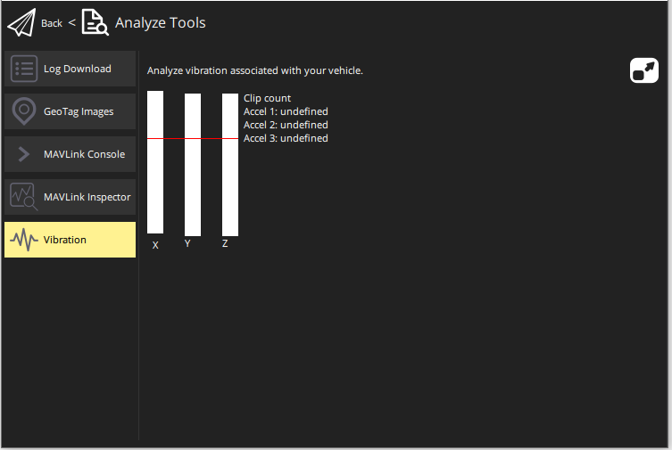

# Vibration (Analyze View)

The Vibration view (**Analyze > Vibration**) provides a high-level indication of whether vehicle vibration may be a problem.
The view shows the acceleration levels and clip count in each axis.

> **Note** High levels of vibration can throw off vehicle position estimates, leading to poor performance in modes that rely on accurate positioning.

Vibration levels that are more than half the level of the red line (30 m/s/s) _may_ cause problems.
If your vehicle is having trouble maintaining position lock then vibration should be investigated further (using log analysis tools).
Vibrations levels above the red line (60 m/s/s) are almost always a problem.

