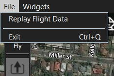

# App Menus

The App Menus (**File** and **Widget**) provide access to tools that primarily useful for developers/debugging. 

 

The linked tools are:

- **File**
  - **[Replay Flight Data](../app_menu/replay_flight_data.md)** - Replay a telemetry log.
  - **Exit** - Close *QGroundControl*
- **Widgets**
  - **[MAVLink Inspector](../app_menu/mavlink_inspector.md)** - Display received MAVLink messages/values.
  - **[Custom Command](../app_menu/custom_command_widget.md)** - Load custom/test QML UI at runtime.
  - **[Onboard Files](../app_menu/onboard_files.md)** - Navigate vehicle file system and upload/download files.
  - **[HIL Config Widget](../app_menu/hil_config.md)** - Settings for HIL simulators.
  - **[Analyze](../app_menu/mavlink_analyzer.md)** - MAVLink Analyzer tool can plot trends for message fields.
  