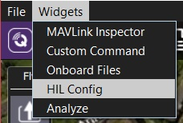
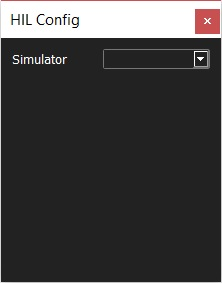
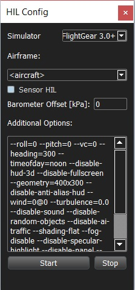
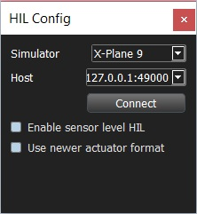
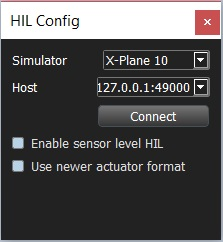

# HIL Config Widget

> **Warning** This feature is intended primarily for **developers**. 
  It is only supported on desktop builds (Windows, Linux, Mac OS).

The *HIL Config* widget allows you to specify simulator settings when using Hardware in the Loop simulation. 

To use the *HIL Config Widget*:
1. Select **Widgets | HIL Config** on any screen.

   

   This will open the empty widget. 
   
   
1. Select the target simulator: Flight Gear 3+, XPlane 9, XPlane10

   > **Tip** The default settings are typically reasonable for each vehicle.
     Specific additional configuration should be in the autopilot flight stack documentation: [PX4 HITL Simulation](https://dev.px4.io/en/simulation/hitl.html), [ArduPilot HITL Simulators](http://ardupilot.org/dev/docs/hitl-simulators.html)

   
   
   
