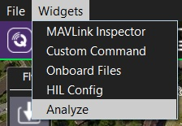
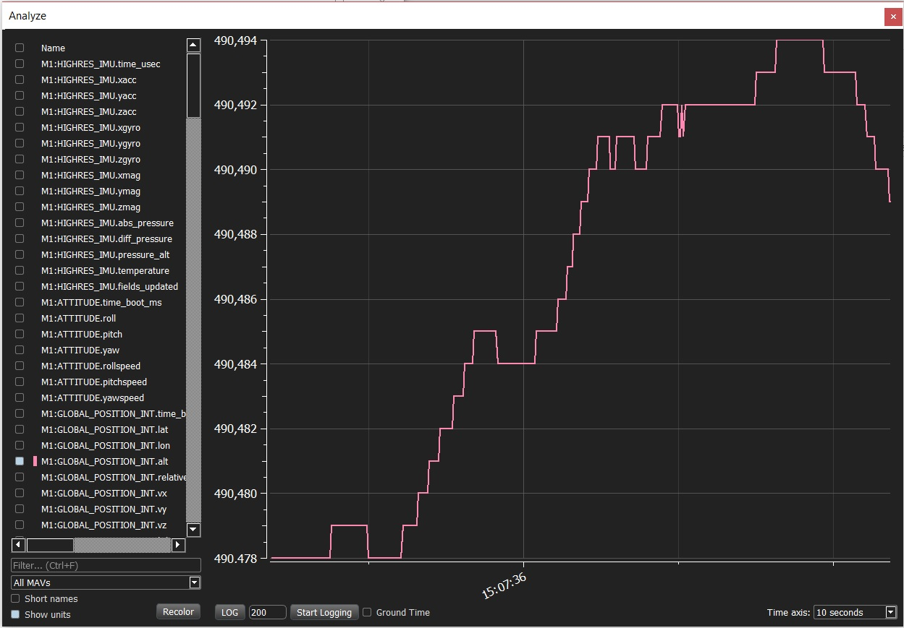
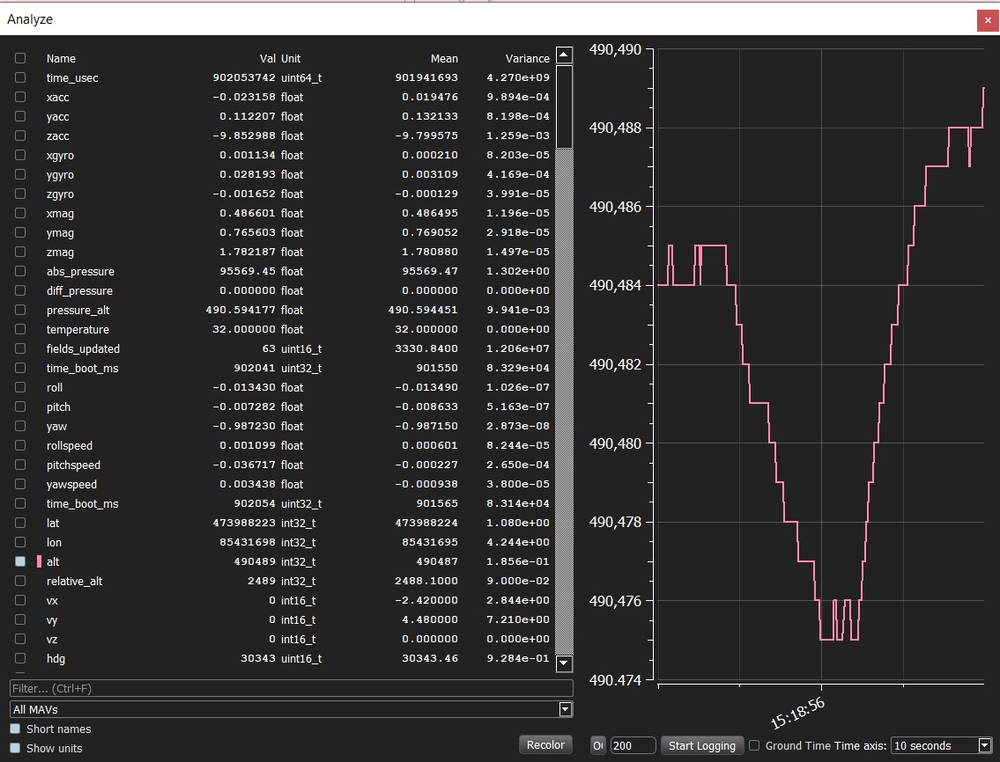

# MAVLink Analyzer Widget (Analyze)

> **Warning** This feature is intended primarily for **autopilot developers**/**vehicle creators**. 
  It is only supported on desktop builds (Windows, Linux, Mac OS).
  Note that this is distinct from the [Analyze View](../analyze_view/README.md).

The *MAVLink Analyzer* widget can be used to show *trend* information for MAVLink traffic received by *QGroundControl*.

For every vehicle it lists all the fields for every received MAVLink message.
You can select any set of fields to graph them (using their associated checkbox) and see the trend by time.

To use the *MAVLink Analyzer*:
1. Select **Widgets | Analyze** on any screen.

   

   The widget will open displaying all message fields on left, and a graph on the right.
   
   
1. Toggle the checkbox to the left of each field to display/hide it on the dynamic plot. 
   
1. Expand the left pane to show values, means and variances.

   
   
   The **Short names** and **Show units** checkboxes can be used to modify information in the table. 

