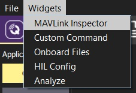
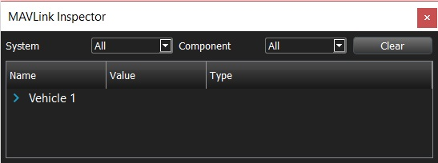
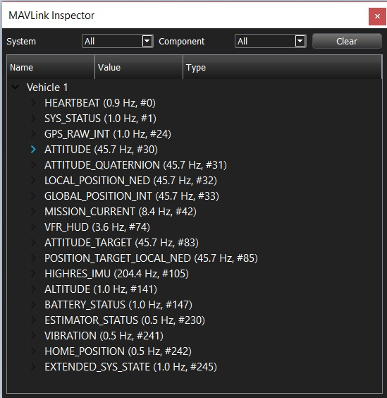
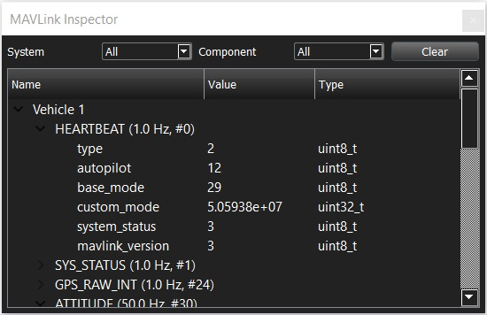

# MAVLink Inspector Widget

> **Warning** This feature is intended primarily for **autopilot developers**/**vehicle creators**. 
  It is only supported on desktop builds (Windows, Linux, Mac OS).

The *MAVLink Inspector* widget provides information about MAVLink traffic received by *QGroundControl*.
For every vehicle it lists all received messages (including their update frequency and command number).
You can drill down into any vehicle message to see the content of the last received message.

<!--  -->

To use the *MAVLink Inspector*:
1. Select **Widgets | MAVLink Inspector** on any screen.

   

   The widget will open displaying all vehicles (for which messages have been received).

   

1. Expand the vehicle toggle to see its messages. 
   
   
1. Expand a message to see its latest (dynamically updating) value:

   
1. You can reset the view by pressing the **Clear** button. 
   The widget will repopulate from new messages.
