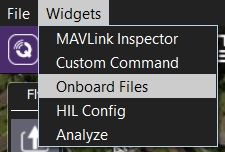
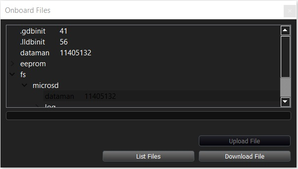

# Onboard Files Widget

> **Warning** This feature is intended primarily for **developers**. 
  It is only supported on desktop builds (Windows, Linux, Mac OS).

The *Onboard Files* widget allows you to navigate the file system/SD card on a connected vehicle and upload/download files.

To use the *Onboard Files Widget*:
1. Select **Widgets | Onboard Files** on any screen.

   

   > **Note** If this is the first time that the widget has been opened for the current connection it will be empty. 
     Press **List Files** to populate the widget with directory/file information.
1. Navigate through the file system. 

   
1. To download a file select it and then press **Download File**. You will be prompted to browse for a target folder for the downloaded file.
1. To upload a file navigate to where you want the file to be copied. Press **Upload File** and select the file to upload from the displayed dialog.

