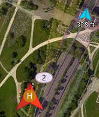

# Daily Build Major Changes

This topic contains a high level and *non-exhaustive* list of new features added to *QGroundControl* since the last [stable release](../releases/release_notes.md). These features are available in [daily builds](../releases/daily_builds.md).

* Plan: Fixed Wing Landing Pattern: You can now adjust the distance from the loiter to land point by either distance or glide slope fall rate.
* Fly: Better display of vehicle icons when connected to multiple vehicles.
* Fly: Multi-Vehicle View supports commands which apply to all vehicles.
* Fly: Displays vehicles reported from ADS-B sensor.

## Detailed Notes

### Fly View

#### Multi-Vehicle vehicle indicators

When you are connected to multiple vehicles the vehicle id will be shown below the vehicle icon. The active vehicle will be opaque and the inactive vehicles will be semi-transparent.

   

#### Multi-Vehicle View supports batch commands

The multi-vehicle list now supports commands which apply to all vehicles.

   
   
The current list of available commands are Pause and Start Mission but that will be exapanded upon with further development.

#### ADS-B sensor vehicle display

Vehicle reported by ADS-B sensor on vehicle are shown on map as smaller blue icons with altitude below the icon.

   

