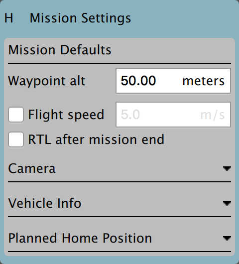

# QGroundControl v3.2 Release Notes (Detailed)

This topic contains a high level and *non-exhaustive* list of new features added to *QGroundControl* in version 3.2.


## Settings

### Telemetry log auto-save
If you have *Save telemetry log after each flight* turned on you will no longer be prompted as to where to save the log each time the vehicle disarms. Logs will automatically be saved to the save path specified in *Settings*.

### AutoLoad plans
If this setting is turned on, QGC will automatically upload a plan to the vehicle when it connects. The plan file must be named **AutoLoad#.plan** where the # is replaced with the vehicle id. The location of the plan file is in the file save path as specified above.

### File Save path
You can now specify a save path which QGC will use as the default location to save files such as Parameters, Telemetry or Mission Plans.

### RTK GPS
You can now specify the *Survey in accuracy* and *Minimum observation duration* for use with a connected RTK GPS.

## Setup

### ArduPilot - Pre-Flight Barometer and Airspeed calibration
This is now supported from the Sensors page.

### ArduPilot - Copy RC Trims
This is now supported from the Copy Trims button on the Radio setup page.

## Plan View

### Plan files
Previous version of QGC saved missions, geo-fences and rally points in separate files (**.mission**, **.fence**, **.rally**). QGC now save all information related to a flight plan into a single file called a *Plan File* with a file extension of **.plan**.

### Plan Toolbar


The new Plan Toolbar is displayed at the top of the Plan View. It shows you information related to the currently selected waypoint as well as statistics for the entire mission.

When you are connected to a vehicle it also show an *Upload* button which can be used to upload the plan to the vehicle.

### Mission Settings
The Mission Settings panel allows you to specify values which apply to the entire mission, or settings you want to control right at the beginning of a mission. This is the first item in the mission list on the right of the screen.



#### Mission defaults

##### Waypoint alt
This specifies the default altitude for newly added mission items. If you update this value while you have a mission loaded it will prompt you to update all the the waypoints to this new altitude.

##### Flight speed
This allows you to set the flight speed for the mission to be different than the default mission speed.

##### RTL after mission end
Check this if you want your vehicle to RTL after the final mission item.

#### Camera section


The camera section allows you to specify a camera action to take, control the gimbal and set your camera into photo or video mode.

The camera actions available are:

*  Continue current action
*  Take photos (time)
*  Take photos (distance)
*  Stop taking photos
*  Start recording video
*  Stop recording video

#### Vehicle Info section


When planning a mission the firmware being run on the vehicle as well as the vehicle type must be known in order for QGroundControl to show you the mission commands which are appropriate for your vehicle.

If you are planning a mission while you are connected to your vehicle the Firmware and Vehicle Type will be determined from the vehicle. If you are planning a mission while not connected to a vehicle you will need to specify this information yourself.

The additional value that can be specified when planning a mission is the vehicle flight speed. By specifying this value, total mission or survey times can be approximated even when not connected to a vehicle.

#### Planned Home Position


The planned home position allows you to simulate the vehicle's home position while planning a mission. This way you see the waypoint trajectory for your vehicle from takeoff to mission completion. Keep in mind that this is only the "planned" home position and you should place it where you plan to start the vehicle from. It has no actual impact on flying the mission. The actual home position of a vehicle is set by the vehicle itself when arming.

### New Waypoint features


* You can now adjust heading and flight speed for each waypoint.
* There is a camera section available for camera changes on each waypoint. Explanation of Camera Section can be read under Mission Settings above.

### Visual Gimbal direction


If you specify gimbal yaw changes on waypoints, both the plan and fly views will show you a visual representation of the gimbal direction.

### Pattern tool

There is a new *Pattern tool*. The following patterns are supported:

* Fixed Wing Landing (new)
* Survey (with new features)

#### Fixed Wing Landing Pattern


This adds a landing pattern for fixed wings to your mission. The first point of the pattern is the loiter point which commands to vehicle to loiter to a specific altitude. Once that altitude is reached, the vehicle will begin the landing sequence and fly down to the specified landing spot.

Both the loiter and land points can be dragged to adjust. Also all the various values associated with the pattern can be adjusted.

#### Survey (new features)
* Images are not automatically taken in the turnaround zone outside of the polygonal survey area.
* There is a new *Hover and Capture* option which can be used to capture the highest quality image at each image location. The vehicle will stop at each image location prior to taking the image such that the vehicle is stable while the image is taken.
* There is a new option to re-fly the survey grid at a 90 degree angle to the previous pass. This allows you to generate much denser coverage for the images.


Manipulating the survey area polygon is now easier to use on tablets with touch screens:

* You can drag the entire polygon to a new location by dragging the center point handle.
* Each polygon vertex can be dragged to a new location.
* To remove a polygon vertex, simple click on the drag handle for it.
* Click on the **+** handles to add a new vertex between two existing vertices.

## Fly View

### RTK GPS
RTK status is now shown in the toolbar.

### Arm/Disarm
There is an armed/disarmed indicator in the toolbar. You can click it to arm/disarm your vehicle. If you click Disarm in the toolbar while your vehicle is flying you will provided the option to Emergency Stop your vehicle.

### Guided Actions

* Takeoff
* Land
* RTL
* Pause
* Actions
  * Start Mission
  * Resume Mission
  * Change Altitude
  * Land Abort
* Direct interaction with map
  * Set Waypoint
  * Goto Location

### Remove mission after vehicle lands
You will be prompted to remove the mission from the vehicle after the mission completes and the vehicle lands and disarms. This is meant to prevent issues where stale missions are unknowingly left on a vehicle cause unexpected behavior.

### Instrument panel
#### Camera trigger


#### Flight Time
Flight time is now available for display in the instrument panel. For new users, flight time will be shown by defeault. For existing users who have already modified their instrument panel values you will have to add it yourself if you want to use it.

## Analyze View
* Log download moved to Analyze view from menu
* New GeoTag images support for PX4 Pro firmware
* New Mavlink Console which provides access the the nsh shell running on the vehicle.

### Multi-Vehicle View

There is a new view available when you have multiple vehicles connected to QGC. It will only show up when more than one vehicle is connected. When that happens you will see an additional set of radio button at the top right of the Plan view.


Click the **Multi-Vehicle** radio button to replace the instrument panel with the multi-vehicle list:


The example above shows three vehicles. The numbers are the vehicle id. In the large font is the current flight mode. You can click the flight mode name to change to a different flight mode. To the right are small version of the instruments for each vehicle. You can command the vehicle to do the following actions from the control panel:

* Arm/Disarm
* Start/Stop a mission
* Return to Launch
* Take Control back of the vehicle by returning to manual control from a mission.

#### Multi-Vehicle Gotchas - Unique vehicle ids
Each vehicle connected to QGC must have a unique id. Otherwise QGC will think the vehicles are actually the same vehicle. The symptom of this is the Plan view jerking around as it tries to position itself to one vehicle and then the next. For PX4 Pro firmwares this is the `MAV_SYS_ID` parameter. For ArduPilot firmwares it is the ```SYSID_THISMAV``` parameter.

## Support for third-party customized QGroundControl
Standard QGC supports multiple firmware types and multiple vehicle types. There is now support in QGC which allows a third-party to create their own custom version of QGC which is targeted specifically to their custom vehicle. They can then release their own version of QGC with their vehicle.
