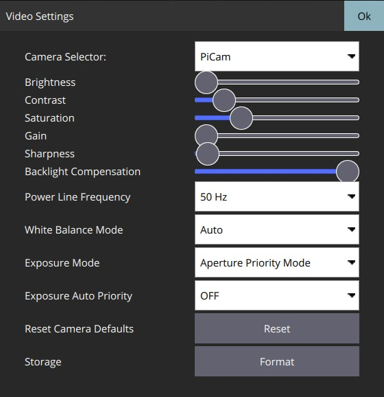
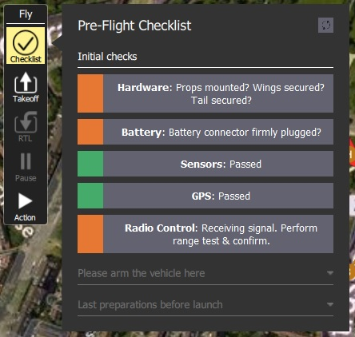
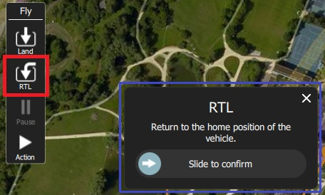
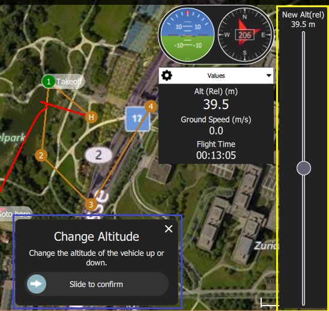
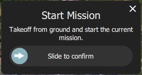
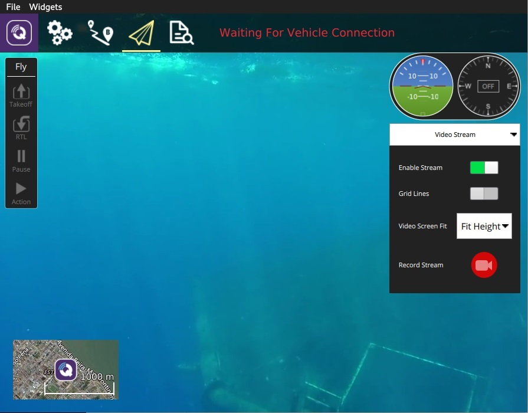

# 비행 뷰

플라이 뷰는 비행 중 차량을 명령하고 모니터링하는 데 사용됩니다.

다음과 같은 용도로 사용할 수 있습니다:

- 자동화된 [비행 전 체크리스트](#preflight_checklist)를 실행합니다.
- 제어 임무: [시작](#start_mission), [계속](#continue_mission), [일시중지](#pause) 및 [재개](#resume_mission).
- 차량의 [경비](#arm)/[해제](#disarm)/[비상 정지](#emergency_stop), [이륙](#takeoff)/[착륙](#land), [고도 변경](#change_altitude), 특정 위치로 [이동](#goto) 또는 [궤도](#orbit), [복귀/RTL](#rtl)할 수 있습니다.
- 지도 보기와 동영상 보기 간 전환(사용 가능한 경우)
- 현재 차량에 대한 비디오, 임무, 원격 측정 및 기타 정보를 표시하고 연결된 차량 간에 전환합니다.

## UI 개요

위의 스크린샷은 비행 뷰의 주요 요소를 나타냅니다.

- **지도:** 연결된 모든 차량의 위치와 현재 차량의 임무를 표시합니다. 
  - 지도를 드래그하여 이동할 수 있습니다(일정 시간이 지나면 지도가 자동으로 중앙에 위치함).
  - 비행 후에는 지도를 클릭하여 [이동](#goto) 또는 [궤도](#orbit) 위치를 설정할 수 있습니다.
- **비행 툴바:** 센서(GPS, 배터리, RC 제어) 및 차량 상태(비행 모드, 무장/해제 상태)에 대한 주요 상태 정보. 
  - 더 자세히 보려면 센서 표시기를 선택하십시오.
  - 새 모드를 선택하려면 *비행 모드* 텍스트(예: "Hold")를 누르십시오. 모든 모드를 사용할 수 있는 것은 아닙니다.
  - 무장 상태를 전환하려면 *Armed/Disarmed* 텍스트를 누르십시오. 비행 중에 이 텍스트를 누르면 *비상 정지*가 가능합니다.
- **비행 툴:** 다음과 같은 용도로 사용할 수 있습니다: 
  - 이륙/착륙 사이를 전환합니다.
  - 현재 작업(예: 착륙 또는 임무)을 일시 중지/재시작합니다.
  - 안전 반환(RTL 또는 반환이라고도 함).
  - *작업* 버튼은 현재 상태에 대한 다른 적절한 옵션을 제공합니다(이 옵션은 *확인 슬라이더*와 중첩됨). 조치에는 고도 변경 또는 임무 계속이 포함됩니다.
  - [실행 전 체크리스트](#preflight_checklist)를 활성화합니다(도구 옵션은 기본적으로 비활성화되어 있음).
- **[계측기 패널](#instrument_panel):** 원격 측정, 카메라, 비디오, 시스템 상태 및 진동을 포함한 차량 정보를 표시하는 다중 페이지 위젯입니다.
- **[동영상/전환기](#video_switcher):** 창에서 비디오 또는 지도 사이를 전환합니다. 
  - 요소를 눌러 *동영상* 및 *지도*를 전경으로 전환합니다.
  - *QGroundControl*은 차량 UDP 연결을 통한 RTP 및 RTSP 비디오 스트리밍을 지원합니다. 또한 직접 연결된 UVC 장치를 지원합니다. QGC 비디오 지원은 [비디오 README](https://github.com/mavlink/qgroundcontrol/blob/master/src/VideoStreaming/README.md)에서 자세히 설명합니다.
  - [Telemetry Overlay](../FlyView/VideoOverlay.md)가 자막 파일로 자동 생성됩니다.
- **확인 슬라이더:** 요청된 작업을 확인하기 위한 상황에 맞는 슬라이더입니다. 슬라이드하여 작동을 시작합니다. 취소하려면 **X**를 누르십시오.

기본적으로 표시되지 않거나 특정 조건에서만 표시되는 다른 요소가 많이 있습니다. 예를 들어 다중 차량 선택기는 차량이 여러 대인 경우에만 표시되고 비행 전 체크리스트 도구 버튼은 적절한 설정이 활성화된 경우에만 표시됩니다.

## 계기판 {#instrument_panel}

계기판은 원격 측정, 카메라, 비디오, 시스템 상태 및 진동 정보를 포함하여 현재 차량에 대한 정보를 표시하는 다중 페이지 위젯입니다.

기본 페이지에는 차량 원격 측정이 표시됩니다. 오른쪽 상단의 드롭다운 메뉴를 사용하여 다른 옵션을 선택하십시오.

### 값(원격 측정)

값 페이지에는 원격 측정 정보가 표시됩니다. 기본적으로 고도(홈 위치 기준) 및 지면 속도입니다.

패널 왼쪽 상단의 작은 톱니바퀴 아이콘을 눌러 표시할 정보를 구성할 수 있습니다. 각 값은 보통 또는 "큰" 크기로 표시될 수 있습니다(큰 크기는 페이지의 행당 하나의 값만 표시하고 보통은 2를 표시함).

### 카메라 {#camera_instrument_page}

카메라 페이지는 카메라를 구성하고 제어합니다. 비행 콘트롤러에 직접 연결된 카메라에 사용할 수 있는 유일한 옵션은 카메라 트리거입니다.

[MAVLink 카메라 프로토콜](https://mavlink.io/en/services/camera.html)을 지원하는 카메라에 연결하면 사용 가능한 다른 카메라 서비스를 추가로 구성하고 사용할 수 있습니다. 예를 들어, 카메라가 비디오 모드를 지원하는 경우 정지 이미지 캡처와 비디오 모드 사이를 전환하고 녹화를 시작/중지할 수 있습니다.

고급 설정은 페이지 왼쪽 상단의 톱니바퀴 아이콘을 통해 변경할 수 있습니다.

> **Note** 표시되는 대부분의 설정은 카메라에 따라 다릅니다([MAVLink 카메라 정의 파일](https://mavlink.io/en/services/camera_def.html)에 정의되어 있음). 마지막에 몇 가지 일반적인 설정이 하드 코딩되어 있습니다: 사진 모드(단일/인터벌), 사진 간격(인터벌인 경우), 카메라 기본값 재설정(카메라에 재설정 명령 전송), 포맷(저장)

### 비디오 스트림 {#video_instrument_page}

비디오 페이지는 비디오 스트리밍을 활성화/비활성화하는 데 사용됩니다. 활성화하면 비디오 스트림을 시작/중지하고, 그리드 오버레이를 활성화하고, 이미지가 화면에 맞는 방식을 변경하고, QGC를 사용하여 로컬로 비디오를 녹화할 수 있습니다.

### 상태

상태 페이지는 차량 내 시스템의 상태를 보여줍니다. 시스템이 비정상으로 변경되면 *QGroundControl*이 자동으로 이 페이지로 전환합니다.

 

### 진동

진동 페이지는 현재 진동 수준과 클립 수를 보여줍니다.

## 액션/태스크

다음 섹션에서는 플라이 뷰에서 일반적인 작업/작업을 수행하는 방법을 설명합니다.

> **Note** 사용 가능한 많은 옵션은 차량 유형과 현재 상태에 따라 다릅니다.

### 비행 전 점검 리스트 {#preflight_checklist}

자동 비행 전 체크리스트를 사용하여 차량이 올바르게 구성되어 있고 비행하기에 안전한지 표준 검사를 실행할 수 있습니다.

체크리스트를 보려면 먼저 [애플리케이션 설정 > 일반 > 플라이 뷰](../SettingsView/General.md)로 이동하고 **실행 전 체크리스트 사용** 확인란을 선택하여 도구를 활성화하십시오. 그러면 *비행 도구*에 도구가 추가됩니다. 체크리스트를 열려면 누르세요.

각 테스트를 수행한 후에는 UI에서 해당 테스트를 선택하여 완료로 표시합니다.

### 시동 {#arm}

> **Tip** 일반적으로 *QGroundControl*에서는 차량을 명시적으로 시동을 걸 필요가 없습니다. 이것은 임무나 이륙을 시작하는 경우 수행됩니다.

차량을 시동을 걸면 이륙을 준비하는 모터가 시동됩니다.

차량에 시동을 걸려면 *Fly Toolbar*에서 **Disarmed**를 선택한 다음 확인 사이드를 사용하십시오.

> **Note** 차량은 일반적으로 몇 초 후에 이륙하지 않으면 자동으로 시동이 해제됩니다.

### 시동 끄기 {#disarm}

차량의 시동을 꺼면 모터가 정지합니다(차량을 안전한 상태로 변경함). 차량의 시동을 꺼려면 차량이 **착륙**했을 때 *비행 도구 모음*에서 **시동**을 선택하십시오.

> **Note** 비행 중 차량의 시동을 꺼는 것을 [비상 정지](#emergency_stop)라고 합니다.

### 비상 정지 {#emergency_stop}

비상 정지는 비행 중 차량의 시동을 꺼는 것과 동일합니다. 차량이 충돌합니다!

비행 중인 차량의 시동을 꺼려면 *비행 도구 모음*에서 **무장**을 선택하십시오.

### 이륙 {#takeoff}

> **Tip** If you are starting a mission for a multicopter, *QGroundControl* will automatically perform the takeoff step.

To takeoff (when landed):

1. Press the **Takeoff** button in the *Fly Tools* (this will toggle to a **Land** button after taking off).
2. Optionally set the takeoff altitude in the right-side vertical slider.
3. Confirm takeoff using the slider.

### Land {#land}

You can land at the current position at any time while flying:

1. Press the **Land** button in the *Fly Tools* (this will toggle to a **Takeoff** button when landed).
2. Confirm landing using the slider.

### RTL/Return

Return to a "safe point" at any time while flying:

1. Press the **RTL** button in the *Fly Tools*.
2. Confirm RTL using the slider.

> **Note** Vehicles commonly return to the "home" (takeoff) location and land. This behaviour depends on the vehicle type and configuration. For example, rally points or mission landings may be used as alternative return targets.

### Change Altitude {#change_altitude}

You can change altitude while flying, except when in a mission:

1. Press the **Action** button on the *Fly Tools*
2. Select the *Change Altitude* action from the dialog.
  
  

3. Move the vertical slider to the desired altitude, then drag the confirmation slider to start the action.
  
  

### Goto Location {#goto}

After taking off you can specify that you want to fly to a particular location.

1. Left click/Press on the map where you want the vehicle to move and select **Go to location** on the popup.
  
  

2. The location will be displayed on the map, along with a confirmation slider.
  
  

3. When you're ready, drag the slider to start the operation (or press the **X** icon to cancel it).

> **Note** Goto points must be set within 1 km of the vehicle (hard-coded in QGC).

### Orbit Location {#orbit}

After taking off you can specify that you want to orbit a particular location.

1. Left click/Press on the map (near the centre of your desired orbit) and select **Orbit at location** on the popup.
  
  

2. The proposed orbit will be displayed on the map, along with a confirmation sider.
  
  
  
  - Select and drag the central marker to move the orbit location.
  - Select and drag the dot on the outer circle to change the orbit radius
3. When you're ready, drag the slider to start the operation (or press the **X** icon to cancel it).

### Pause

You can pause most operations, including taking off, landing, RTL, mission execution, orbit at location. The vehicle behaviour when paused depends on the vehicle type; typically a multicopter will hover, and a fixed wing vehicle will circle.

> **Note** You cannot pause a *Goto location* operation.

To pause:

1. Press the **Pause** button in the *Fly Tools*.
2. Optionally set a new altitude using the right-side vertical slider.
3. Confirm the pause using the slider.

### Missions

#### Start Mission {#start_mission}

You can start a mission when the vehicle is landed (the start mission confirmation slider is often displayed by default).

To start a mission from landed:

1. Press the **Action** button on the *Fly Tools*
2. Select the *Start Mission* action from the dialog.
  
  
  
      (to display the confirmation slider)
      

3. When the confirmation slider appears, drag it to start the mission.
  
  

#### Continue Mission {#continue_mission}

You can *continue* mission from the *next* waypoint when you're flying (the *Continue Mission* confirmation slider is often displayed by default after you takeoff).

> **Note** Continue and [Resume mission](#resume_mission) are different! Continue is used to restart a mission that has been paused, or where you have taken off, so you've already missed a takeoff mission command. Resume mission is used when you've used a RTL or landed midway through a mission (e.g. for a battery change) and then wish to continue the next mission item (i.e. it takes you to where you were up to in the mission, rather than continuing from your place in the mission).

You can continue the current mission while (unless already in a mission!):

1. Press the **Action** button on the *Fly Tools*
2. Select the *Continue Mission* action from the dialog.
  
  

3. Drag the confirmation slider to continue the mission.
  
  

#### Resume Mission {#resume_mission}

*Resume Mission* is used to resume a mission after performing an [RTL/Return](#rtl) or [Land](#land) from within a mission (in order, for example, to perform a battery change).

> **Note** If you are performing a battery change, **do not** disconnect QGC from the vehicle after disconnecting the battery. After you insert the new battery *QGroundControl* will detect the vehicle again and automatically restore the connection.

After landing you will be prompted with a *Flight Plan complete* dialog, which gives you the option to remove the plan from the vehicle, leave it on the vehicle, or to resume the mission from the last waypoint that was traveled through.

If you select to resume the mission, then *QGroundControl* will rebuild the mission and upload it to the vehicle. Then use the *Start Mission* slider to continue the mission.

The image below shows the mission that was rebuilt after the Return shown above.

> **Note** A mission cannot simply resume from the last mission item that the vehicle executed, because there may be multiple items at the last waypoint that affect the next stage of the mission (e.g. speed commands or camera control commands). Instead *QGroundControl* rebuilds the mission, starting from the last mission item flown, and automatically prepending any relevant commands to the front of the mission.

#### Remove Mission Prompt After Landing {#resume_mission_prompt}

You will be prompted to remove the mission from the vehicle after the mission completes and the vehicle lands and disarms. This is meant to prevent issues where stale missions are unknowingly left on a vehicle, potentially resulting in unexpected behavior.

### Display Video {#video_switcher}

When video streaming is enabled, *QGroundControl* will display the video stream for the currently selected vehicle in the "video switcher window" at the bottom left of the map. You can press the switcher anywhere to toggle *Video* and *Map* to foreground (in the image below, the video is shown in the foreground).

> **Note** Video streaming is configured/enabled in [Application Settings > General tab > Video](../SettingsView/General.md#video).

You can further configure video display using controls on the switcher:

    
    

- Resize the switcher by dragging the icon in the top right corner.
- Hide the switcher by pressing the toggle icon in the lower left.
- Detach the video switcher window by pressing on the icon in its top left corner (once detached, you can move and resize the window just like any other in your OS). If you close the detached window the switcher will re-lock to the QGC Fly view.

### Record Video

If supported by the camera and vehicle, *QGroundControl* can start and stop video recording on the camera itself. *QGroundControl* can also record the video stream and save it locally.

> **Tip** Video stored on the camera may be of much higher quality, but it is likely that your ground station will have a much larger recording capacity.

#### Record Video Stream (on GCS)

Video stream recording is controlled on the [video stream instrument page](#video_instrument_page). Press the red circle to start recording a new video (a new video file is created each time the circle is pressed); the circle will change into a red square while recording is in progress.

Video stream recording is configured in the [Application Settings > General tab](../SettingsView/General.md):

- [Video Recording](../SettingsView/General.md#video-recording) - specifies the recording file format and storage limits. > **Note** Videos are saved in Matroska format (.mkv) by default. This format is relatively robust against corruption in case of errors.
- [Miscellaneous](../SettingsView/General.md#miscellaneous) - Streamed video is saved under the **Application Load/Save Path**. 

> **Tip** The stored video includes just the video stream itself. To record video with QGroundControl application elements displayed, you should use separate screen recording software.

#### Record Video on Camera

Start/stop video recording *on the camera itself* using the [camera instrument page](#camera_instrument_page). First toggle to video mode, then select the red button to start recording.

