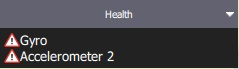
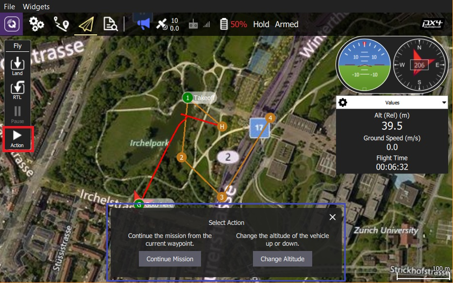
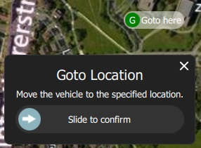
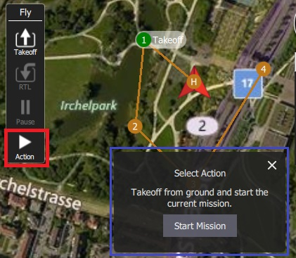

# 비행 뷰

플라이 뷰는 비행 중 차량을 명령하고 모니터링하는 데 사용됩니다.

다음과 같은 용도로 사용할 수 있습니다:

- 자동화된 [비행 전 체크리스트](#preflight_checklist)를 실행합니다.
- 제어 임무: [시작](#start_mission), [계속](#continue_mission), [일시중지](#pause) 및 [재개](#resume_mission).
- 차량의 [경비](#arm)/[해제](#disarm)/[비상 정지](#emergency_stop), [이륙](#takeoff)/[착륙](#land), [고도 변경](#change_altitude), 특정 위치로 [이동](#goto) 또는 [궤도](#orbit), [복귀/RTL](#rtl)할 수 있습니다.
- 지도 보기와 동영상 보기 간 전환(사용 가능한 경우)
- 현재 차량에 대한 비디오, 임무, 원격 측정 및 기타 정보를 표시하고 연결된 차량 간에 전환합니다.

## UI 개요

위의 스크린샷은 비행 뷰의 주요 요소를 나타냅니다.

- **지도:** 연결된 모든 차량의 위치와 현재 차량의 임무를 표시합니다. 
  - 지도를 드래그하여 이동할 수 있습니다(일정 시간이 지나면 지도가 자동으로 중앙에 위치함).
  - 비행 후에는 지도를 클릭하여 [이동](#goto) 또는 [궤도](#orbit) 위치를 설정할 수 있습니다.
- **비행 툴바:** 센서(GPS, 배터리, RC 제어) 및 차량 상태(비행 모드, 무장/해제 상태)에 대한 주요 상태 정보. 
  - 더 자세히 보려면 센서 표시기를 선택하십시오.
  - 새 모드를 선택하려면 *비행 모드* 텍스트(예: "Hold")를 누르십시오. 모든 모드를 사용할 수 있는 것은 아닙니다.
  - 무장 상태를 전환하려면 *Armed/Disarmed* 텍스트를 누르십시오. 비행 중에 이 텍스트를 누르면 *비상 정지*가 가능합니다.
- **비행 툴:** 다음과 같은 용도로 사용할 수 있습니다: 
  - 이륙/착륙 사이를 전환합니다.
  - 현재 작업(예: 착륙 또는 임무)을 일시 중지/재시작합니다.
  - 안전 반환(RTL 또는 반환이라고도 함).
  - *작업* 버튼은 현재 상태에 대한 다른 적절한 옵션을 제공합니다(이 옵션은 *확인 슬라이더*와 중첩됨). 조치에는 고도 변경 또는 임무 계속이 포함됩니다.
  - [실행 전 체크리스트](#preflight_checklist)를 활성화합니다(도구 옵션은 기본적으로 비활성화되어 있음).
- **[계측기 패널](#instrument_panel):** 원격 측정, 카메라, 비디오, 시스템 상태 및 진동을 포함한 차량 정보를 표시하는 다중 페이지 위젯입니다.
- **[동영상/전환기](#video_switcher):** 창에서 비디오 또는 지도 사이를 전환합니다. 
  - 요소를 눌러 *동영상* 및 *지도*를 전경으로 전환합니다.
  - *QGroundControl*은 차량 UDP 연결을 통한 RTP 및 RTSP 비디오 스트리밍을 지원합니다. 또한 직접 연결된 UVC 장치를 지원합니다. QGC 비디오 지원은 [비디오 README](https://github.com/mavlink/qgroundcontrol/blob/master/src/VideoStreaming/README.md)에서 자세히 설명합니다.
  - [Telemetry Overlay](../FlyView/VideoOverlay.md)가 자막 파일로 자동 생성됩니다.
- **확인 슬라이더:** 요청된 작업을 확인하기 위한 상황에 맞는 슬라이더입니다. 슬라이드하여 작동을 시작합니다. 취소하려면 **X**를 누르십시오.

기본적으로 표시되지 않거나 특정 조건에서만 표시되는 다른 요소가 많이 있습니다. 예를 들어 다중 차량 선택기는 차량이 여러 대인 경우에만 표시되고 비행 전 체크리스트 도구 버튼은 적절한 설정이 활성화된 경우에만 표시됩니다.

## 계기판 {#instrument_panel}

계기판은 원격 측정, 카메라, 비디오, 시스템 상태 및 진동 정보를 포함하여 현재 차량에 대한 정보를 표시하는 다중 페이지 위젯입니다.

기본 페이지에는 차량 원격 측정이 표시됩니다. 오른쪽 상단의 드롭다운 메뉴를 사용하여 다른 옵션을 선택하십시오.

### 값(원격 측정)

값 페이지에는 원격 측정 정보가 표시됩니다. 기본적으로 고도(홈 위치 기준) 및 지면 속도입니다.

패널 왼쪽 상단의 작은 톱니바퀴 아이콘을 눌러 표시할 정보를 구성할 수 있습니다. 각 값은 보통 또는 "큰" 크기로 표시될 수 있습니다(큰 크기는 페이지의 행당 하나의 값만 표시하고 보통은 2를 표시함).

### 카메라 {#camera_instrument_page}

카메라 페이지는 카메라를 구성하고 제어합니다. 비행 콘트롤러에 직접 연결된 카메라에 사용할 수 있는 유일한 옵션은 카메라 트리거입니다.

[MAVLink 카메라 프로토콜](https://mavlink.io/en/services/camera.html)을 지원하는 카메라에 연결하면 사용 가능한 다른 카메라 서비스를 추가로 구성하고 사용할 수 있습니다. 예를 들어, 카메라가 비디오 모드를 지원하는 경우 정지 이미지 캡처와 비디오 모드 사이를 전환하고 녹화를 시작/중지할 수 있습니다.

고급 설정은 페이지 왼쪽 상단의 톱니바퀴 아이콘을 통해 변경할 수 있습니다.

> **Note** 표시되는 대부분의 설정은 카메라에 따라 다릅니다([MAVLink 카메라 정의 파일](https://mavlink.io/en/services/camera_def.html)에 정의되어 있음). 마지막에 몇 가지 일반적인 설정이 하드 코딩되어 있습니다: 사진 모드(단일/인터벌), 사진 간격(인터벌인 경우), 카메라 기본값 재설정(카메라에 재설정 명령 전송), 포맷(저장)

### 비디오 스트림 {#video_instrument_page}

비디오 페이지는 비디오 스트리밍을 활성화/비활성화하는 데 사용됩니다. 활성화하면 비디오 스트림을 시작/중지하고, 그리드 오버레이를 활성화하고, 이미지가 화면에 맞는 방식을 변경하고, QGC를 사용하여 로컬로 비디오를 녹화할 수 있습니다.

### 상태

상태 페이지는 차량 내 시스템의 상태를 보여줍니다. 시스템이 비정상으로 변경되면 *QGroundControl*이 자동으로 이 페이지로 전환합니다.

 

### 진동

진동 페이지는 현재 진동 수준과 클립 수를 보여줍니다.

## 액션/태스크

다음 섹션에서는 플라이 뷰에서 일반적인 작업/작업을 수행하는 방법을 설명합니다.

> **Note** 사용 가능한 많은 옵션은 차량 유형과 현재 상태에 따라 다릅니다.

### 비행 전 점검 리스트 {#preflight_checklist}

자동 비행 전 체크리스트를 사용하여 차량이 올바르게 구성되어 있고 비행하기에 안전한지 표준 검사를 실행할 수 있습니다.

체크리스트를 보려면 먼저 [애플리케이션 설정 > 일반 > 플라이 뷰](../SettingsView/General.md)로 이동하고 **실행 전 체크리스트 사용** 확인란을 선택하여 도구를 활성화하십시오. 그러면 *비행 도구*에 도구가 추가됩니다. 체크리스트를 열려면 누르세요.

각 테스트를 수행한 후에는 UI에서 해당 테스트를 선택하여 완료로 표시합니다.

### 시동 {#arm}

> **Tip** 일반적으로 *QGroundControl*에서는 차량을 명시적으로 시동을 걸 필요가 없습니다. 이것은 임무나 이륙을 시작하는 경우 수행됩니다.

차량을 시동을 걸면 이륙을 준비하는 모터가 시동됩니다.

차량에 시동을 걸려면 *Fly Toolbar*에서 **Disarmed**를 선택한 다음 확인 사이드를 사용하십시오.

> **Note** 차량은 일반적으로 몇 초 후에 이륙하지 않으면 자동으로 시동이 해제됩니다.

### 시동 끄기 {#disarm}

차량의 시동을 꺼면 모터가 정지합니다(차량을 안전한 상태로 변경함). 차량의 시동을 꺼려면 차량이 **착륙**했을 때 *비행 도구 모음*에서 **시동**을 선택하십시오.

> **Note** 비행 중 차량의 시동을 꺼는 것을 [비상 정지](#emergency_stop)라고 합니다.

### 비상 정지 {#emergency_stop}

비상 정지는 비행 중 차량의 시동을 꺼는 것과 동일합니다. 차량이 충돌합니다!

비행 중인 차량의 시동을 꺼려면 *비행 도구 모음*에서 **무장**을 선택하십시오.

### 이륙 {#takeoff}

> **Tip** 멀티콥터의 임무를 시작하는 경우 *QGroundControl*이 자동으로 이륙 단계를 수행합니다.

이륙 절차(착륙 후):

1. *비행 도구*에서 **이륙** 버튼을 누릅니다(이륙 후 **착륙** 버튼으로 전환됨).
2. 오른쪽 수직 슬라이더에서 이륙 고도를 설정을 선택할 수 있습니다.
3. 슬라이더를 사용하여 이륙을 확인합니다.

### 착륙 {#land}

비행 중에는 언제든지 현재 위치에 착륙할 수 있습니다.

1. *비행 도구*에서 **착륙** 버튼을 누릅니다(착륙 시 **이륙** 버튼으로 전환됨).
2. 슬라이더를 사용하여 착륙을 확인합니다.

### 출발지복귀(RTL)/복귀

비행 중 언제든지 "안전 지점"으로 돌아갈 수 있습니다.

1. *비행 도구*에서 **RTL** 버튼을 누릅니다.
2. 슬라이더를 사용하여 RTL을 확인합니다.

> **Note** 차량은 일반적으로 "홈"(이륙) 위치와 착륙 지점으로 돌아갑니다. 이 동작은 차량 유형 및 설정에 따라 차이가 날 수 있습니다. 예를 들어, 집결지나 임무 착륙을 대체 반환 목표로 사용할 수 있습니다.

### 고도 변경 {#change_altitude}

임무 수행중이 아니면, 비행 중 고도를 변경할 수 있습니다.

1. *비행 도구*에서 **액션** 버튼을 누릅니다.
2. 대화상자에서 *고도 변경* 작업을 선택합니다.
  
  

3. 수직 슬라이더를 원하는 고도로 이동한 다음 확인 슬라이더를 끌어 작업을 시작합니다.
  
  

### 위치 이동 {#goto}

이륙후 특정 위치로 이동하도록 지정할 수 있습니다.

1. 차량을 이동하려는 지도를 왼쪽 클릭/누르고 팝업에서 **위치 이동**을 선택합니다.
  
  

2. 위치는 확인 슬라이더와 함께 지도에 표시됩니다.
  
  

3. 준비가 되면 슬라이더를 끌어 작업을 시작합니다(또는 **X** 아이콘을 눌러 취소).

> **Note** 위치 이동 지점은 차량에서 1km 이내에 설정하여야 합니다(QGC에 하드 코딩됨).

### 선회 비행 {#orbit}

이륙 후 특정 위치를 선회하도록 지정할 수 있습니다.

1. 지도(원하는 궤도의 중심 부근)를 마우스 왼쪽 버튼으로 클릭/누르고 팝업에서 **위치에서 궤도**를 선택합니다.
  
  

2. 예정 궤도는 확인 슬라이더와 함께 지도에 표시됩니다.
  
  
  
  - 중심 마커를 선택하고 끌어 궤도 위치를 이동합니다.
  - 외부 원의 점을 선택하고 끌어 궤도 반경을 변경합니다.
3. 준비가 되면 슬라이더를 끌어 작업을 시작합니다(또는 **X** 아이콘을 눌러 취소).

### 일시 중지

이륙, 착륙, RTL, 임무 실행, 위치 궤도를 포함한 대부분의 작업을 일시 중지할 수 있습니다. 일시 정지 시 차량 동작은 차량 유형에 따라 다릅니다. 일반적으로 멀티콥터는 호버링하고 고정익은 선회합니다.

> **Note** *위치 이동* 작업은 일시중지할 수 없습니다.

일시 중지하려면:

1. *비행 도구*에서 **일시중지** 버튼을 누릅니다.
2. 선택적으로 오른쪽 수직 슬라이더를 사용하여 새 고도를 설정합니다.
3. 슬라이더를 사용하여 일시 중지를 확인합니다.

### 미션

#### 미션 시작 {#start_mission}

차량이 착륙하면 임무를 시작할 수 있습니다(임무 시작 확인 슬라이더는 대부분 기본적으로 표시됩니다).

착륙에서 임무를 시작하려면:

1. *비행 도구*에서 **액션** 버튼을 누릅니다.
2. 대화 상자에서 *미션 시작* 작업을 선택합니다.
  
  
  
      (확인 슬라이더를 표시하기 위하여)
      

3. 확인 슬라이더가 나타나면 드래그하여 미션을 시작합니다.
  
  

#### 미션 계속 {#continue_mission}

비행 중일 때 *다음* 웨이포인트에서 임무를 *계속*할 수 있습니다(이륙 후에 *임무 계속* 확인 슬라이더가 기본적으로 표시되는 경우가 많습니다).

> **Note** 계속과 [임무 재개](#resume_mission)는 다릅니다! 계속은 일시 중지되었거나 이륙했기 때문에 이미 이륙 임무 명령을 놓친 임무를 다시 시작하는 데 사용됩니다. 미션 재개는 RTL을 사용했거나 미션 중간에 착륙했을 때 사용됩니다(예: 배터리 교체). 그런 다음 다음 임무 항목을 계속하기를 원합니다(즉, 임무에서 계속하는 것이 아니라 임무에 있었던 위치로 이동합니다).

현재 임무를 계속할 수 있습니다(이미 임무에 참여하지 않는 한!):

1. *비행 도구*에서 **액션** 버튼을 누릅니다.
2. 대화 상자에서 *임무 계속* 작업을 선택합니다.
  
  

3. 확인 슬라이더를 끌어 임무를 계속하십시오.
  
  

#### 임무 재개 {#resume_mission}

*임무 재개*는 미션 내에서 [RTL/Return](#rtl) 또는 [Land](#land)를 수행한 후 미션을 재개하는 데 사용됩니다 (예를 들어 배터리 교체를 수행하기 위해).

> **Note** 배터리 교체를 수행하는 경우 배터리를 분리한 후 차량에서 QGC를 분리하지 **마십시오**. 새 배터리를 삽입하면 *QGroundControl*이 차량을 다시 감지하고 자동으로 연결을 복원합니다.

착륙 후에는 *비행 계획 완료* 대화상자가 표시되며, 이 대화상자에서는 계획을 차량에서 제거하고, 차량에 그대로 두거나, 또는 통과한 마지막 웨이포인트에서 임무를 재개합니다.

임무 재개를 선택하면 *QGroundControl*이 임무를 재구성하고 차량에 업로드합니다. 그런 다음 *미션 시작* 슬라이더를 사용하여 미션을 계속합니다.

아래 이미지는 위의 귀환 이후 재건된 미션을 나타냅니다.

> **Note** 미션은 미션의 다음 단계에 영향을 미치는 마지막 웨이포인트에 여러 항목이 있을 수 있으므로 차량이 실행한 마지막 미션 항목에서 단순히 재개할 수 없습니다(예: 속도 명령 또는 카메라 제어 명령). 대신 *QGroundControl*은 비행한 마지막 임무 항목부터 시작하여 임무를 재구성하고 자동으로 임무 앞에 관련 명령을 추가합니다.

#### 착륙 후 미션 프롬프트 제거 {#resume_mission_prompt}

임무가 완료되고 차량이 착륙하고 무장 해제되면 차량에서 임무를 제거하라는 메시지가 표시됩니다. 이는 오래된 임무가 자신도 모르는 사이에 차량에 남겨져 잠재적으로 예기치 않은 동작을 초래할 수 있는 문제를 방지하기 위한 것입니다.

### 비디오 출력 {#video_switcher}

비디오 스트리밍이 활성화되면 *QGroundControl*은 지도 왼쪽 하단의 "비디오 전환기 창"에 현재 선택된 차량의 비디오 스트림을 표시합니다. 아무 곳이나 스위처를 눌러 *동영상* 및 *지도*를 전경으로 전환할 수 있습니다(아래 이미지에서 동영상은 전경에 표시됨).

> **Note** 비디오 스트리밍은 [애플리케이션 설정 > 일반 탭 > 비디오](../SettingsView/General.md#video)에서 구성/활성화됩니다.

스위처의 컨트롤을 사용하여 비디오 디스플레이를 추가로 구성할 수 있습니다.

    
    

- 오른쪽 상단 모서리에 있는 아이콘을 끌어 스위처의 크기를 조정합니다.
- 왼쪽 하단의 토글 아이콘을 눌러 스위처를 숨깁니다.
- 왼쪽 상단 모서리에 있는 아이콘을 눌러 비디오 스위처 창을 분리합니다. (일단 분리되면 운영체제의 다른 창과 마찬가지로 창을 이동하고 크기를 조정할 수 있습니다.) 분리된 창을 닫으면 스위처가 QGC Fly 보기로 다시 잠깁니다.

### 동영상 녹화

카메라와 차량에서 지원하는 경우 *QGroundControl*이 카메라 자체에서 동영상 녹화를 시작 및 중지할 수 있습니다. *QGroundControl*은 또한 비디오 스트림을 녹화하고 로컬에 저장할 수 있습니다.

> **Tip** 카메라에 저장된 동영상의 품질은 훨씬 높을 수 있지만, 지상국의 녹화 용량은 훨씬 더 클 수 있습니다.

#### 비디오 스트림 녹화(GCS에서)

비디오 스트림 녹화는 [비디오 스트림 도구 페이지](#video_instrument_page)에서 제어됩니다. 새 비디오 녹화를 시작하려면 빨간색 원을 누르십시오(원을 누를 때마다 새 비디오 파일이 생성됨). 녹화가 진행되는 동안 원이 빨간색 사각형으로 바뀝니다.

비디오 스트림 녹화는 [애플리케이션 설정 > 일반 탭](../SettingsView/General.md)에서 구성됩니다.

- [동영상 녹화](../SettingsView/General.md#video-recording) - 녹화 파일 형식 및 저장 제한을 지정합니다. **참고** 동영상은 기본적으로 Matroska 형식(.mkv)으로 저장됩니다. 이 형식은 오류 발생 시 손상에 대해 상대적으로 강력합니다.
- [Miscellaneous](../SettingsView/General.md#miscellaneous) - 스트리밍된 동영상은 **애플리케이션 로드/저장 경로** 아래에 저장됩니다. 

> **Tip** 저장된 동영상에는 동영상 스트림 자체만 포함됩니다. QGroundControl 애플리케이션을 포함하여 비디오를 녹화하려면 별도의 화면 녹화 프로그램을 사용하여야 합니다.

#### 카메라 비디오 녹화

[카메라 기기 페이지](#camera_instrument_page)를 사용하여 *카메라 자체에서* 동영상 녹화를 시작/중지합니다. 먼저 비디오 모드로 전환한 다음 빨간색 버튼을 선택하여 녹화를 시작합니다.

