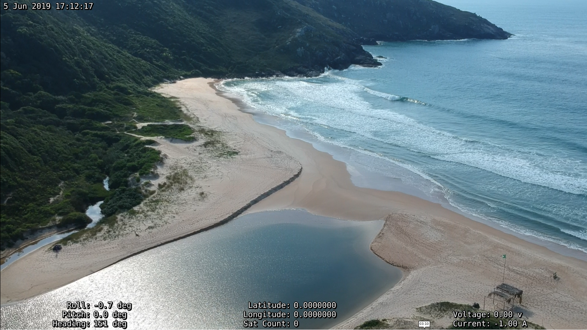
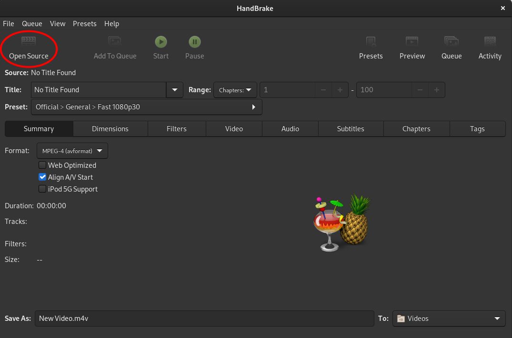
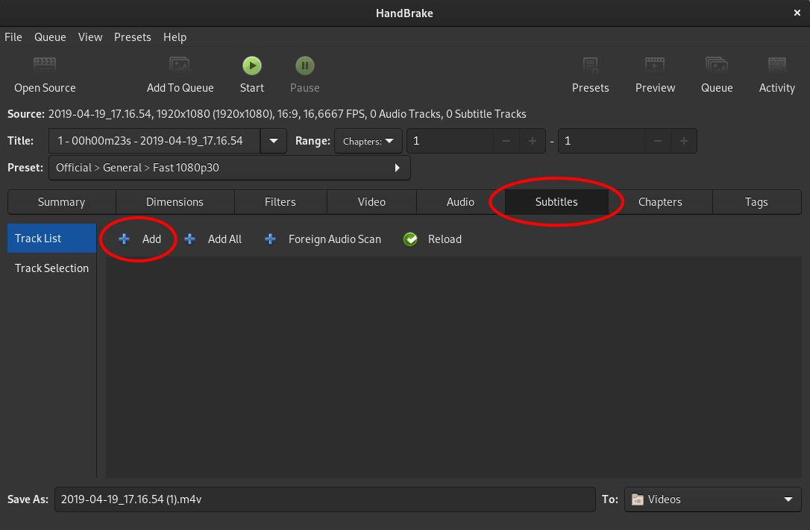
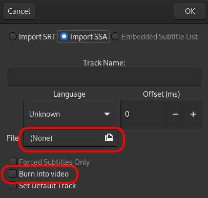
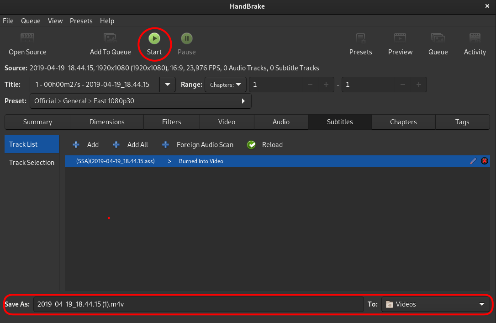

# 비디오 오버레이

QGroundControl이 비디오 스트림을 파일에 기록할 때 재생하는 동안 비디오에 원격 측정을 오버레이하는 데 사용할 수 있는 원격 측정 데이터가 포함된 자막 파일도 내보냅니다. 원격 측정 [값 위젯](FlyView.md#values-telemetry)에 표시하기 위해 선택한 원격 측정 값도 오버레이로 내보내집니다. 오버레이 값은 1Hz에서 업데이트됩니다.

선택한 값은 화면 활용을 최적화하기 위해 3개의 열에 배치됩니다.

## 재생 중

The overlay can be used with any player that [supports the SubStation Alpha](https://en.wikipedia.org/wiki/SubStation_Alpha#Players_and_renderers) subtitle format. Most players will open both files together when you try to play the video. They need to be in the same folder and with the same name, which is how they are created by QGC.

## Permanent Video Subtitles using Handbrake

Subtitles can be permanently added to a video file using [HandBrake](https://handbrake.fr/). This will make the subtitles permanently visible on any video player.

Open **HandBrake**, you should see its main interface. Click **Open** and select the video file.

With the video file loaded, switch to the subtitles tab. Click **Add** to load the subtitle file.

Choose **import SSA** ([ASS](https://en.wikipedia.org/wiki/SubStation_Alpha#Advanced_SubStation_Alpha) is an extension of SSA).

Load the **.ass** file corresponding to your video and tick the **Burn into video** checkbox.

Choose where you want to save the new file and click **Start**.

This will start burning the subtitle and video to a new file.