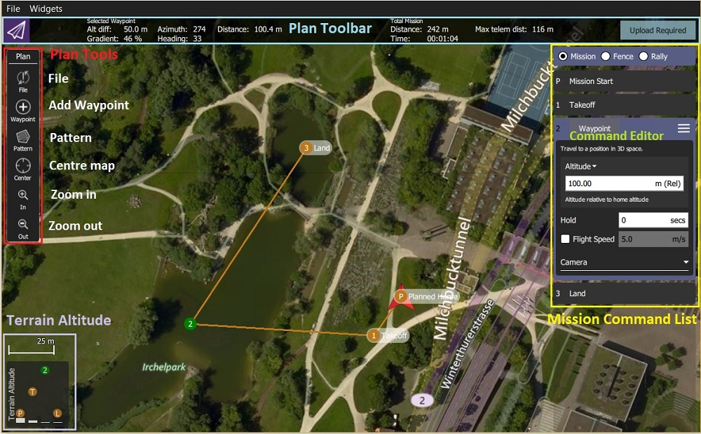
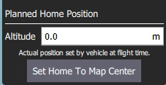
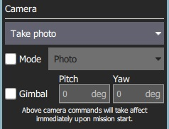
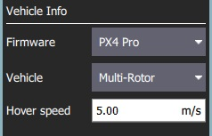

# 계획 뷰 

*계획 뷰*에서는 차량에 대한 *자율 임무*를 계획하고 차량에 업로드합니다. 미션이 [계획](#plan_mission)되어 차량으로 전송되면 [비행 뷰](../FlyView/FlyView.md)로 전환하여 미션을 실행합니다.

펌웨어에서 지원하는 경우 [지오 펜스](PlanGeoFence.md)와 [랠리 포인트](PlanRallyPoints.md)를 설정할 수 있습니다.

## UI 개요 {#ui_overview}

[위의 스크린샷](#plan_screenshot)은 [Planned Home](#planned_home) 위치(H)에서 이륙으로 시작하는 간단한 임무 계획을 보여줍니다. 3개의 웨이포인트를 통과한 다음 마지막 웨이포인트(즉, 웨이포인트 3)에 착륙합니다.

UI의 주요 요소는 다음과 같습니다.

- **지도:** [계획된 집](#planned_home)을 포함하여 현재 임무에 대한 번호가 매겨진 표시기를 표시합니다. 표시기를 클릭하여 선택하거나(편집용) 드래그하여 위치를 변경합니다. 
- **계획 툴바:** 이전 웨이포인트와 관련된 현재 선택된 웨이포인트의 상태 정보와 전체 임무에 대한 통계(예: 임무를 위한 수평 거리 및 시간). 
  - `최대 원격 거리`는 [계획된 홈](#planned_home)과 가장 먼 웨이포인트의 거리입니다. 
  - 차량에 연결하면 **업로드** 버튼도 표시되며, 차량에 계획을 업로드할 수 있습니다.
- **[계획 도구](#plan_tools):** 임무를 만들고 관리하는 데 사용됩니다.
- **[임무 명령 목록/오버레이](#mission_command_list):** 현재 임무 항목 목록을 표시합니다([편집](#mission_command_editors)할 항목 선택).
- **지형 고도 오버레이:** 각 임무 명령의 상대 고도를 표시합니다.

현재 선택된 웨이포인트와 관련된 정보와 전체 미션에 대한 통계를 보여줍니다.

## 임무 계획 {#plan_mission}

매우 높은 수준에서 임무를 생성하는 단계는 다음과 같습니다.

1. *계획 뷰*로 변경합니다.
2. 임무에 웨이포인트 또는 명령을 추가하고 필요에 따라 편집합니다.
3. 차량에 임무를 업로드합니다.
4. *비행 뷰*로 변경하여 임무 비행을 실히합니다.

다음 섹션에서는 보기의 일부 세부 정보에 대해 설명합니다.

## 지정된 홈 위치 {#planned_home}

*계획 뷰*에 표시된 *계획된 홈*은 임무 계획시 대략적인 시작 지점을 설정합니다(예: 차량이 QGC에 연결되지 않은 경우). QGC에서 임무 시간을 추정하고 웨이포인트 라인을 그립니다.

계획된 홈 위치를 이륙 지점 근처로 끌어서 이동하여야 합니다. 계획된 홈 위치의 고도는 [미션 설정](#mission_settings) 패널에서 설정합니다.

> **Tip** 비행 뷰는 시동시에 차량 펌웨어에 의해 설정된 *실제* 홈 위치를 표시합니다(차량이 리턴/RTL 모드에서 복귀하는 위치).

## 계획 도구 {#plan_tools}

계획 도구는 개별 웨이포인트 추가, 복잡한 형상에 대한 쉬운 임무 생성, 임무 업로드/다운로드/저장/복원 및 지도를 탐색합니다. 주요 도구는 아래와 같습니다.

> **Tip** **지도 중심 이동**, **확대**, **축소** 도구는 사용자가 *계획 보기* 지도를 탐색을 편리하게 합니다(차량에 전송되는 임무 명령에는 영향을 미치지 않음).

### 경유지 추가

**경유지 추가** 도구를 클릭하여 활성화합니다. 활성 상태에서 지도를 클릭하면 클릭한 위치에 새 임무의 경유지가 추가됩니다. 도구는 다시 선택할 때까지 활성 상태를 유지합니다. 경유지를 추가한 후에는 경유지를 선택하고 끌어서 위치를 변경할 수 있습니다.

### 파일 (동기화) {#file}

*파일 도구*는 지상국과 차량 간에 임무를 이동하고 파일에서 저장/복원하는 데 사용됩니다. 도구에 `!`가 표시된면 차량에 임무 변경 내역이 완전하게 전송되지 않았음을 나타냅니다.

> **Note** Before you fly a mission you must upload it to the vehicle.

The *File tools* provide the following functionality:

- Upload (Send to vehicle)
- Download (Load from vehicle)
- Save/Save as to File, including as KML file.
- Load from File
- Remove All (removes all mission waypoints from *Plan view* and from vehicle)

### Pattern

The [Pattern](Pattern.md) tool simplifies the creation of missions for flying complex geometries, including [surveys](../PlanView/pattern_survey.md) and [structure scans](../PlanView/pattern_structure_scan_v2.md).

## Mission Command List {#mission_command_list}

Mission commands for the current mission are listed on the right side of the view. At the top are a set of options to switch between editing the mission, GeoFence and rally points. Within the list you can select individual mission items to edit their values.

### Mission Command Editors {#mission_command_editors}

Click on a mission command in the list to display its editor (in which you can set/change the command attributes).

You can change the **type** of the command by clicking on the command name (for example: *Waypoint*). This will display the *Select Mission Command* dialog shown below. By default this just displays the "Basic Commands", but you can use the **Category** drop down menu to display more (e.g. choose **All commands** to see all the options).

To the right of each command name is a menu that you can click to access to additional options such as *Insert* and *Delete*.

> **Note** The list of available commands will depend on firmware and vehicle type. Examples may include: Waypoint, Start image capture, Jump to item (to repeat mission) and other commands.

### Mission Settings {#mission_settings}

The *Mission Start* panel is the first item that appears in the [mission command list](#mission_command_list). It may be used to specify a number default settings that may affect the start or end of the mission.

#### Mission Defaults

##### Waypoint alt

Set the default altitude for the first mission item added to a plan (subsequent items take an initial altitude from the previous item). This can also be used to change the altitude of all items in a plan to the same value; you will be prompted if you change the value when there are items in a plan.

##### Flight speed

Set a flight speed for the mission that is different than the default mission speed.

#### Mission End

##### Return to Launch after mission end

Check this if you want your vehicle to Return/RTL after the final mission item.

#### Planned Home Position

The [Planned Home Position](#planned_home) section allows you to simulate the vehicle's home position while planning a mission. This allows you to view the waypoint trajectory for your vehicle from takeoff to mission completion.

> **Note** This is only the *planned* home position and you should place it where you plan to start the vehicle from. It has no actual impact on flying the mission. The actual home position of a vehicle is set by the vehicle itself when arming.

This section allows you to set the **Altitude** and **Set Home to Map Centre** (you can move it to another position by dragging it on the map).

#### Camera

The camera section allows you to specify a camera action to take, control the gimbal and set your camera into photo or video mode.

The available camera actions are:

- No change (continue current action)
- Take photos (time)
- Take photos (distance)
- Stop taking photos
- Start recording video
- Stop recording video

#### Vehicle Info

The appropriate mission commands for the vehicle depend on the firmware and vehicle type.

If you are planning a mission while you are *connected to a vehicle* the firmware and vehicle type will be determined from the vehicle. This section allows you to specify the vehicle firmware/type when not connected to a vehicle.

The additional value that can be specified when planning a mission is the vehicle flight speed. By specifying this value, total mission or survey times can be approximated even when not connected to a vehicle.

## Troubleshooting

### Mission (Plan) Upload/Download Failures {#plan_transfer_fail}

Plan uploading and downloading can fail over a noisy communication link (affecting missions, GeoFence, and rally points). If a failure occurs you should see a status message in the QGC UI similar to:

> Mission transfer failed. Retry transfer. Error: Mission write mission count failed, maximum retries exceeded.

The loss rate for your link can be viewed in [Settings View > MAVLink](../SettingsView/MAVLink.md). The loss rate should be in the low single digits (i.e. maximum of 2 or 3):

- A loss rate in the high single digits can lead to intermittent failures.
- Higher loss rates often lead to 100% failure.

There is a much smaller possibility that issues are caused by bugs in either flight stack or QGC. To analyse this possibility you can turn on [Console Logging](../SettingsView/console_logging.md) for Plan upload/download and review the protocol message traffic.

## Further Info

- New Plan View features for [QGC release v3.2](../releases/stable_v3.2_long.md#plan_view)
- New Plan View features for [QGC release v3.3](../releases/stable_v3.3_long.md#plan_view)