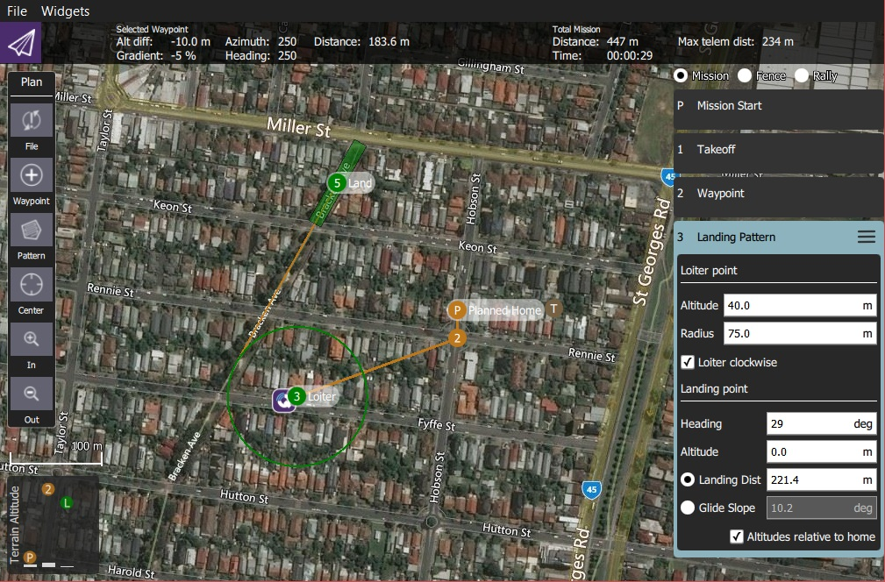
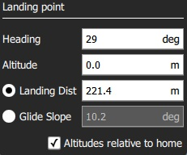

# 고정익 착륙 패턴(계획 패턴)

*고정익 착륙 패턴* 도구를 사용하여 임무에 고정익 착륙 패턴을 추가할 수 있습니다. ArduPilot과 PX4 모두에서 지원됩니다.

패턴의 첫 번째 지점은 특정 고도를 가진 배회 지점이고 두 번째 지점은 착륙 지점입니다. 기체는 목표 고도에 도달할 때까지 첫 번째 지점에서 배회한 다음, 착륙 시퀀스를 순서대로 지정된 착륙 지점으로 비행합니다.

배회 및 착륙 지점을 모두 새 위치로 드래그할 수 있으며, 관련 임무 항목에서 여러가지를 설정할 수 있습니다.

## 착륙 패턴 생성

착륙 패턴을 생성하려면:

1. [계획 뷰](../PlanView/PlanView.md)에서 *계획 도구*를 오픈합니다.
2. *계획 도구*에서 *패턴 도구*를 선택한 다음 *고정익 착륙 패턴*을 선택합니다.
  
  
  
  그러면 임무 목록(오른쪽)에 *착륙 패턴* 항목이 추가됩니다.
  
  

3. 지도를 클릭하여 배회 지점과 착륙 지점을 모두 생성합니다. 지도에서 이동할 수 있습니다.

추가 설정은 다음 섹션에서 설명합니다.

## 설정

착륙 패턴은 연계된 미션 아이템(플랜 보기 우측 미션 아이템 목록)에서 추가로 설정할 수 있습니다.

### 배회 지점

*배회 지점* 설정은 배회 고도, 반경 및 방향을 설정합니다.

설정 옵션은 다음과 같습니다:

- **고도** - 배회 고도.
- **반경** - 배회 반경.
- **시계 방향 배회** - 시계 방향으로 배회하려면 선택합니다(반시계 방향이 기본값임). 

### 착륙 지점

*착륙 지점* 설정은 착륙 위치와 경로를 설정합니다.

설정 옵션은 다음과 같습니다:

- **방향** - 배회 지점에서 착륙 지점까지의 방향입니다.
- **고도** - 착륙 지점의 고도입니다(일반적으로 0).
- *라디오 버튼* 
  - **착륙 거리** - 배회 지점과 착륙 지점 사이의 거리입니다.
  - **Glide Slope** - Glide slope between loiter point and landing point.
- **Altitudes relative to home** - Check to set all altitudes in mission item to be relative to home (default is AMSL).

## Implementation

This pattern creates three mission items:

- `DO_LAND_START` - If you abort a landing it sends `DO_GO_AROUND` to the vehicle, which then causes the mission to return to this point and try to land again.
- `NAV_LOITER_TO_ALT` - Start point for landing
- `NAV_LAND` - End point for landing

The vehicle flares to landing using a flight path generated by the firmware between the `NAV_LOITER_TO_ALT` point and the `NAV_LAND` point.

If those two locations violate the vehicle's flare constraints (e.g. descent angle is too steep) an error will be raised after you upload the invalid mission to the vehicle.

> **Note** On PX4, violating the flare constraints sends an error message to the ground station at upload time, and the autopilot will refuse to start the mission (since it fails integrity checks).