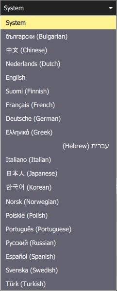
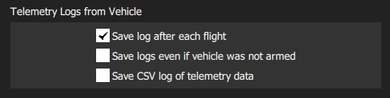
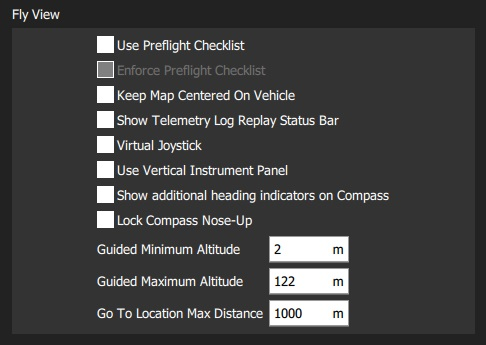
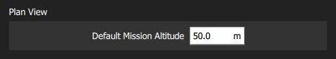
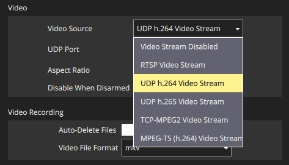
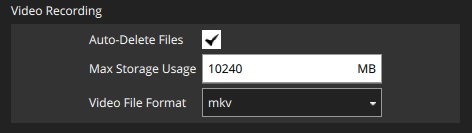

# 일반 설정(설정 화면)

일반 설정(**설정 화면> 일반 설정**)은 애플리케이션의 주요 항목들을 설정합니다. 디스플레이 장치, 자동 연결 장치, 비디오 디스플레이 및 저장 장치, RTK GPS, 브랜드 이미지 및 기타 항목들을 설정합니다.

> **Note** 기체가 연결되지 않은 상태에서도 설정할 수 있습니다. 차량 재시동이 필요한 설정은 UI에 표시됩니다.

## 단위

이 섹션에서는 응용 프로그램의 표시 단위를 정의합니다.

설정은 다음과 같습니다:

- **거리**: 미터 | 피트
- **면적**: 평방미터 | 스퀘어피트 | 평방킬로미터 | 헥타르 | 에이커 | 스퀘어마일스
- **속도**: 미터/초 | 피트/초 | 마일/시간 | 킬로미터/시간 | 매듭
- **온도**: 섭씨 | 화씨

## 기타

이 섹션에서는 (완벽하지 않음)과 관련된 여러 가지 항목들을 설정합니다: 글꼴 크기, 색 구성표, 지도 제공자, 지도 유형, 원격 측정 로깅, 오디오 출력, 배터리 부족 알림 수준, 기본 임무 고도, [가상 조이스틱](../SettingsView/VirtualJoystick.md), 임무 자동 로드, 기본 애플리케이션 파일 로드/저장 경로 등

설정은 다음과 같습니다:

- **Language**: System (System Language) | Bulgarian, Chinese, ...
  
  

- **Color Scheme**: Indoor (Dark) | Outdoor (Light)

- **Map Provider**: Google | Mapbox | Bing | Airmap | VWorld | Eniro | Statkart
- **Map Type**: Road | Hybrid | Satellite
- **Stream GCS Position**: Never | Always | When in Follow Me Flight Mode.
- **UI Scaling**: UI scale percentage (affects fonts, icons, button sizes, layout etc.) 
- **Mute all audio output**: Turns off all audio output.
- **Check for Internet Connection**: Uncheck to allow maps to be used in China/places where map tile downloads are likely to fail (stops the map-tile engine continually rechecking for an Internet connection). 
-  **Autoload Missions**: If enabled, automatically upload a plan to the vehicle on connection. 
  - The plan file must be named **AutoLoad#.plan**, where the `#` is replaced with the vehicle id. 
  - The plan file must be located in the [Application Load/Save Path](#load_save_path).
- **Clear all settings on next start**: Resets all settings to the default (including this one) when *QGroundControl* restarts.
- **Announce battery lower than**: Battery level at which *QGroundControl* will start low battery announcements.
- **Application Load/Save Path**: Default location for loading/saving application files, including: parameters, telemetry logs, and mission plans.

## Data Persistence {#data_persistence}

The settings are:

- **Disable all data persistence**: Check to prevent any data being saved or cached: logs, map tiles etc. This setting disables the [telemetry logs section](#telemetry_logs).

## Telemetry Logs from Vehicle {#telemetry_logs}

The settings are:

- **Save log after each flight**: Telemetry logs (`.tlog`) automatically saved to the *Application Load/Save Path* ([above](#load_save_path)) after flight. 
- **Save logs even if vehicle was not armed**: Logs when a vehicle connects to *QGroundControl*. Stops logging when the last vehicle disconnects.
- [**CSV Logging**](csv.md): Log subset of telemetry data to a CSV file.

## Fly View {#fly_view}

The settings are:

- **Use Preflight Checklist**: Enable pre-flight checklist in Fly toolbar.
- **Enforce Preflight Checklist**: Checklist completion is a pre-condition for arming.
- **Keep Map Centered on Vehicle**: Forces map to center on the currently selected vehicle.
- **Show Telemetry Log Replay Status Bar**: Display status bar for [Replaying Flight Data](../FlyView/replay_flight_data.md).
- **Virtual Joystick**: Enable [virtual joysticks](../SettingsView/VirtualJoystick.md) (PX4 only)
- **Use Vertical Instrument Panel**: Align instrument panel vertically rather than horizontally (default).
- **Show additional heading indicators on Compass**: Adds additional indicators to the compass rose: 
- *Blue arrow*: course over ground.
- *White house*: direction back to home.
- *Green line*: Direction to next waypoint.

- **Lock Compass Nose-Up**: Check to rotate the compass rose (default is to rotate the vehicle inside the compass indicateor).

- **Guided Minimum Altitude**: Minimum value for guided actions altitude slider.
- **Guided Maximum Altitude**: Minimum value for guided actions altitude slider.
- **Go To Location Max Distance**: The maximum distance that a Go To location can be set from the current vehicle location (in guided mode).

## Plan View {#plan_view}

The settings are:

- **Default Mission Altitude**: The default altitude used for the Mission Start Panel, and hence for the first waypoint.

## AutoConnect to the following devices {#auto_connect}

This section defines the set of devices to which *QGroundControl* will auto-connect.

Settings include:

- **Pixhawk:** Autoconnect to Pixhawk-series device
- **SiK Radio:** Autoconnect to SiK (Telemetry) radio
- **PX4 Flow:** Autoconnect to PX4Flow device
- **LibrePilot:** Autoconnect to Libre Pilot autopilot
- **UDP:** Autoconnect to UDP
- **RTK GPS:** Autoconnect to RTK GPS device
- **NMEA GPS Device:** Autoconnect to an external GPS device to get ground station position ([see below](#nmea_gps))

### Ground Station Location (NMEA GPS Device) {#nmea_gps}

*QGroundControl* will automatically use an internal GPS to display its own location on the map with a purple `Q` icon (if the GPS provides a heading, this will be also indicated by the icon). It may also use the GPS as a location source for *Follow Me Mode* - currently supported on [PX4 Multicopters only](https://docs.px4.io/en/flight_modes/follow_me.html).

You can also configure QGC to connect to an external GPS device via a serial or UDP port. The GPS device must support the ASCII NMEA format - this is normally the case.

> **Tip** A higher quality external GPS system may be useful even if the ground station has internal GPS support.

Use the *NMEA GPS Device* drop-down selector to manually select the GPS device and other options:

- USB connection:
  
  
  
  - **NMEA GPS Device:** *Serial*
  - **NMEA GPS Baudrate**: The baudrate for the serial port
  
  > **Tip** To troubleshoot serial GPS problems: Disable RTK GPS [auto connection](#auto_connect), close *QGroundControl*, reconnect your GPS, and open QGC.

- Network connection:
  
  
  
  - **NMEA GPS Device:** *UDP Port*.
  - **NMEA Stream UDP Port**: The UDP port on which QGC will listen for NMEA data (QGC binds the port as a server)

## RTK GPS {#rtk_gps}

This section allows you to specify the RTK GPS "Survey-in" settings, to save and reuse the result of a Survey-In operation, or to directly enter any other known position for the base station.

> **Note** The *Survey-In* process is a startup procedure required by RTK GPS systems to get an accurate estimate of the base station position. The process takes measurements over time, leading to increasing position accuracy. Both of the setting conditions must met for the Survey-in process to complete. For more information see [RTK GPS](https://docs.px4.io/en/advanced_features/rtk-gps.html) (PX4 docs) and [GPS- How it works](http://ardupilot.org/copter/docs/common-gps-how-it-works.html#rtk-corrections) (ArduPilot docs).

> **Tip** In order to save and reuse a base position (because Survey-In is time consuming!) perform Survey-In once, select *Use Specified Base Position* and press **Save Current Base Position** to copy in the values for the last survey. The values will then persist across QGC reboots until they are changed.

The settings are:

- Perform Survey-In 
  - **Survey-in accuracy (U-blox only):** The minimum position accuracy for the RTK Survey-In process to complete.
  - **Minimum observation duration:** The minimum time that will be taken for the RTK Survey-in process.
- Use Specified Base Position 
  - **Base Position Latitude:** Latitude of fixed RTK base station.
  - **Base Position Longitude:** Longitude of fixed RTK base station.
  - **Base Position Alt (WGS94):** Altitude of fixed RTK base station.
  - **Base Position Accuracy:** Accuracy of base station position information.
  - **Save Current Base Position** (button): Press to copy settings from the last Survey-In operation to the *Use Specified Base Position* fields above.

## ADSB Server {#adsb_server}

The settings are:

- **Connect to ADSB SBS server**: Check to connect to ADSB server on startup.
- **Host address**: Host address of ADSB server
- **Server port**: Port of ADSB server

QGC can consume ADSB messages in SBS format from a remote or local server (at the specified IP address/port) and display detected vehicles on the Fly View map.

> **Tip** One way to get ADSB information from nearby vehicles is to use [dump1090](https://github.com/antirez/dump1090) to serve the data from a connected RTL-SDR dongle to QGC. The steps are: 1. Get an RTL-SDR dongle (and antenna) and attach it to your ground station computer (you may need to find compatible drivers for your OS). 1. Install *dump1090* on your OS (either pre-built or build from source). 1. Run `dump1090 --net` to start broadcasting messages for detected vehicles on TCP localhost port 30003 (127.0.0.1:30003). 1. Enter the server (`127.0.0.1`) and port (`30003`) address in the QGC settings above. 1. Restart QGC to start seeing local vehicles on the map.

## Video {#video}

The *Video* section is used to define the source and connection settings for video that will be displayed in *Fly View*.

The settings are:

- **Video Source**: Video Stream Disabled | RTSP Video Stream | UDP h.264 Video Stream | UDP h.265 Video Stream | TCP-MPEG2 Video Stream | MPEG-TS (h.264) Video Stream | Integrated Camera > **Note** If no video source is specified then no other video or *video recording* settings will be displayed (above we see the settings when UDP source is selected).
- **URL/Port**: Connection type-specific stream address (may be port or URL).
- **Aspect Ratio**: Aspect ratio for scaling video in video widget (set to 0.0 to ignore scaling)
- **Disabled When Disarmed**: Disable video feed when vehicle is disarmed.
- **Low Latency Mode**: Enabling low latency mode reduces the video stream latency, but may cause frame loss and choppy video (especially with a poor network connection). <!-- disables the internal jitter buffer -->

## Video Recording

The *Video Recording* section is used to specify the file format and maximum allocated file storage for storing video. Videos are saved to a sub-directory ("Video") of the [Application Load/Save Path](#load_save_path).

The settings are:

- **Auto-Delete Files**: If checked, files are auto deleted when the specified amount of storage is used.
- **Max Storage Usage**: Maximum video file storage before video files are auto deleted.
- **Video File Format**: File format for the saved video recording: mkv, mov, mp4.

## Brand Image

This setting specifies the *brand image* used for indoor/outdoor colour schemes.

The brand image is displayed in place of the icon for the connected autopilot in the top right corner of the toolbar. It is provided so that users can easily create screen/video captures that include a company logo/branding.

The settings are:

- **Indoor Image**: Brand image used in [indoor color scheme](#colour_scheme)
- **Outdoor Image**: Brand image used in [outdoor color scheme](#colour_scheme)
- **Reset Default Brand Image**: Reset the brand image back to default.