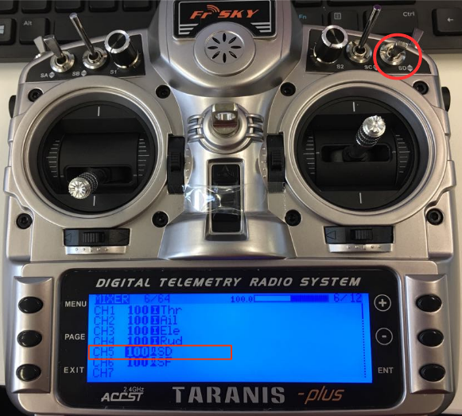

# 비행 모드 설정

*비행 모드* 섹션을 사용하면 비행 모드를 무선 채널에 매핑할 수 있으며, 따라서 무선 제어 송신기의 스위치에 매핑할 수 있습니다. 비행 모드 설정 방법과 사용 가능한 비행 모드는 PX4와 ArduPilot이 동일하지 않습니다. (ArduCopter와 ArduPlane 간에도 약간의 차이가 있습니다).

> **Note** 비행 모드를 설정하려면 이미 [무전기를 구성](../SetupView/Radio.md)하고 [송신기를 설정](#transmitter-setup)하여야 합니다(아래 그림 참조).

이 섹션에 액세스하려면, 상단 툴바에서 **기어** 아이콘(차량 설정)을 선택한 다음 사이드바에서 **비행 모드**를 선택하세요.

플라이트 스택별 설정에 대한 자세한 내용은 다음을 참조하세요.

- [ArduPilot 비행 모드 설정](../SetupView/flight_modes_ardupilot.md)
- [PX4 비행 모드 설정](../SetupView/flight_modes_px4.md)

## 송신기 설정

In order setup flight modes you will first need to configure your *transmitter* to encode the physical positions of your mode switch(es) into a single channel.

On both PX4 and ArduPilot you can assign up to 6 different flight modes to a single channel of your transmitter It is common to use the positions of a 2- and a 3-position switch on the transmitter to represent the 6 flight modes. Each combination of switches is then encoded as a particular PWM value that will be sent on a single channel.

> **Note** The single channel is selectable on PX4 and ArduPlane, but is fixed to channel 5 on Copter.

The process for this varies depending on the transmitter. A number of setup examples are provided below.

### Taranis

These examples show several configurations for the *FrSky Taranis* transmitter.

#### Map 3-way Switch to a Single Channel

If you only need to support selecting between two or three modes then you can map the modes to the positions just one 3-way switch. Below we show how to map the Taranis 3-way "SD" switch to channel 5.

Open the Taranis UI **MIXER** page and scroll down to **CH5**, as shown below:

Press **ENT(ER)** to edit the **CH5** configuration then change the **Source** to be the *SD* button.

That's it! Channel 5 will now output 3 different PWM values for the three different **SD** switch positions.

#### Map Multiple Switches to a Single Channel

Most transmitters do not have 6-way switches, so if you need to be able to support more modes than the number of switch positions available (up to 6) then you will have to represent them using multiple switches. Commonly this is done by encoding the positions of a 2- and a 3-position switch into a single channel, so that each switch position combination results in a different PWM value.

On the FrSky Taranis this process involves assigning a "logical switch" to each combination of positions of the two real switches. Each logical switch is then assigned to a different PWM value on the same channel.

This video shows how this is done with the *FrSky Taranis* transmitter: https://youtu.be/TFEjEQZqdVA

<!-- @[youtube](https://youtu.be/BNzeVGD8IZI?t=427) - video showing how to set the QGC side - at about 7mins and 3 secs -->