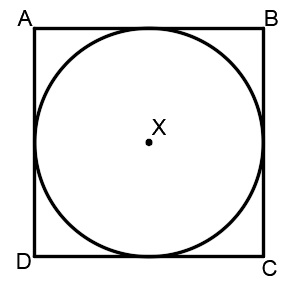
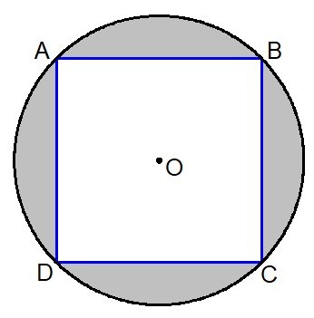

# 조이스틱 설정

*QGroundControl*은 RC 송신기 대신 조이스틱이나 게임패드로 기체를 조종할 수 있습니다.

> **Note** 조이스틱(또는 [가상 썸스틱](../SettingsView/VirtualJoystick.md))으로 비행하려면 조이스틱 정보가 MAVLink로 전송되기 때문에 기체가 조이스틱에 반응하기 위하여 안정적인 고대역폭 원격 측정 채널이 필요합니다.

<span></span>

> **Note** 조이스틱과 게임패드 지원은 이기종 플랫폼 [SDL2](http://www.libsdl.org/index.php) 라이브러리를 사용하여 활성화됩니다. 특정 컨트롤러와의 호환성은 SDL에 따라 다릅니다(해당 API에 의해 노출되는 모든 버튼은 *QGroundControl* UI를 통하여 표시됨). [일반적인 조이스틱과 게임패드](#supported-joysticks)들은 호환됩니다.

<span></span>

> **Note** 조이스틱은 보정 프로세스의 마지막 단계로 *활성화*됩니다.

## PX4 조이스틱 활성화

PX4에서 조이스틱 지원을 활성화하려면 매개변수 [`COM_RC_IN_MODE`](h[ttp://localhost:8080/px4_user_guide/en](https://docs.px4.io/en/main/advanced_config/parameter_reference.html#COM_RC_IN_MODE)을 `1</0)로 설정합니다. 
이 매개변수가 <code>0`이면 *조이스틱*이 설정 옵션으로 제공되지 않습니다.

이것은 PX4 SITL 빌드에서 기본적으로 활성화됩니다. 매개변수의 검색 및 설정 방법은 [매개변수](../SetupView/Parameters.md)를 참고하십시오.

## Ardupilot 조이스틱 지원

ArduPilot 기체에서 지원됩니다. 매개변수 설정은 필요하지 않습니다.

## 조이스틱 설정 {#configure}

조이스틱을 설정하려면:

1. *QGroundControl*을 실행후, 기체를 연결합니다.
2. USB 포트에 조이스틱이나 게임패드를 연결합니다.
3. 상단 도구 모음에서 **톱니 바퀴** 아이콘(기체 설정)을 선택한 다음 가장자리 표시줄에서 **조이스틱**을 선택하십시오. 아래의 화면이 표시됩니다.
    
    

4. **활성화된 조이스틱** 드롭다운에서 조이스틱이 선택 여부를 확인합니다.

5. **교정** 탭으로 이동하여 **시작** 버튼을 클릭하여 다음 화면의 지시에 따라 스틱을 교정하고 이동합니다.
    
    
    
    조이스틱은 보정 프로세스의 마지막 단계에서 *활성화*됩니다.

6. 버튼과 스틱이 의도한 대로 작동하는지 테스트하고 **일반** 탭의 축과 버튼 모니터에서 결과를 확인합니다.

7. 각 조이스틱 버튼으로 활성화되는 비행 모드와 차량의 기능을 선택합니다.

## 고급 설정

Some additional Options are available at the **Advanced** tab. These options may be useful for specific, unsual setups, for increasing sensibility, and for handling noisy joysticks.

### Throttle Options


- **Center stick is zero throttle**: Centered or lowered stick sends 0 in [MANUAL_CONTROL **z**](https://mavlink.io/en/messages/common.html#MANUAL_CONTROL), raised stick sends 1000. 
    - **Spring loaded throttle smoothing**: In this mode you control not the throttle itself, but the rate at which it increases/decreases. This is useful for setups where the throttle stick is spring loaded, as the user can hold the desired throttle while releasing the stick.
- **Full down stick is zero throttle**: In this mode, lowered stick sends 0 in [MANUAL_CONTROL **z**](https://mavlink.io/en/messages/common.html#MANUAL_CONTROL), centered stick 500, and raised 1000.
- **Allow negative thrust**: When in **Center stick is zero throttle** mode, this allows the user to send negative values by lowering the stick. So that lowered stick sends -1000 in [MANUAL_CONTROL **z**](https://mavlink.io/en/messages/common.html#MANUAL_CONTROL), centered sends zero, and raised stick sends 1000. This mode is only enabled for vehicles that support negative thrust, such as [Rover](http://ardupilot.org/rover/index.html).

### Expo

The expo slider allows you to make the sticks less sensitive in the center, allowing finer control in this zone.


The slider adjusts the curvature of the exponential curve.


The higher the Expo value, the flatter the curve is at the center, and steeper it is at the edges.

### Advanced Settings

The advanced settings are not recommended for everyday users. They can cause unpredicted results if used incorrectly.


The following settings are available:

- **Enable Gimbal Control**: Enabled two additional channels for controlling a gimbal.

- **Joystick Mode**: Changes what the joystick actually controls, and the MAVLink messages sent to the vehicle.
    
    - **Normal**: User controls as if using a regular RC radio, MAVLink [MANUAL_CONTROL](https://mavlink.io/en/messages/common.html#MANUAL_CONTROL) messages are used.
    - **Attitude**: User controls the vehicle attitude, MAVLink [SET_ATTITUDE_TARGET](https://mavlink.io/en/messages/common.html#SET_ATTITUDE_TARGET) messages are used.
    - **Position**: User controls the vehicle position, MAVLink [SET_POSITION_TARGET_LOCAL_NED](https://mavlink.io/en/messages/common.html#SET_POSITION_TARGET_LOCAL_NED) messages with bitmask for **position** only are used.
    - **Force**: User controls the forces applied to the vehicle, MAVLink [SET_POSITION_TARGET_LOCAL_NED](https://mavlink.io/en/messages/common.html#SET_POSITION_TARGET_LOCAL_NED) messages with bitmask for **force** only are used.
    - **Velocity**: User controls the forces applied to the vehicle, MAVLink [SET_POSITION_TARGET_LOCAL_NED](https://mavlink.io/en/messages/common.html#SET_POSITION_TARGET_LOCAL_NED) messages with bitmask for **velocity** only are used.

- **Axis Frequency**: When the joystick is idle (inputs are not changing), the joystick commands are sent to the vehicle at 5Hz. When the joystick is in use (input values are changing), the joystick commands are sent to the vehicle at the (higher) frequency configured by this setting. The default is 25Hz.

- **Button Frequency**: Controls the frequency at which repeated button actions are sent.

- **Enable Circle Correction**: RC controllers sticks describe a square, while joysticks usually describe a circle. When this option is enabled a square is inscribed inside the joystick movement area to make it more like an RC controller (so it is possible to reach all four corners). The cost is decreased resolution, as the effective stick travel is reduced.
    
    - **Disabled:** When this is **disabled** the joystick position is sent to the vehicle unchanged (the way that it is read from the joystick device). On some joysticks, the (roll, pitch) values are confined to the space of a circle inscribed inside of a square. In this figure, point B would command full pitch forward and full roll right, but the joystick is not able to reach point B because the retainer is circular. This means that you will not be able to achieve full roll and pitch deflection simultaneously.
    
    
    
    - **Enabled:** The joystick values are adjusted in software to ensure full range of commands. The usable area of travel and resolution is decreased, however, because the area highlighted grey in the figure is no longer used.
    
    

- **Deadbands:** Deadbands allow input changes to be ignored when the sticks are near their neutral positions. This helps to avoid noise or small oscillations on sensitive sticks which may be interpreted as commands, or small offsets when sticks do not re-center well. They can be adjusted during the first step of the [calibration](#configure), or by dragging vertically on the corresponding axis monitor.

## Supported Joysticks

The following joysticks/controllers have been shown to work with relatively recent *QGroundControl* builds.

### Sony Playstation 3/4 Controllers

Both these joysticks are highly recommended. They work well "out of the box" and have many buttons that you can map to flight modes.

#### Sony PS4 - DualShock 4 Controller V2 (Wireless setup)

This controller supports both USB and Bluetooth wireless connection. Wired USB connection usually works out of the box. The wireless connection needs some setup.

##### Linux Ubuntu setup

To make the controller work wirelessly under Linux the [jstest-gtk](https://jstest-gtk.gitlab.io/) and [ds4drv](https://github.com/chrippa/ds4drv) utilities are needed.

The steps are:

1. Install *jstest-gtk*: ```sudo apt install jstest-gtk```
2. Install *ds4drv*: ```sudo pip install ds4drv```
3. Run ds4drv ```sudo ds4drv```
4. Hold **Share** button and then **PS** button until controller LED starts blinking rapidly. The *ds4drv* should then detect a new device.
5. Last of all, you should check the controller setup by running the *jstest-gtk* utility. 

### FrSky Taranis XD9 plus

The *FrSky Taranis XD9 plus* remote control can also be connected as a joystick. You will need to connect it via the USB port on the back.

The Taranis does not allow you to use button options (to be precise, you can set the options, but toggling the buttons on your transmitter does not cause them to be pressed).

> **Note** The Taranis is an open system that is openly being worked on. It is possible that at time of writing there is a firmware or configuration that allows it to work effectively as a joystick.

### Logitech Gamepad F310

The Logitech Gamepad F310 has been tested via USB on MacOSX "Sierra".

### Logitech Extreme 3D Pro

The [Logitech Extreme 3D Pro](http://gaming.logitech.com/en-ch/product/extreme-3d-pro-joystick) Joystick has been tested on all platforms (Linux, Windows, Mac OSX). This is a single stick controller that can also be twisted. The main stick axes are used for pitch and roll, while the twist action is used for yaw. The throttle is mapped onto a separate wheel.

### Logitech F710 Gamepad

<!-- This is from http://qgroundcontrol.org/users/joystick -->

This gamepad is great for flying a multirotor manually via QGroundControl. It works on Windows, Linux and Mac OS.

#### Mac OS Leopard / Lion Setup

The F710 is detected under Leopard / Lion but is not automatically configured as an input device. In order to get a working configuration, the F710 has to be recognised as *Rumblepad2*.

First check how it is recognised: **Apple > About this Mac > Additional Information > System Report > USB**. It is detected as "Logitech Cordless RumblePad 2" then nothing further needs to be done.

If it is detected as a "Logitech Wireless 710", perform these steps:

1. Unplug the USB receiver of the gamepad
2. Prepare to quickly plug it into a USB port
3. Hit the Logitech button (its silver with the Logitech Logo on it in the center of the pad)
4. Quickly connect the USB receiver to your Mac
5. The pad should now be detected in the system report as "Logitech Cordless RumblePad 2". If not, retry the above steps.