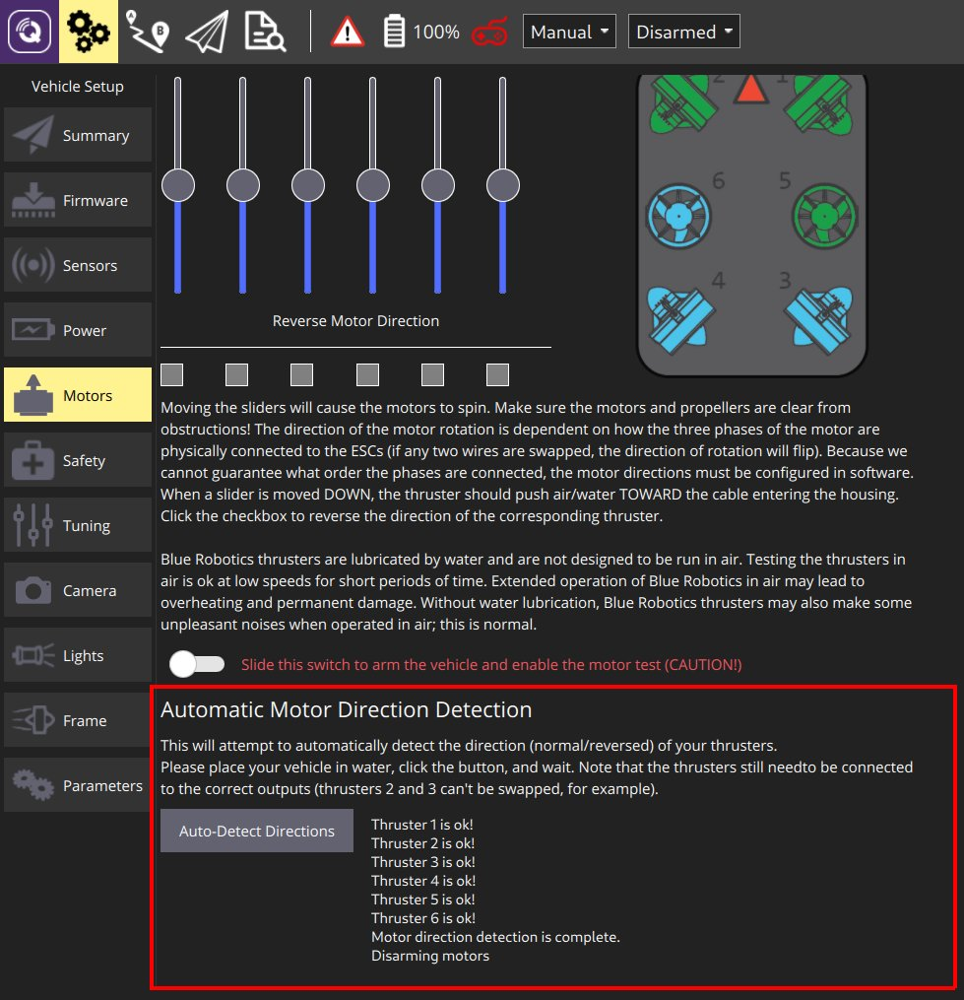

# 모터 설정 (ArduSub)

ArduSub가 제대로 작동하려면 모터가 올바르게 설정되어야 합니다.

ROV를 방금 조립했다면 먼저 **수동 테스트** 섹션에서 추진기가 올바른 출력에 연결되었는 지 확인하십시오. 각 슬라이더를 드래그하여 표시된 프레임에 따라 *올바른 모터*가 회전하는 지 확인합니다.

추진기가 적절한 출력에 연결되면, [자동 방향 감지](#automatic)(ArduSub 4.0에서 권장) 또는 [수동 테스트](#manual)로 *정확한 방향*(정방향/역방향)을 확인할 수 있습니다.

> **Note** [수동 테스트](#manual)는 ArduSub 3.5까지 지원되며, ArduSub 4.0은 [수동 테스트](#manual)와 [자동 방향 감지](#automatic)를 모두 지원합니다.

## 수동 테스트 {#manual}

ArduSub 모터 설정에서 각각의 모터를 테스트할 수 있습니다. 슬라이더를 사용하면 각 모터를 정방향 또는 역방향 모드로 회전할 수 있으며, 슬라이더 아래의 확인란을 사용하면 개별 추진기의 작동을 반대로 할 수 있습니다.

오른쪽 이미지는 각 추진기의 위치, 방향 및 현재 사용 중인 프레임을 보여줍니다. If the frame selection does not match your vehicle, first select the correct frame in the [Frame](../SetupView/airframe_ardupilot.md#ardusub) tab.

To manually set up and test the motors, read and follow the instructions on the page.

> **Warning** Make sure the motors and propellers are clear from obstructions before sliding the switch to arm the vehicle and enable the test!

## Automatic Direction Detection {#automatic}

Ardusub 4.0 and newer support automatic detection of the motor directions. This works by applying pulses to each motor, checking if the frame reacts as expected, and reversing the motor if necessary. The process takes around one minute.

To perform the automatic motor direction detection, navigate to **Vehicle Setup->Motors** tab, click the **Auto-Detect Directions** button and wait. Additional output about the process will be shown next to the button as it runs.

> **Warning** This procedure still requires that the motors are connected to the *correct outputs* as shown in the frame view!

