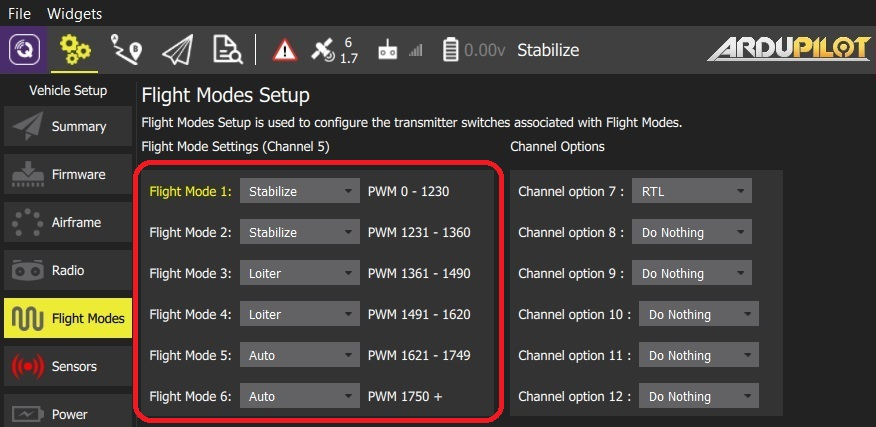
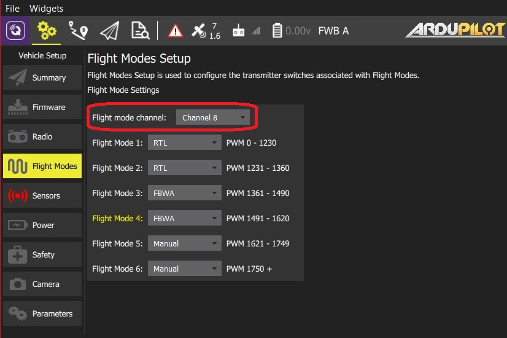

# ArduPilot 비행 모드 설정

*비행 모드* 섹션에서는 RC 송신기의 특정 스위치/스위치 위치에 의해 트리거되는 비행 모드 및 기타 작업을 설정할 수 있습니다.

> **Note** 비행 모드를 설정하려면 비행 모드를 설정하기 위해 [무전기를 구성](../SetupView/Radio.md)해야 합니다. - [RC 송신기 설정](../SetupView/FlightModes.md#transmitter-setup)(비행 모드 & 송신기 설정)

이 섹션에 액세스하려면, 상단 툴바에서 **기어** 아이콘(차량 설정)을 선택한 다음 사이드바에서 **비행 모드**를 선택하세요.

## 비행 모드 설정

On ArduPilot you can assign up to 6 different flight modes to a single channel of your transmitter (the channel is selectable on Plane, but fixed to channel 5 on Copter). ArduCopter also allows you to specify additional *Channel Options* for channels 7-12. These allow you to assign functions to these switches (for example, to turn on a camera, or return to launch).

To set the flight modes:

1. Turn on your RC transmitter.
1. Select the **Gear** icon (Vehicle Setup) in the top toolbar and then **Flight Modes** in the sidebar.

   

   > **Note** The above image is a screenshot of the flight mode setup for ArduCopter.

1. Select up to 6 flight modes in the drop downs.
1. **ArduCopter only:** Select additional *Channel Options* for channels 7-12.
1. **ArduPlane only:** Select the mode channel from the dropdown.

   
1. Test that the modes are mapped to the right transmitter switches by selecting each mode switch on your transmitter in turn, and check that the desired flight mode is activated (the text turns yellow on *QGroundControl* for the active mode).

All values are automatically saved as they are changed.

> **Note** The ArduCopter screenshot above shows a typical setup for a three position flight mode switch with an additional option of RTL being on a channel 7 switch. You can also setup 6 flight modes using two switches plus mixing on your transmitter. Scroll down to the center section of this [page](http://ardupilot.org/copter/docs/common-rc-transmitter-flight-mode-configuration.html#common-rc-transmitter-flight-mode-configuration) for tutorials on how to do that.

## See Also

- [ArduCopter Flight Modes](http://ardupilot.org/copter/docs/flight-modes.html)
- [ArduPlane Flight Modes](http://ardupilot.org/plane/docs/flight-modes.html)
- [ArduCopter > Auxiliary Function Switches](https://ardupilot.org/copter/docs/channel-7-and-8-options.html#channel-7-and-8-options) - additional information about channel configuration.

