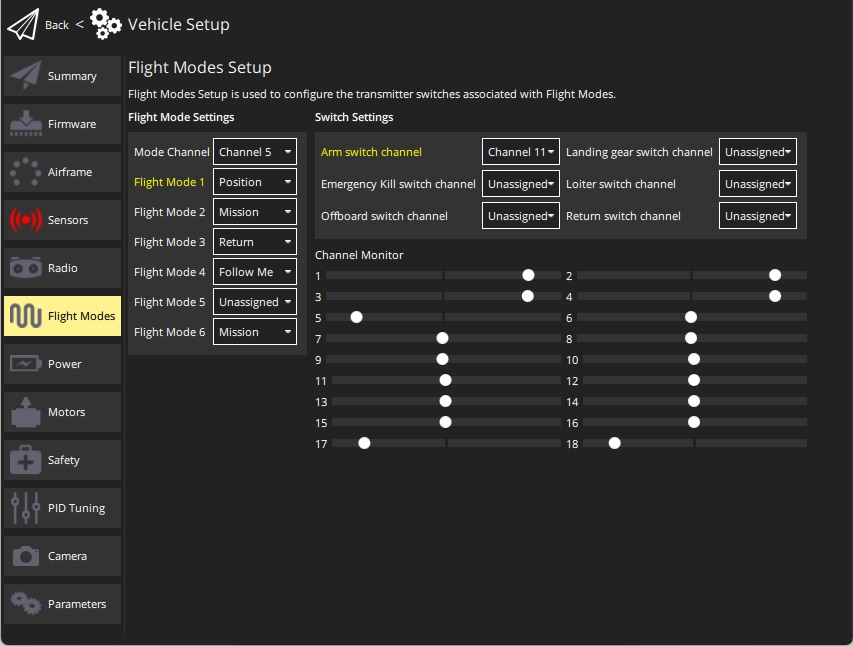

# PX4 비행 모드 설정

*비행 모드* 섹션에서는 RC 송신기의 특정 스위치/스위치 위치에 의해 트리거되는 비행 모드 및 기타 작업을 설정할 수 있습니다.

> **Note** 비행 모드를 설정하려면 비행 모드를 설정하기 위해 [무전기를 구성](../SetupView/Radio.md)해야 합니다. - [RC 송신기 설정](../SetupView/FlightModes.md#transmitter-setup)(비행 모드 & 송신기 설정)

이 섹션에 액세스하려면, 상단 툴바에서 **기어** 아이콘(차량 설정)을 선택한 다음 사이드바에서 **비행 모드**를 선택하세요.

## 비행 모드 설정

화면에서 "모드" 채널을 지정하고 채널에서 전송된 값을 기반으로 활성화될 최대 6개의 비행 모드를 선택할 수 있습니다. 또한 소수의 채널을 할당하여 랜딩 기어 배치 또는 비상 정지(킬 스위치)와 같은 특정 작업을 트리거할 수 있습니다.

단계는 다음과 같습니다:

1. RC 송신기를 켭니다.
1. 상단 툴바에서 **기어** 아이콘(차량 설정)을 선택한 다음 사이드바에서 **비행 모드**를 선택합니다.

   

1. *비행 모드 설정* 설정
   * 송신기 **모드 채널**을 선택합니다(위의 채널 5로 표시됨).
   * 채널에 인코딩된 스위치 위치에 대해 최대 6개의 **비행 모드**를 선택합니다. > **참고** 위치 모드, 리턴 모드 및 미션 모드가 [권장됩니다](https://docs.px4.io/master/en/config/flight_mode.html#what-flight-modes-and-switches-should-i-set).
1. Specify *Switch Settings*:
   * Select the channels that you want to map to specific actions - *Kill switch*, landing gear, etc. (if you have spare switches and channels on your transmitter).
1. Test that the modes are mapped to the right transmitter switches:
   * Check the *Channel Monitor* to confirm that each switch moves the expected channel.
   * Select each mode switch on your transmitter in turn, and check that the desired flight mode is activated (the text turns yellow on *QGroundControl* for the active mode).

All values are automatically saved as they are changed.

## See Also

- [PX4 Flight Modes](https://docs.px4.io/en/flight_modes/)
