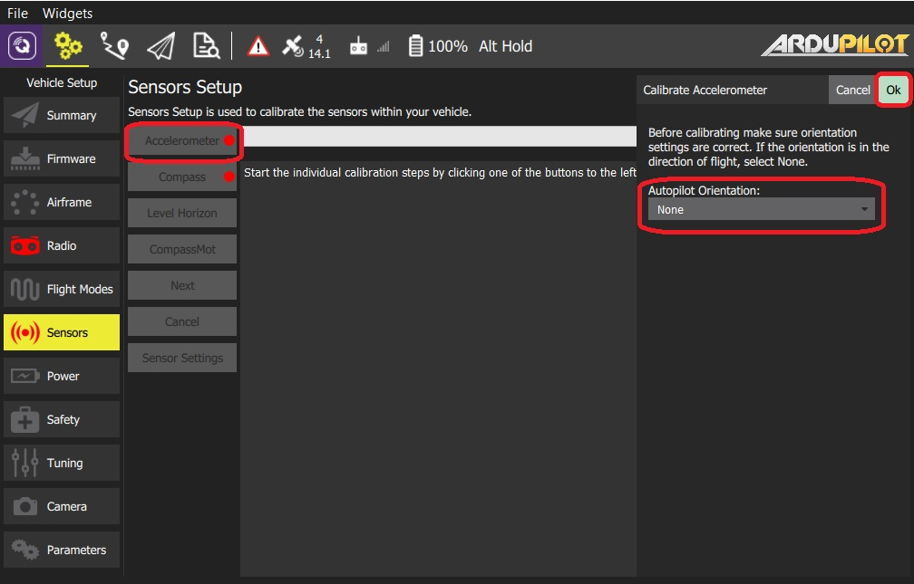
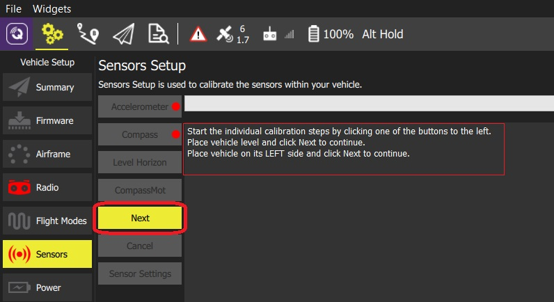
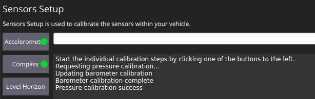
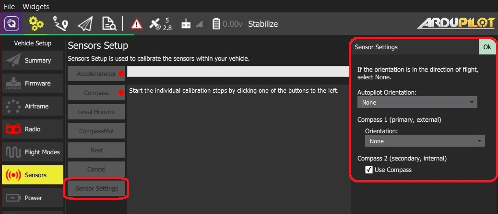

# 센서 설정 (ArduPilot)

*센서 설정* 섹션에서는 차량의 나침반, 자이로스코프, 가속도계 및 기타 센서를 구성하고 보정할 수 있습니다(사용 가능한 센서는 차량 유형에 따라 다름).

사용 가능한 센서는 사이드바 옆에 버튼 목록으로 표시됩니다. 녹색으로 표시된 센서는 이미 보정된 반면 빨간색으로 표시된 센서는 비행 전에 보정이 필요합니다. 조명이 없는 센서는 보정하지 않도록 선택할 수 있는 기본값이 있는 간단한 설정입니다.

각 센서의 버튼을 클릭하여 보정 시퀀스를 시작합니다.

## 가속도계  {#accelerometer}

비행 컨트롤러의 가속도계를 보정하려면 차량을 여러 방향으로 배치하고 유지하여야 합니다(위치 사이를 이동할 때 메시지가 표시됨).

보정 절차는 다음과 같습니다:

1. **가속도계** 버튼을 클릭합니다.  **참고** 위의 [비행 컨트롤러 방향](#flight_controller_orientation)을 미리 설정하여야 합니다. 미리 설정하지 않았다면, 여기에서 설정하십시오. 
2. 보정을 시작하려면 **확인** 버튼을 클릭합니다. 
3. 중앙 디스플레이의 지침에 따라 기체를 배치하십시오. 각 위치를 캡처하려면 **다음** 버튼을 클릭하세요. 

## 나침반 {#compass}

ArduPilot은 보다 정확한 보정을 가능한 온보드 보정 기능을 사용합니다.

> **Note** 이전 ArduPilot 펌웨어는 [PX4와 동일한 프로세스](../SetupView/sensors_px4.md#compass)를 사용하여 보정합니다.

진행률 표시줄이 오른쪽 끝까지 채워지고 보정이 완료될 때까지, 모든 축을 중심으로 기체를 무작위로 회전합니다. 보정이 완료되면 다음과 같은 결과가 나타납니다.

이것은 각 나침반에 대한 보정 품질을 보여줍니다. 이 값을 사용하여 성능이 좋지 않은 나침반의 사용 여부를 결정합니다.

## 수평 보정 {#level_horizon}

가속도계 보정 후, 수평선(HUD에 표시됨)이 수평이 아닌 경우 차량의 수평 수평을 보정할 수 있습니다. 정보를 캡처하는 동안 기체를 수평 방향으로 배치하라는 메시지가 표시됩니다.

1. **수평 보정** 버튼을 클릭합니다.  **참고** 위의 [비행 컨트롤러 방향](#flight_controller_orientation)을 미리 설정하여야 합니다. 미리 설정하지 않았다면, 여기에서 설정하십시오. 
2. 기체를 방향을 유지한 채로 평평한 바닥에 두십시오: 
    - 고정익의 경우 이 자세가 수평 비행 자세입니다 (비행기는 날개가 약간 올라가는 경향이 있습니다!).
    - 헬리콥터의 경우 이 자세가 부양 자세입니다.
3. 보정을 시작하려면 **확인** 버튼을 클릭합니다.

## 압력/기압계 {#pressure}

이 보정 세트는 현재 압력값에서 고도를 0으로 설정합니다.

**압력** 보정을 수행하려면:

1. **압력 보정** 버튼을 클릭한 다음 **확인** 버튼을 클릭합니다.
    
    
    
    보정 결과가 즉시 표시됩니다:
    
    

## CompassMot(선택 사항)

CompassMot 보정은 선택 사항입니다! 내부 나침반만 있는 기체와 모터, 전선 등의 간섭이 심한 경우에 권장됩니다. 지자기센서는 전류와 자기간섭을 측정하므로, 배터리 전류 측정이 설정되어 있어야 올바르게 작동합니다.

To perform **CompassMot** calibration:

1. Click the **CompassMot** sensor button.
    
    

2. Follow the onscreen prompts.
    
    

## Sensor Settings {#sensor_settings}

The *Sensor Settings* section allows you to specify the compass orientation and which compasses are enabled.

> **Tip** You can skip this section if the flight controller and compass are mounted upright on the vehicle and facing the front (this is the default orientation - `ROTATION_NONE`).

If the autopilot/compass are mounted in any other way you will need to specify their orientations as YAW, PITCH and/or ROLL offsets relative to the forward-facing-upright orientation (clock-wise rotation around the Z, Y and X axis, respectively).

For example, the image below are at orientations: `ROTATION_NONE`, `ROTATION_YAW_90`,`ROTATION_YAW_180`,`ROTATION_YAW_270`.

To set the orientation(s) and compasses used:

1. Select the **Sensor Settings** button.
    
    

2. Select the **AutoPilot Orientation**.

3. Select the *orientation* from **Compass 1 (primary/external) > Orientation** (or check **Compass2 (secondary, external) > Use Compass** to instead use the internal compass).
4. Press **OK**.