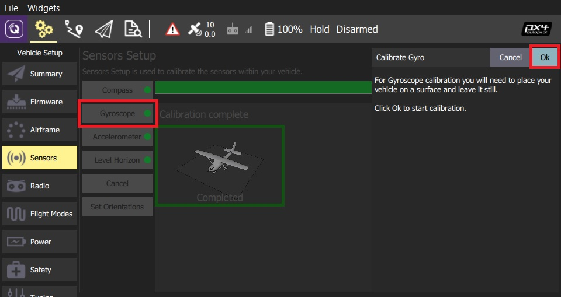
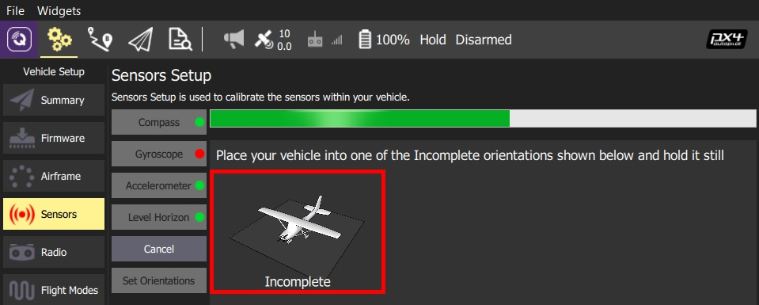
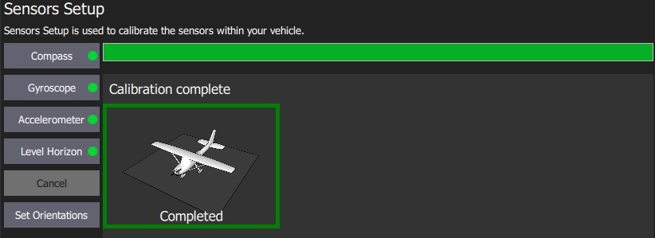
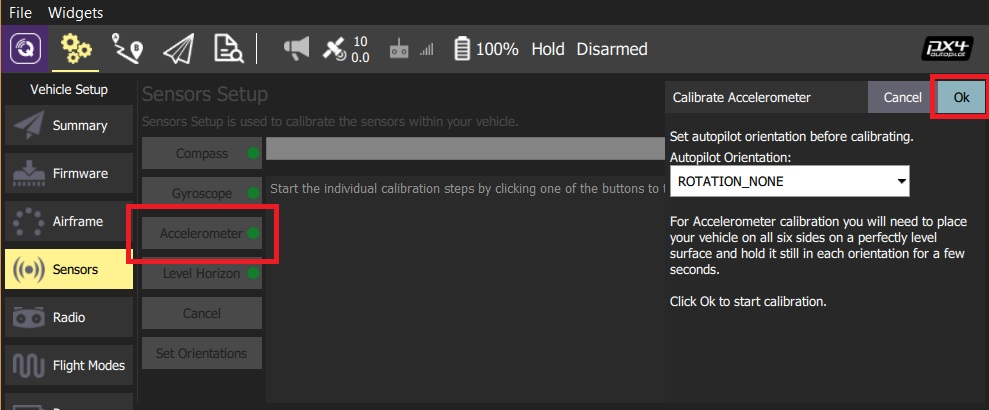
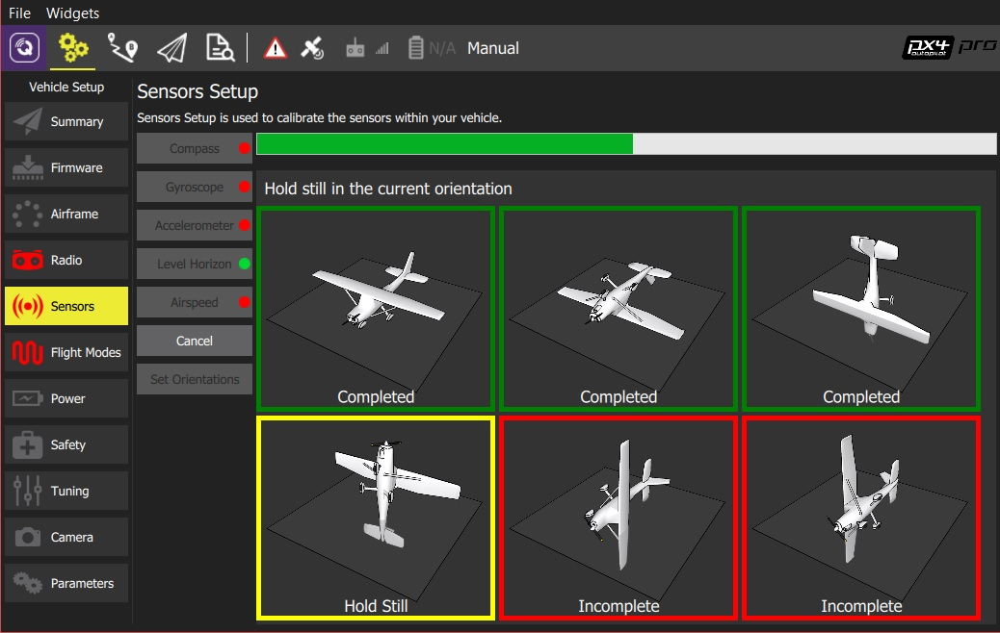

# 센서 설정 (PX4)

*센서 설정* 섹션에서는 차량의 나침반, 자이로스코프, 가속도계 및 기타 센서를 구성하고 보정할 수 있습니다(사용 가능한 센서는 차량 유형에 따라 다름).

사용 가능한 센서는 사이드바 옆에 버튼 목록으로 표시됩니다. 녹색으로 표시된 센서는 이미 보정된 반면 빨간색으로 표시된 센서는 비행 전에 보정이 필요합니다. 조명이 없는 센서는 보정하지 않도록 선택할 수 있는 기본값이 있는 간단한 설정입니다.

각 센서의 버튼을 클릭하여 보정 시퀀스를 시작합니다.

> **Note** 표시된 이미지는 PX4 펌웨어를 실행하는 VTOL 차량입니다. 다른 자동 조종 장치 펌웨어 및 차량은 약간 다른 옵션을 제공합니다.

## 나침반 {#compass}

The process guides you to position the vehicle in a number of set orientations and rotate the vehicle about the specified axis.

The calibration steps are:

1. Click the **Compass** sensor button  > **Note** The default flight controller orientation is `ROTATION_NONE` (flight controller and compass mounted upright on the vehicle and facing the front). You can set a different value here or in [Set Orientations](#flight_controller_orientation). 
2. Click **OK** to start the calibration. 
3. Place the vehicle in any of the orientations shown in red (incomplete) and hold it still. Once prompted (the orientation-image turns yellow) rotate the vehicle around the specified axis in either/both directions. Once the calibration is complete in that orientation the associated image on the screen will turn green. 
4. Repeat the calibration process for all vehicle orientations.

Once you've rotated the vehicle in all the positions *QGroundControl* will display *Calibration complete* (all orientation images will be displayed in green and the progress bar will fill completely) You can then proceed to the next sensor.

## Gyroscope {#gyroscope}

You will be guided to place the vehicle on a flat surface and keep it still.

The calibration steps are:

1. Click the **Gyroscope** sensor button 
2. Place the vehicle on a surface and leave it still.
3. Click **Ok** to start the calibration.
    
    The bar at the top shows the progress:
    
    

4. When finished, *QGroundControl* will display *Calibration complete* and the progress bar will fill completely. 

> **Note** If you move the vehicle during calibration, *QGroundControl* will automatically restart the calibration.

You can then proceed to the next sensor.

## Accelerometer {#accelerometer}

To calibrate the flight controller accelerometers you will be asked to place and hold your vehicle a number of orientations (you will be prompted when to move between positions).

The calibration steps are:

1. Click the **Accelerometer** sensor button.  > **Note** You should already have set the [Flight Controller Orientation](#flight_controller_orientation) above. If not, you can also set it here. 
2. Click **OK** to start the calibration. 
3. Position the vehicle as guided by the *images* on the screen. This is very similar to compass calibration. 
4. Repeat the calibration process for all vehicle orientations.

Once you've rotated the vehicle in all the positions *QGroundControl* will display *Calibration complete*.

You can then proceed to the next sensor.

## Level Horizon

If the horizon (as shown in the HUD) is not level after completing accelerometer calibration you can calibrate the level horizon for your vehicle. You will be asked to place the vehicle in a level orientation while it captures the information.

1. Click the **Level Horizon** sensor button.  > **Note** You should already have set the [Flight Controller Orientation](#flight_controller_orientation) above. If not, you can also set it here. 
2. Place the vehicle in its level flight orientation on a level surface: 
    - For planes this is the position during level flight (planes tend to have their wings slightly pitched up!)
    - For copters this is the hover position.
3. Click **OK** to start the calibration.

## Airspeed {#airspeed}

The airspeed calibration needs to read a stable baseline with 0 airspeed in order to determine an offset. Cup your hands over the pitot to block any wind (if calibrating the sensor indoors this is not needed) and then blow into the tube using your mouth (to signal completion of the calibration).

To calibrate the airspeed sensor:

1. Click the **Airspeed** sensor button
    
    

2. Cover the sensor (i.e. with your hand)
    
    > **Warning** Do not touch the sensor (obstruct any holes) during calibration.

3. Click **OK** to start the calibration.

4. Blow into the sensor.
5. Wait for 2-3 seconds before removing the covering (calibration completes silently after several seconds)

## Set Orientations {#flight_controller_orientation}

> **Tip** You can skip this section if the flight controller and compass are mounted upright on the vehicle and facing the front (this is the default orientation - `ROTATION_NONE`).

If the autopilot/compass are mounted in any other way you will need to specify their orientations as YAW, PITCH and/or ROLL offsets relative to the forward-facing-upright orientation (clock-wise rotation around the Z, Y and X axis, respectively).

For example, the image below are at orientations: `ROTATION_NONE`, `ROTATION_YAW_90`,`ROTATION_YAW_180`,`ROTATION_YAW_270`.

To set the orientation(s) on PX4:

1. Select the **Set Orientations** button.
    
    

2. Select the **AutoPilot Orientation**.

3. Select the **External Compass Orientation** (this option will only be displayed if there is an external compass).
4. Press **OK**.