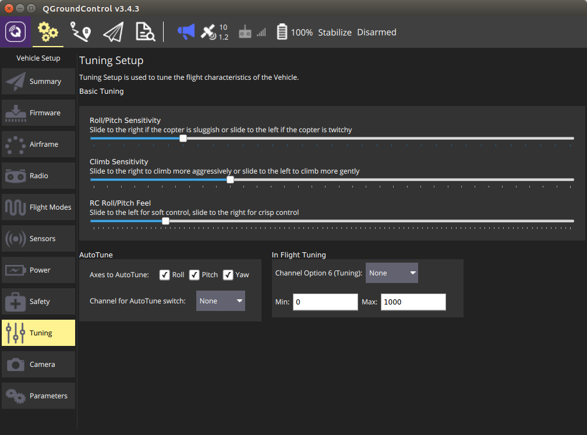

# ArduCopter 튜닝

## 튜닝 기초

원하는 슬라이더를 왼쪽이나 오른쪽으로 이동하여 비행 특성을 설정합니다.

## 자동 튜닝

AutoTune is used to automatically tune the rate parameters in order to provide the highest response without significant overshoot.

Performing an AutoTune:

* Select which axes you would like to tune. > **Tip** Tuning all axes at once can take a significant amount of time, which may cause you to run out of battery. To prevent this choose to tune only one axis at a time. 
* Assign AutoTune to one of your transmitter switches. Ensure that switch is in low position before taking off.
* Take off and put the copter into AltHold.
* Turn on AutoTune with your transmitter switch.
* The copter will twitch around the specified axes for a few minutes.
* When AutoTune completes the copter will change back to the original settings.
* Move the AutoTune switch back to low position and then back to high to test the new settings.
* Move the AutoTune switch to low to test previous settings.
* To save new settings, land and disarm while AutoTune switch is in high position.

Note:

* Since AutoTune is done in AltHold your copter must already have a tuning which is minimally flyable in AltHold. You can cancel AutoTune at any time by moving the AutoTune switch back to low position.
* You can reposition the copter using your transmitter at any time during AutoTune.

### In-Flight Tuning

This is an advanced option which allows you to tune a flight control parameter using one of your transmitter dial channels. Select the control option from the dropdown and specify the min/max for the values to assign to the dial.