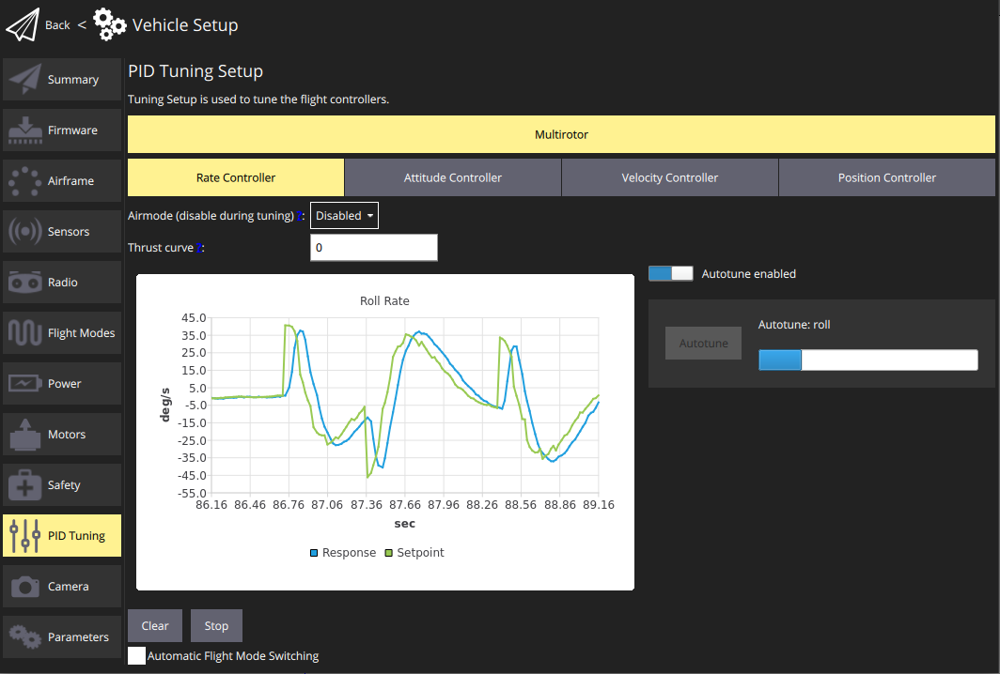
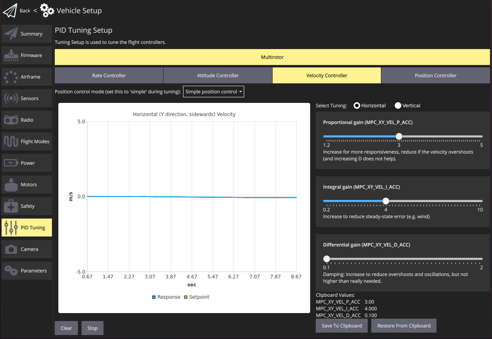

# 튜닝 (PX4)

한 번 튜닝으로 충분하며, 제조업체에서 튜닝후 기체를 수정한 기체가 아니면 튜닝을 하는 것이 바람직합니다.

[자동 튜닝](#autotune)은 일반적으로 프레임 유형 및 이를 지원하는 콘트롤러(멀티콥터, 고정익 및 하이브리드 VTOL 고정익)에 적용하여야 합니다. 튜닝 UI는 모든 콘트롤러의 수동 튜닝도 지원합니다.

> **Note**[기체 설정](../config/airframe.md) 중에 귀하의 기체와 가장 근접하게 일치하는 프레임을 미리 선택하여야 합니다. 이것은 일반적으로 비행하기에 충분히 잘 조정되며 자동 튜닝을 실행하기에 충분히 잘 *조정될 수* 있습니다.

## 자동 튜닝

자동 튜닝은 안정적이고 반응성이 뛰어난 비행을 위한 가장 중요한 컨트롤러인 PX4의 속도 및 자세의 튜닝을 자동화합니다(다른 튜닝은 "선택 사항"에 가깝습니다).

> **Note** 이 가이드는 자동 튜닝의 기본 사용법을 보여줍니다. 추가 정보 및 설정은 [PX4 자동 튜닝 가이드](http://docs.px4.io/master/en/config/autotune.html)(PX4 사용자 가이드)을 참고하십시오.

### 사전 자동 튜닝 테스트

비행 중에 자동 튜닝이 수행됩니다. 기체 자동 튜닝을 실행하기 전에 비행할 수 있고 적절하게 안정화되어야 합니다. 이 테스트는 기체의 위치 제어 모드에서 안전하게 비행할 수 있는 지 확인합니다.

To make sure the vehicle is stable enough for auto-tuning:

1. Perform a normal preflight safety checklist to ensure the flight zone is clear and has enough space.
2. Takeoff and prepare for the test 
    - **Multicopters:** Take off and hover at 1m above ground in **Altitude mode** or Stabilized mode.
    - **Fixed-wing mode:** Take off and fly at cruise speed in **Position mode** or **Altitude mode**.
3. Use the RC transmitter roll stick to perform the following maneuver, tilting the vehicle just a few degrees: *roll left > roll right > center* (The whole maneuver should take about 3 seconds). The vehicle should stabilise itself within 2 oscillations.
4. Repeat the maneuver, tilting with larger amplitudes at each attempt. If the vehicle can stabilise itself within 2 oscillations at ~20 degrees move to the next step.
5. Repeat the same maneuvers but on the pitch axis. As above, start with small angles and confirm that the vehicle can itself within 2 oscillations before increasing the tilt.

If the drone can stabilize itself within 2 oscillations it is ready for the auto-tuning procedure.

If not, see the [PX4 User Guide > Autotuning > Troubleshooting](http://docs.px4.io/master/en/config/autotune.html#troubleshooting).

### Auto-tuning procedure

The auto-tuning sequence must be performed in a **safe flight zone, with enough space**. It takes about 40 seconds (between 19 and 68 seconds). For best results, we recommend running the test in calm weather conditions.

> **Note** Be ready to abort the autotuning process by moving the RC controller sticks.

The test steps are:

1. Perform the [pre-tuning test](#pre-tuning-test) above.
2. Takeoff using RC control and prepare for test: 
    - **Multicopters:** Takeoff using the remote controller in **Altitude mode**. Hover the vehicle at a safe distance and at a few meters above ground (between 4 and 20m).
    - **VTOL in Fixed-wing mode:** Once flying at cruise speed, activate **Hold Mode**. This will guide the plane to fly in circle at constant altitude and speed.

3. In QGroundControl, open the menu: **Vehicle setup > PID Tuning**
    
    

4. Select either the *Rate Controller* or *Attitude Controller* tabs. Ensure that the **Autotune enabled** button is enabled (this will display the **Autotune** button and remove the manual tuning selectors).

5. Stop moving the joysticks and click on the **Autotune** button. Read the warning popup and click on **OK** to start tuning.
6. The drone will first start to perform quick roll motions followed by pitch and yaw motions. The progress is shown in the progress bar, next to the *Autotune* button.
7. Apply the tuning: 
    - **Fixed Wing:** The tuning will be immediately/automatically be applied and tested in flight (by default). PX4 will then run a 4 second test and revert the new tuning if a problem is detected.
    - **Multicopters:** Manually land and disarm to apply the new tuning parameters. Takeoff carefully and manually test that the vehicle is stable.
8. If any strong oscillations occur, land immediately and follow the instructions in [PX4 User Guide > Autotuning > Troubleshooting](http://docs.px4.io/master/en/config/autotune.html#troubleshooting).

  

A video of the process is shown below:

https://youtu.be/5xswOhhqrIQ

## Manual Tuning

Manual tuning is done in-flight, so your vehicle must already be tuned well enough to fly with (this is normally the case if you have selected an appropriate default airframe).

The instructions below explain how you can use the manual tuning UI. It is designed to be read/used in conjustion with the [PX4 Manual PID Tuning Guides](http://docs.px4.io/master/en/config/autotune.html#see-also), which provide more detailed hints on the kinds of step sizes to use when changing PID values.

In overview:

1. Takeoff using RC control and prepare for test: 
    - **Multicopters:** Takeoff using the remote controller in **Altitude mode**. Hover the vehicle at a safe distance and at a few meters above ground (between 4 and 20m).
    - **Fixed-wing:** Once flying at cruise speed, activate **Hold Mode**. This will guide the plane to fly in circle at constant altitude and speed.
2. In QGroundControl, open the menu: **Vehicle setup > PID Tuning**
3. Select the *Rate Controller* tab. Ensure that the **Autotune enabled** button is is turned off.
    
    

4. Select the *Tuning axis* to tune: **Roll**, **Pitch** or **Yaw** (each axis is tuned separately).

5. Fly the vehicle, observing the tracking on the chart. 
    - Adjust the *Tuning Values* (parameters) to improve the tracking shown on the graph using the slider.
    - The values are automatically saved, but you may wish to use the **Save to Clipboard** and **Restore from Clipboard** buttons to store the last known good configuration.
    - You can also **Clear**/**Stop** the chart using the buttons provided.
6. Tune the other axes.
7. Switch to the other controllers and repeat the process. Screenshots of the tuning pages are shown below.
    
      