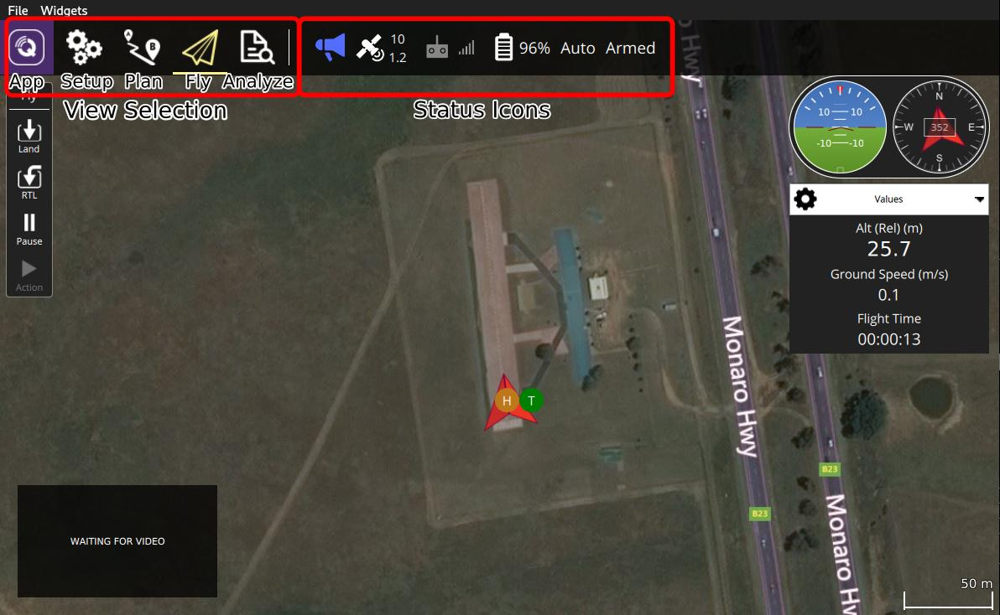

# QGroundControl 시작하기

*QGroundControl*를 설치하고 실행하는 방법은 간단합니다.

1. 애플리케이션을 [다운로드 후 설치](../getting_started/download_and_install.md)합니다.
2. *QGroundControl*을 실행합니다. 
3. USB나 텔레메트리 또는 WiFi로 지상국(QGroundControl)에서 기체를 연결합니다. *QGroundControl*에서 자동으로 기체를 감지하여 연결합니다.

준비과정이 끝났습니다. 기체 비행 준비가 완료되면, *QGroundControl*이 아래와 같은 [비행화면](../FlyView/FlyView.md)을 표시합니다. 그렇지 않으면, [설정화면](../SetupView/SetupView.md)을 표시합니다.

*QGroundControl*에 익숙해지는 방법은 많이 사용하는 것입니다.

- [도구 모음](../toolbar/toolbar.md)을 사용하여 기본 화면들을 전환할 수 있습니다. 
  - [설정](../SettingsView/SettingsView.md): *QGroundControl* 애플리케이션을 설정합니다.
  - [설정](../SetupView/SetupView.md): 기체를 설정하고 튜닝합니다.
  - [계획](../PlanView/PlanView.md): 자율 미션을 생성합니다.
  - [비행](../FlyView/FlyView.md): 스트리밍 비디오를 포함하여 비행중 기체를 모니터링합니다.
  - [분석] ** 분석 보기에 대한 설명이 누락되었습니다 **
- 툴바에서 *상태 아이콘*을 클릭하여 연결된 기체의 상태를 확인할 수 있습니다. 

매우 직관적인 UI를 제공하지만, 그 사용 방법을 이 문서에서 자세하게 설명합니다.