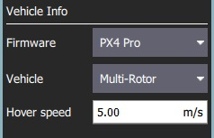

# QGroundControl v3.2 릴리스 노트(추가)

이 섹션에는 버전 3.2에서 *QGroundControl*에 추가된 새 기능의 상위 수준 및 *전체* 목록이 포함되어 있습니다.

## 설정

### 원격 측정 로그 자동 저장

*비행 후 텔레메트리 로그 저장*을 켠 경우 더 이상 차량이 시동 정지 시마다 로그를 저장 위치를 묻는 메시지가 표시되지 않습니다. 로그는 [애플리케이션 로드/저장 경로](../SettingsView/General.md#load_save_path)에 자동으로 저장됩니다.

자세한 내용은 [설정 > 일반(기타)](../SettingsView/General.md#autosave_log)을 참고하십시오.

### 계획 자동 로드

이 설정이 켜져 있으면, *QGroundControl*에 차량 연결시 계획을 자동으로 업로드합니다. 계획 파일의 이름은 **AutoLoad#.plan**이어야 하며, 여기서 `#`은 차량 Id로 대체됩니다. 계획 파일은 [응용 프로그램 로드/저장 경로](../SettingsView/General.md#load_save_path)에 위치하여야 합니다.

자세한 내용은 [설정 > 일반(기타)](../SettingsView/General.md#autoload_missions)을 참고하십시오.

### 응용프로그램 불러오기/저장 경로

이제 QGroundControl에 매개변수, 원격 측정 또는 임무 계획의 기본 저장 경로를 지정할 수 있습니다.

자세한 내용은 [설정 > 일반(기타)](../SettingsView/General.md#load_save_path)을 참고하십시오.

### RTK GPS

이제 연결된 RTK GPS와 함께 사용할 *정확도 조사* 및 *최소 관찰 기간*을 지정할 수 있습니다.

자세한 내용은 [설정 > 일반(RTK GPS)](../SettingsView/General.md#rtk_gps)을 참고하십시오.

## 설정

### ArduPilot - 비행 전 기압계 및 대기 속도 보정

이제 센서 페이지에서 지원됩니다.

### ArduPilot - RC 트림 복사

이제 라디오 설정 페이지의 트림 복사 버튼에서 지원됩니다.

## 계획 화면 {#plan_view}

### 계획 파일

이전 버전의 *QGroundControl*은 미션, 지오펜스 및 집회 지점을 별도의 파일(**.mission**, **.fence**, **.rally**)에 저장하였습니다 . QGroundControl은 이제 비행 계획과 관련된 모든 정보를 파일 확장자를 **.plan**인 *계획 파일*을 사용합니다.

형식에 대한 정보는 [계획 파일 형식](https://dev.qgroundcontrol.com/en/file_formats/plan.html)(QGroundControl 개발자 안내서)을 참고하십시오.

### 계획 툴바


[계획 화면](../PlanView/PlanView.md) 상단에 새로운 *계획 도구 모음*이 표시됩니다. 현재 선택된 웨이포인트와 관련된 정보와 전체 미션에 대한 통계를 나타냅니다.

차량에 연결하면 **업로드** 버튼도 표시되며, 차량에 계획을 업로드할 수 있습니다.

### 임무 설정

[미션 설정](../PlanView/PlanView.md#mission_settings) 패널을 사용하면 전체 미션에 적용되는 값을 지정하거나 미션 시작 시 바로 제어하려는 설정을 지정할 수 있습니다. 화면 오른쪽 미션 목록의 첫 번째 아이템입니다.


#### 임무 기본값

##### 경로점 고도

새로 추가된 임무 항목의 기본 고도를 지정합니다. 임무를 로드한 상태에서 이 값을 업데이트하면, 모든 경로점들을 새로운 고도값으로 업데이트하는 메시지가 표시됩니다.

##### 비행 속도

이를 통하여 미션의 비행 속도를 기본 미션 속도와 다르게 설정합니다.

##### 임무 종료 후 출발지 복귀

최종 미션 아이템 이후에 차량이 출발지복귀를 설정합니다.

#### 카메라 선택


카메라 섹션에서는 수행할 카메라 동작을 지정하고 짐벌을 제어하며 카메라를 사진 또는 비디오 모드로 설정합니다.

사용 가능한 카메라 작업은 다음과 같습니다.

* 현재 동작 지속
* 사진 찍기(시간)
* 사직 찍기 (거리)
* 사진 촬영 중지
* 동영상 녹화 시작
* 동영상 녹화 중지

#### 기체 정보 섹션



임무 계획시, QGroundControl에서 기체에 적합한 임무 명령을 표시하려면 실행 중인 펌웨어와 기체 유형을 알아야 합니다.

기체가 연결된 상태에서 임무를 계획하는 경우에는 펌웨어와 기체 유형은 기체에서 결정됩니다. 기체에 연결되지 않은 상태에서 임무를 계획하는 경우 이 정보를 직접 지정하여야 합니다.

임무를 계획할 때 지정할 수 있는 추가 값은 기체 비행 속도입니다. 이 값을 지정하면 기체에 연결되지 않은 상태에서도 총 임무 또는 조사 시간을 대략적으로 계산할 수 있습니다.

#### 지정된 홈 위치


계획된 홈 위치를 사용하면, 임무를 계획하는 동안 기체의 홈 위치를 시뮬레이션할 수 있습니다. 이 방법을 통해 이륙에서 임무 완료까지 차량의 경로점들의 궤적을 조회할 수 있습니다. 이것은 "계획된" 홈 위치일 뿐이며 기체가 출발할 계획인 위치에 배치하여야 합니다. 미션 비행에 실질적인 영향은 없습니다. 차량의 실제 홈 위치는 시동시 결정됩니다.

### 새로운 경로점 기능


* 이제 각 경로점의 방향과 비행 속도를 조정할 수 있습니다.
* 각 경로점에서 카메라 변경에 사용할 수 있는 카메라 섹션이 있습니다. 카메라 섹션에 대한 설명은 위의 미션 설정에서 읽을 수 있습니다.

### 비주얼 짐벌 방향


경로점에서 짐벌 편요각 변경을 지정하면, 평면도와 조감도는 짐벌 방향을 시각적으로 나타냅니다.

### 패턴 도구

There is a new *Pattern tool*. The following patterns are supported:

* Fixed Wing Landing (new)
* Survey (with new features)

#### Fixed Wing Landing Pattern


This adds a landing pattern for fixed wings to your mission. The first point of the pattern is the loiter point which commands to vehicle to loiter to a specific altitude. Once that altitude is reached, the vehicle will begin the landing sequence and fly down to the specified landing spot.

Both the loiter and land points can be dragged to adjust. Also all the various values associated with the pattern can be adjusted.

For more information see [Fixed Wing Landing Pattern](../PlanView/pattern_fixed_wing_landing.md).

#### Survey (new features)

* Images are not automatically taken in the turnaround zone outside of the polygonal survey area.
* There is a new *Hover and Capture* option which can be used to capture the highest quality image at each image location. The vehicle will stop at each image location prior to taking the image such that the vehicle is stable while the image is taken.
* There is a new option to re-fly the survey grid at a 90 degree angle to the previous pass. This allows you to generate much denser coverage for the images.


Manipulating the survey area polygon is now easier to use on tablets with touch screens:

* You can drag the entire polygon to a new location by dragging the center point handle.
* Each polygon vertex can be dragged to a new location.
* To remove a polygon vertex, simple click on the drag handle for it.
* Click on the **+** handles to add a new vertex between two existing vertices.

## Fly View

### RTK GPS

RTK status is now shown in the toolbar.

### Arm/Disarm

There is an armed/disarmed indicator in the toolbar. You can click it to arm/disarm your vehicle. If you click Disarm in the toolbar while your vehicle is flying you will provided the option to Emergency Stop your vehicle.

### Guided Actions

* Takeoff
* Land
* RTL
* Pause
* Actions 
  * Start Mission
  * Resume Mission
  * Change Altitude
  * Land Abort
* Direct interaction with map 
  * Set Waypoint
  * Goto Location

#### Resume Mission

The Resume Mission guided action is used to resume a mission after performing an RTL from within the mission to perform a battery change. After the vehicle lands from RTL and you have disconnected the battery **do not** disconnect QGC from the Vehicle. Put in your new battery and QGC will detect the vehicle again and automatically restore the connection. Once this happens you will be prompted with a Resume Mission confirmation slider. If you want to resume the mission, confirm this and the mission will be rebuilt from your last waypoint traveled through. Once the mission is rebuilt you will be presented with another Resume Mission slide which allows you to review the rebuilt mission before starting it again. Confirm this Resume Mission slider to continue on with the mission.

###### How resume mission rebuilding works

In order to resume a mission you cannot simply continue it from the last mission item the vehicle ran. The reason is is that may skip over important change speed commands or camera control commands which are prior to that item in the mission. If you skipped over those the remainder of the mission will not run correctly. In order to make resume mission work correctly QGC rebuilds the mission looking backwards from the last mission item flown and automatically appends relevant commands to the front of the mission. By doing this the state of the mission prior to the resume point is restore. The following mission commands are the ones scanned for:

* `MAV_CMD_DO_CONTROL_VIDEO`
* `MAV_CMD_DO_SET_ROI`
* `MAV_CMD_DO_DIGICAM_CONFIGURE`
* `MAV_CMD_DO_DIGICAM_CONTROL`
* `MAV_CMD_DO_MOUNT_CONFIGURE`
* `MAV_CMD_DO_MOUNT_CONTROL`
* `MAV_CMD_DO_SET_CAM_TRIGG_DIST`
* `MAV_CMD_DO_FENCE_ENABLE`
* `MAV_CMD_IMAGE_START_CAPTURE`
* `MAV_CMD_IMAGE_STOP_CAPTURE`
* `MAV_CMD_VIDEO_START_CAPTURE`
* `MAV_CMD_VIDEO_STOP_CAPTURE`
* `MAV_CMD_DO_CHANGE_SPEED`
* `MAV_CMD_NAV_TAKEOFF`

### Remove mission after vehicle lands

You will be prompted to remove the mission from the vehicle after the mission completes and the vehicle lands and disarms. This is meant to prevent issues where stale missions are unknowingly left on a vehicle cause unexpected behavior.

### Instrument panel

#### Camera trigger

#### Flight Time

Flight time is now available for display in the instrument panel. For new users, flight time will be shown by default. For existing users who have already modified their instrument panel values you will have to add it yourself if you want to use it.

## [Analyze View](../analyze_view/README.md)

* [Log Download](../analyze_view/log_download.md) moved to *Analyze View* from menu.
* New [GeoTag Images](../analyze_view/geotag_images.md) support for PX4 Pro firmware
* New [MAVLink Console](../analyze_view/mavlink_console.md) which provides access the the *nsh shell* running on the vehicle.

## Multi-Vehicle View

There is a new view available when you have multiple vehicles connected to QGC. It will only show up when more than one vehicle is connected. When that happens you will see an additional set of radio button at the top right of the Plan view.


Click the **Multi-Vehicle** radio button to replace the instrument panel with the multi-vehicle list:


The example above shows three vehicles. The numbers are the vehicle id. In the large font is the current flight mode. You can click the flight mode name to change to a different flight mode. To the right are small version of the instruments for each vehicle. You can command the vehicle to do the following actions from the control panel:

* Arm/Disarm
* Start/Stop a mission
* Return to Launch
* Take Control back of the vehicle by returning to manual control from a mission.

### Multi-Vehicle Gotchas - Unique vehicle ids

Each vehicle connected to QGC must have a unique id. Otherwise QGC will think the vehicles are actually the same vehicle. The symptom of this is the Plan view jerking around as it tries to position itself to one vehicle and then the next. For PX4 Pro firmwares this is the `MAV_SYS_ID` parameter. For ArduPilot firmwares it is the ```SYSID_THISMAV``` parameter.

## Support for third-party customized QGroundControl

Standard QGC supports multiple firmware types and multiple vehicle types. There is now support in QGC which allows a third-party to create their own custom version of QGC which is targeted specifically to their custom vehicle. They can then release their own version of QGC with their vehicle.