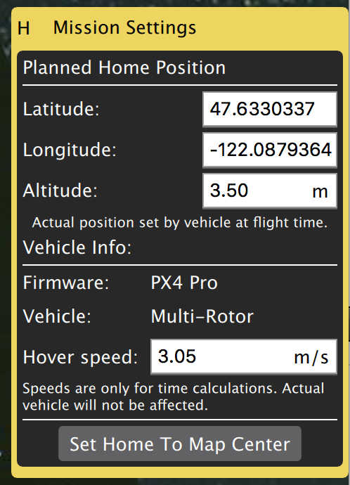

# Daily Build Major Changes

## Settings

### File save path
You can now specify a save path which QGC will use as the default location to save files such as Parameters, Telemetry or Mission to.

### Telemetry log auto-save
If you have *Save telemetry log after each flight* turned on you will no longer be prompted as to where to save the log each time the vehicle disarms. They will automatically be saved to the save path specified in Settings.

### Video save

### AutoLoad missions

When this settings is turned on when QGC connects to a vehicle it will automatically upload a mission to the vehicle. The mission file must be named "AutoLoad#.mission" where the # is replaced with the vehicle id. The location of the mission file is in the file save path as specified above.

## Plan View

### Plan Toolbar

#### Battery information

### Mission Settings
When planning a mission the first item in the mission list on the right of the screen is Mission Settings. This allows you to specify your planned home positions as well as specify vehicle information associated with the planned mission.



#### Mission defaults

##### Waypoint altitude
When you add the first new waypoint to a mission the altitude for that item was previously hardcoded to 50 meters. You can now choose a default value for that from Mission Settings. If you update this value while you have a mission loaded it will prompt you to update all the your waypoints to this new altitude.

If you change the altitude on a waypoint, subsequent items will continue to use that new altitude. This is an existing feature that has not changed. That new altitude entered from he Plan view does not affect the default altitude stored in settings.

##### Flight speed
This allows you to set the flight speed for the mission to be different than the default mission speed.

##### Mission End Action
This allows you to specify what you would like to happen when the mission completes:

* No action on mission end
* Loiter after mission end
* RTL after mission end

##### Camera Section

Both Mission Settings and individual Waypoint items have a new camera section available. This section allows you to specify camera actions to take as well as to control the gimbal pitch and yaw. The camera actions available are:

*  Continue current action
*  Take photos (time)
*  Take photos (distance)
*  Stop taking photos
*  Start recording video
*  Stop recording video

#### Vehicle Info
When planning a mission the firmware being run on the vehicle as well as the vehicle type must be known in order for QGroundControl to show you the mission items appropriate for you vehicle.

If you are planning a mission while you are connected to your vehicle the Firmware and Vehicle Type will be determined from the vehicle connection. If you are planning a mission while not connected to a vehicle you will need to specify this information yourself.

The additional value which can be specified when planning a mission is the vehicle flight speed. By specifying this value total mission or survey times can be approximated.

#### Planned Home Position
The planned home position allows you to simulate the vehicle's home position while planning a mission. This way you see that waypoint trajectory for your vehicle from takeoff to mission completion. Keep in mind that this is the "planned" home position and you should place it where you plan to start the vehicle from. The actual home position of a vehicle is set by the vehicle itself when arming.

###  Waypoint features
* There is a camera section available (as described above) on each waypoint.
* You can also adjust the flight speed with each waypoint.

### Gimbal direction
If you specify gimbal yaw changes on waypoints both the plan and fly views will show you a visual representation of the gimbal direction.

### Pattern tool

There is a new Pattern tool available. The following patterns are supported:

* Fixed Wing Landing (new) - Allows you to set up a fixed wing landing pattern with a loiter to a specified altitude followed by a landing.
* Survey (with new features)

#### Fixed Wing Landing Pattern

#### Survey
* Images are automatically not taken in the turnaround zone outside of the polygonal survey area.
* There is a new Hover and Capture option which can be used to capture the highest quality image at each image location. The vehicle will stop at each image location prior to taking the image such that the vehicle is stable while the image is taken.
* There is a new option to re-fly the survey grid at a 90 degree angle to the previous pass. This allows you to generate much denser coverage for the images.

### Sync Tool - Auto-sync

## Fly View

### Arm/Disarm

### Guided Actions

* Takeoff
* Land
* RTL
* Pause
* Actions
  * Start Mission
  * Resume Mission
  * Change Altitude
  * Land Abort
* Direct interaction with map
  * Set Waypoint
  * Goto Location

### Remove mission after vehicle lands
You will be prompted to remove the mission from the vehicle after the mission completes and the vehicle lands and disarms. This is meant to prevent issues where stale missions are unknowingly left on a vehicle cause unexpected behavior.

### Instrument panel
#### Camera trigger

## Analyze View
* Log download moved to Analyze view from menu
* New GeoTag images support for PX4 Pro firmware
* New Mavlink Console which provides access the the nsh shell running on the vehicle.

### Multi-Vehicle View

There is a new view available when you have multiple vehicles connected to QGC. It will only show up when more than one vehicle is connected. When that happens you will see an additional set of radio button at the top right of the Plan view.


Click the Multi-Vehicle radio button to replace the instrument panel with the multi-vehicle list:


The example above shows three vehicles. The numbers are the vehicle id. In the large font is the current flight mode. You can click the flight mode name to change to a different flight mode. To the right are small version of the instruments for each vehicle. You can command the vehicle to do the following actions from the control panel:

* Arm/Disarm
* Start/Stop a mission
* Return to Launch
* Take Control back of the vehicle by returning to manual control from a mission.

#### Multi-Vehicle Gotchas - Unique vehicle ids
Each vehicle connected to QGC must have a unique id. Otherwise QGC will think the vehicles are actually the same vehicle. The symptom of this is the Plan view jerking around as it tries to position itself to one vehicle and then the next. For PX4 Pro firmwares this is the ```MAV_SYS_ID``` parameter. For ArduPilot firmwares it is the ```SYSID_THISMAV``` parameter.

## Support for third-party customized QGroundControl
Standard QGC supports multiple firmware types and multiple vehicle types. There is now support in QGC which allows a third-party to create their own custom version of QGC which is targeted specifically to their custom vehicle.
