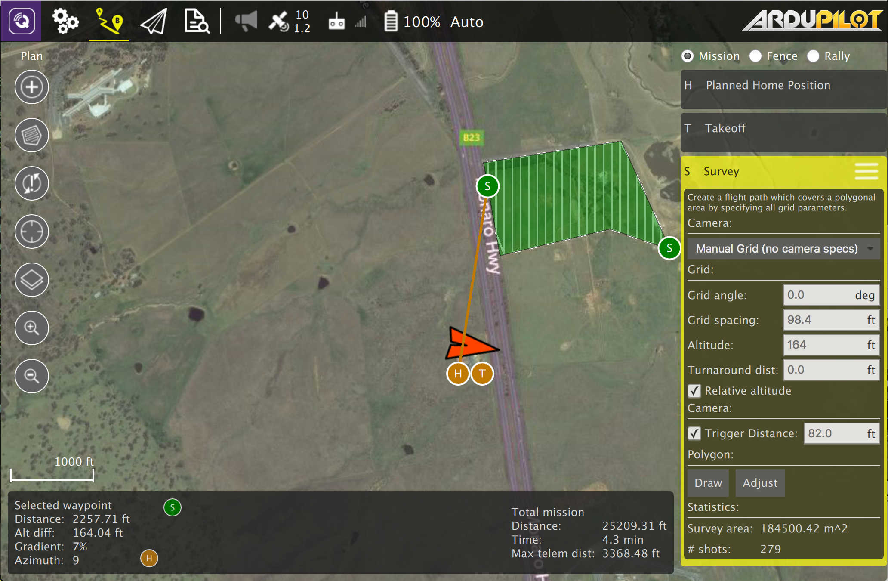

# Plan - Survey

다각형 영역상에서 격자형태 비행 패턴을 생성할 수 있습니다. geotagged 이미지를 생성할 수 있도록 격자와 카메라 셋팅 관련 스펙 및 다각형을 지정할 수 있습니다.

survey를 위한 다각형을 그릴려면, "Draw" 버튼을 클릭하고 지도에 클릭하여 다각형 꼭지점을 설정합니다.

survey 격자에는 다양한 옵션이 있습니다. editor 상단에 있는 드롭다운을 통해 주요 옵션을 선택할 수 있습니다.

## Manual Grid

수동으로 다각형으로 격자패턴을 생성하기 위한 모든 값들을 지정할 수 있습니다.

* Grid angle - 격자에 평행한 비행 트랙을 위한 각도. 예로 0도는 북/남을 비행하는 평행 라인을 생성.
* Grid spacing - 각 평행 비행 트랙 사이에 거리
* Altitude - 전체 격자 패턴을 비행을 위한 고도
* Turnaround distance - 다음 비행 트랙을 위해 턴어라운드를 수행하기 전에 다각형의 모퉁이를 비행하는데 추가로 드는 거리
* Trigger Distance - 비행한 거리를 기반으로 카메라가 사진을 찍도록 하는데 사용

## Camera

드롭다운 옵션에서 알려진 카메라를 선택하면 카메라 스펙을 기반으로 격자 패턴을을 생성할 수 있습니다.

* Landscape/Portrait - 카메라가 비행체에 달려있는 방향을 지정
* Image Overap - 각 이미지 사이에 오버랩되는 양을 지정
* Altitude - 이 값을 지정하면 서베이 동작시 고도를 지정. 지면 해상도를 계산하고 지정한 고도를 표시함
* Ground resolution - 각 이미지에 대해서 지상 해상도를 지정. 이 해상도를 구하는데 필요한 고도를 계산하고 표시됨

## Custom Camera

커스텀 카메라 옵션은 카메라 옵션과 비슷합니다. 차이점은 여러분이 직접 카메라 스펙에 대한 자세한 내용을 지정해 주어야 한다는 것입니다.

* Sensor width/height - 카메라의 이미지 센서의 크기
* Image width/height - 카메라로 찍은 이미지의 해상도
* Focal Length - 카메라 렌즈의 초점 거리
